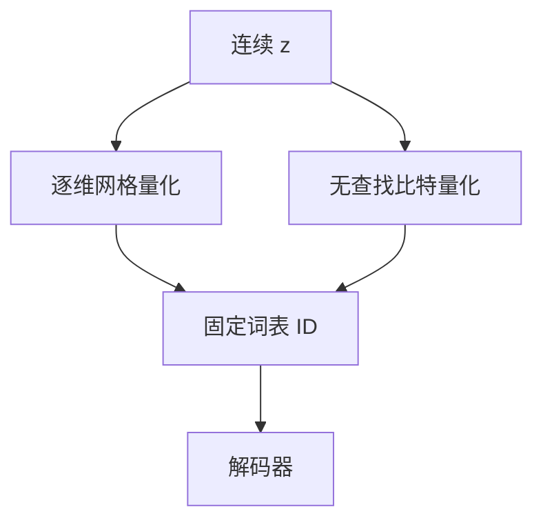

# FSQ / LFQ

码本学习会崩溃。把每个维直接量化到固定网格，或对符号做无查找量化，词表变成设计出来的，而不是抢着用的。

<footer>—— Mentzer 等 FSQ；Yu 等 MAGVIT-v2 的 Lookup-Free Quantization</footer>

[上一课](/llm/vqgan)仍要维护可学习码本。Mentzer 等人的有限标量量化（FSQ）对每个通道独立量化到少量水平；Yu 等人的 LFQ 用符号位组合出词表，前向无码本查找。缺口是量化器的稳定性。后课连续对离散默认：离散侧不一定再背一个大码本。

## 问题

VQ 的最近邻与 EMA 码本在大数据上仍会死码、要调承诺损失。FSQ：令 $z\in\mathbb{R}^{d}$，每维量化到 $L$ 档，词表大小 $L^{d}$（$d$ 很小）。没有可学习 $e_k$，崩溃被结构禁止。LFQ：对二元或低比特维做查找无关的整数编码，同样避免码本抢占。二者用重构 + 辅助损失训练编码器/解码器。

权衡：网格量化在感知上可能弱于精心学的码本，要靠解码器与损失补；词表大小由网格组合爆炸，维数必须小。

FSQ 的「词表」是笛卡尔网格，LM 看到的 ID 是网格坐标的编码。ID 的邻域结构与语义邻域不必一致。

## 方法

选 $L$ 与通道数使词表与序列长度可接 LM。训练盯重构与有效使用率（网格点是否都被访问）。接自回归时，ID 映射必须冻结，否则旧检查点的 token 失效。与 VQGAN 比，GAN 仍可加在解码器上，量化器本身更简单。

## 机制

可学习码本是聚类：热门模式抢走码字。固定网格把容量均匀铺在坐标箱上，编码器必须把语义放进这些箱的组合。这更稳，但把几何负担全交给编码器。LM 建模的是箱下标的语法，不是码向量的余弦。

## 边界

不是所有生成系统都要离散。下一课把连续潜变量（扩散/流）与离散 token 两条路对照。

## 小结

- FSQ / LFQ 用固定网格或无查找编码避免码本崩溃。
- 词表是设计量；ID 邻域不等于语义邻域。
- 稳定性换来的负担在编码器与解码器。
- 出处：Mentzer 等 FSQ；Yu 等 MAGVIT-v2 / LFQ。
