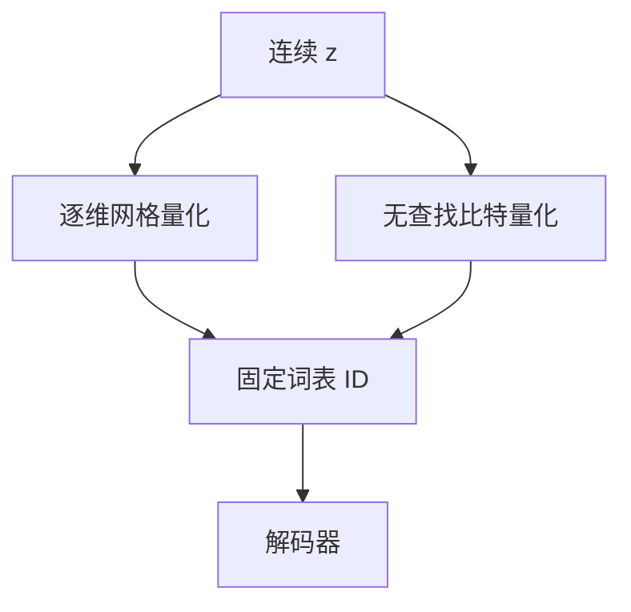
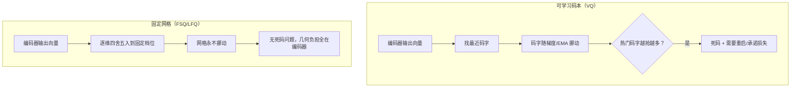

# FSQ / LFQ

码本学习会崩溃。把每个维直接量化到固定网格，或对符号做无查找量化，词表变成设计出来的，而不是抢着用的。

<footer>—— Mentzer 等 FSQ；Yu 等 MAGVIT-v2 的 Lookup-Free Quantization</footer>

[上一课](/llm/vqgan)仍要维护可学习码本。Mentzer 等人的有限标量量化（FSQ）对每个通道独立量化到少量水平；Yu 等人的 LFQ 用符号位组合出词表，前向无码本查找。缺口是量化器的稳定性。后课连续对离散默认：离散侧不一定再背一个大码本。

## 问题

VQ 的最近邻与 EMA 码本在大数据上仍会死码、要调承诺损失。FSQ：令 $z\in\mathbb{R}^{d}$，每维量化到 $L$ 档，词表大小 $L^{d}$（$d$ 很小）。没有可学习 $e_k$，崩溃被结构禁止。LFQ：对二元或低比特维做查找无关的整数编码，同样避免码本抢占。二者用重构 + 辅助损失训练编码器/解码器。

「码本崩溃」可以想象成食堂窗口：训练早期几个热门码字抢走几乎所有客流，其余窗口永远没人排队（死码），最后词表名义上有一万个码字、实际只在用几十个。FSQ 的做法等价于把窗口固定死、谁也别想扩张，食物（编码器输出）只能自己往窗口送。

数字实例：FSQ 论文常用 $L=5$、$d=6$，词表就是 $5^6 = 15625$ 个格点——和常见 VQ 词表同一量级，却不带任何可学习码字。想扩词表？加一维就是 $5^7=78125$；但每加一维，编码器要把更多信息塞进这一维的 5 个档位，重构难度也随之上升。

权衡：网格量化在感知上可能弱于精心学的码本，要靠解码器与损失补；词表大小由网格组合爆炸，维数必须小。

FSQ 的「词表」是笛卡尔网格，LM 看到的 ID 是网格坐标的编码。ID 的邻域结构与语义邻域不必一致。

## 方法

选 $L$ 与通道数使词表与序列长度可接 LM。训练盯重构与有效使用率（网格点是否都被访问）。接自回归时，ID 映射必须冻结，否则旧检查点的 token 失效。与 VQGAN 比，GAN 仍可加在解码器上，量化器本身更简单。

```mermaid
flowchart TD
  ZE["连续 z"] --> FSQ["逐维网格量化"]
  ZE --> LFQ["无查找比特量化"]
  FSQ --> ID["固定词表 ID"]
  LFQ --> ID
  ID --> DEC["解码器"]
```

## 机制

可学习码本是聚类：热门模式抢走码字。固定网格把容量均匀铺在坐标箱上，编码器必须把语义放进这些箱的组合。这更稳，但把几何负担全交给编码器。LM 建模的是箱下标的语法，不是码向量的余弦。

```mermaid
flowchart TD
  subgraph VQ["可学习码本（VQ）"]
    E1["编码器输出向量"] --> N1["找最近码字"]
    N1 --> U1["码字随梯度/EMA 挪动"]
    U1 --> R1{"热门码字越抢越多？"}
    R1 -- "是" --> D1["死码 + 需要重启/承诺损失"]
  end
  subgraph FG["固定网格（FSQ/LFQ）"]
    E2["编码器输出向量"] --> Q2["逐维四舍五入到固定档位"]
    Q2 --> U2["网格永不挪动"]
    U2 --> D2["无死码问题，几何负担全在编码器"]
  end
```

「承诺损失」（commitment loss）是 VQ 时代的小拐杖：一项惩罚，逼着编码器输出「承诺」待在选中的码字附近，别每步都跳来跳去。调它是个手艺活。FSQ 直接四舍五入、梯度用直通估计回传，这项拐杖整个不需要了——这也是它「稳」的来源之一。

## 边界

不是所有生成系统都要离散。下一课把连续潜变量（扩散/流）与离散 token 两条路对照。

## 小结

- FSQ / LFQ 用固定网格或无查找编码避免码本崩溃。
- 词表是设计量；ID 邻域不等于语义邻域。
- 稳定性换来的负担在编码器与解码器。
- 出处：Mentzer 等 FSQ；Yu 等 MAGVIT-v2 / LFQ。
