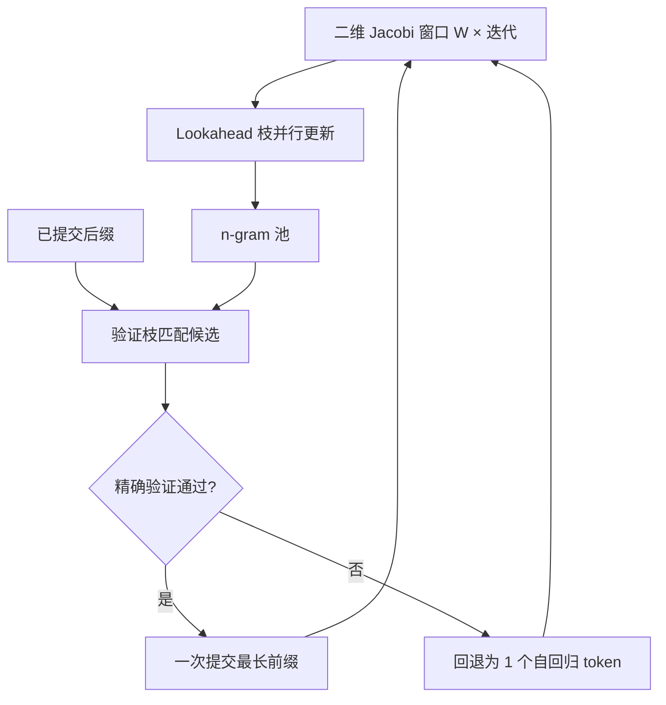

# Lookahead 原文

把自回归看成非线性方程组，用 Jacobi 迭代并行更新互不依赖的未来位置；猜错不可怕，只要把像样的 n-gram 存进池子，再用同一次前向精确验证。

<footer>—— Fu, Bailis, Stoica, Zhang，Break the Sequential Dependency of LLM Inference Using Lookahead Decoding，2024</footer>

草稿模型要训、要对齐、要进调度。[SpecInfer](/llm/specinfer) 用小模型长树，[Medusa](/llm/medusa) 用额外头，都还是「另有一套 $q$」。Fu、Bailis、Stoica、Zhang 的 Lookahead Decoding 问：目标模型 $f$ 自己能不能既当提议器又当验证器？观察是 Jacobi 迭代可以同时刷新多个未来位置，尽管这些位置在当前因果链上并不合法；把轨迹切成 n-gram 缓存起来，等到当前后缀匹配再验证，就得到一种零额外参数的投机。本篇按原文写方程、二维窗口与验证枝；服务对照见 [Lookahead Decoding](/llm/lookahead-decoding)。

## 问题

记已提交前缀为 $x_{\le t}$。自回归约束是

$$
x_{t+i}=f(x_{\le t+i-1}),\qquad i=1,2,\ldots
$$

这是一组三角形依赖的非线性方程。逐步解码相当于 Gauss–Seidel：必须先解出 $x_{t+1}$ 才能更新 $x_{t+2}$。GPU 的矩阵单元并不喜欢这种串行。Jacobi 迭代改成：用上一轮对未知数的全部猜测，并行写出本轮每个位置的新猜测。形式上

$$
x_{t+i}^{(j+1)}=f\bigl(x_{\le t},\,x_{t+1}^{(j)},\ldots,x_{t+i-1}^{(j)}\bigr).
$$

朴素 Jacobi 解码几乎从不加速。早期位置错了，后面位置的「并行更新」全是在错误条件下算 $f$，接受长度接近 1，还多付了平行位置的 FLOPs 与 KV。原文要解决的不是「能不能并行猜」，而是「并行产生的碎片如何变成可复用、可精确验证的提议」，使得逐步依赖只在期望上被打断。

### 为何坚持零辅助模型

小草稿难跟版本、难进多卡、在私有权重场景可能根本拿不到。Lookahead 把这一点写成与 Medusa 相同的痛点，给出的解却不是接头，而是把并行度花在 $f$ 自己的一次更宽前向上。作者主张用逐步 $\log(\mathrm{FLOPs})$ 量级的变贵，换解码步数的线性下降，并且能与 FlashAttention 一类 IO 感知核共存。对已经打满算力的大 batch decode，这条交换可能亏损；对单请求、代码补全、多卡把 lookahead 枝切开的设定，原文认为划算。

原文的「精确」指输出分布与原模型贪心或采样一致，不是指 Jacobi 猜测每次都对。猜测可以全错，验证枝拒绝它们，算法退化成略贵的一步自回归。加速全部来自池子里恰好接得上的 n-gram。

## 方法

算法维护一个二维窗口：横轴是未来位置，纵轴是 Jacobi 迭代轮次。宽度 $W$ 是并行猜测的未来步数，$N$ 是切下来的 n-gram 长度。每一轮对目标模型做一次带特制掩码的前向，同时走两枝。

### Lookahead 枝：不相交 n-gram

Lookahead 枝按 Jacobi 规则更新窗口内 token：位置 $t+i$ 看见的是上一轮窗口，而不是本轮刚刚写下的 $t+i-1$。因此同一轮里可以刷新若干段**互不依赖**的 n-gram。这些片段在当前已提交序列上并不构成合法续写，但作为「$f$ 在相似局部上下文里可能再次说出的短语」是有信息的。它们被写入以起始 token 为键的 n-gram 池。池容量有限，用近期轨迹更新；没有外部语料，数据就是这次生成自己的 Jacobi 历史。

### 验证枝：池中候选的一次核对

验证枝用当前已提交后缀去池里取「以当前最后 token 开头」的候选 n-gram，用树状或分支掩码在同一次前向里核对。接受规则与投机采样同类：从左到右，目标分布同意则提交，直到第一处分歧。至少会提交一个真正的自回归 token（验证失败时的回退）。窗口随提交长度滑动，没用上的 n-gram 留在池里等后续后缀。

## 机制

机制是「用看似浪费的并行 FLOPs 生产可复用短语，再用精确验证把短语接回因果链」。Jacobi 保证窗口更新没有逐步依赖；池保证短语的生命周期长于一次失败猜测；验证保证对外 token 流与逐步 $f$ 不可区分。期望上，每当当前 token 是某个高质量 n-gram 的首词，一步可以前进约 $N$ 个位置。$W$ 与 $N$ 增大，每步 FLOPs 与短暂 KV 上升，串行步数下降。原文把加速写成一条可调曲线，而不是固定倍数。

与参数化草稿相比，接受率完全由「$f$ 是否反复说出同一 n-gram」决定，没有「草稿是否校准」这一项。低熵、高重复的域——代码补全、填表、带模板的客服——池命中高；高熵开放对话命中低。这是零草稿方法的信息论边界：没有另一个模型提供额外预测，并行只能挖掘 $f$ 自己轨迹里的相关结构。

池不是检索增强。它不读文档库，只缓存本轮 Jacobi 片段。换会话应清空；连续批处理里必须按请求隔离，否则会把 A 的 n-gram 验证进 B 的上下文。对照检索式投机见 [REST](/llm/rest-spec)。

### 原文给出的数字该怎么读

论文在 MT-bench 一类对话上报告相对自回归约 1.5–1.8× 量级；代码补全上更高，多 GPU 切 lookahead 枝时可达约 4×。这些数字随 $W$、$N$、模型宽度和采样温度变。温度升高，n-gram 可复用性下降，加速比通常不如贪心。引用时应写 Fu et al., arXiv:2402.02057，并区分对话与代码、单卡与多卡，不要把某一演示里的 7B 速度当成上限。

## 边界与工程取舍

Lookahead 不训练、不改权重，接入成本低，适合不能另服草稿的场景。它不降低 KV 随长度的增长，窗口额外位置还会短暂加大注意力。$W$、$N$ 过大时单步变成 compute-bound，在已经很大的 decode batch 上可能负加速。验证必须真正计算目标 logits；若改成「池里有就直接用」，分布坏了，延迟也不可比。

不要把 Jacobi 解码本身叫做 Lookahead。没有池与验证枝，Jacobi 只是并行乱猜。也不要把后续的 EAGLE 特征外推或 MTP 训练目标说成 Jacobi 的别名：那些方法重新引入了可训练模块，换的是更高接受率，不再是原文的零参数约束。

加速比公式不能直接套 Leviathan 的草稿延迟比 $c$。应改成「每步窗口加候选的 token 数 / 每步实际提交 token 数」。接受率仍可定义，但统计的是池中 n-gram 被验证枝接受的比例，不是独立草稿 $\alpha$。

## 小结

- 原文把自回归写成非线性方程，用 Jacobi 迭代在目标模型上并行产生不相交 n-gram。
- 二维窗口宽度 $W$ 与 n-gram 长度 $N$ 用逐步 FLOPs 换更少串行步；池缓存可复用短语。
- 验证枝保证与原解码分布一致；无验证则不是该算法。
- 加速依赖文本可复用性：代码高于开放对话；论文约 1.8×（MT-bench）与多卡代码约 4×。
- 池按请求隔离；过大窗口会打满算力墙。
- 出处：Fu et al., *Break the Sequential Dependency of LLM Inference Using Lookahead Decoding*，arXiv:2402.02057，2024。
