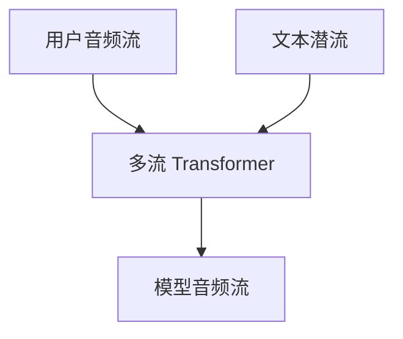

# 全双工语音 Moshi

对话不是「你说完我再说」。同时听、插话、边听边组织下一句，才是全双工。

<footer>—— Défossez 等 Moshi: a speech-text foundation model for real-time dialogue</footer>

[上一课](/llm/valle-tts)是提示到整句合成。缺口是时间上重叠的听与说：用户可能打断，模型也可能在用户说话时出声或等待。Moshi 用语音–文本基础模型加全双工编解码。后课端到端对话默认双工栈已经存在，再问要不要把文本当必经中间件。

## 问题

半双工流水线：ASR → LLM → TTS，延迟叠三跳，而且强制轮次。用户插话时 TTS 还在播，系统不知道该停。全双工要求：输入音频流与输出音频流同时活着，内部状态按帧更新。Moshi 用 Mimi 等低延迟 codec，RQ-Transformer 多流（用户声、自己的声、文本「内心独白」）对齐到同一时间格。

Inner Monologue 把文本当作与语音并行的潜流，而不是先写完整句再念。

帧长（如 80 ms）决定可插话粒度。比它短的停顿无法被当作轮次边界。这与视频时间 ID 必须对齐绝对时间是同一类协议。

## 方法

流式 codec → 多流 Transformer → 流式解码。训练数据要含重叠说话、打断、停顿，不能只用干净朗读。评测：端到端延迟、打断后是否停、内容是否仍连贯；不要用离线 TTS MOS 代替双工。

## 机制

多流让「正在听的声学」与「正在说的声学」分键值，避免自己的回声被当成用户。文本潜流提供可训练的语言规划，使语音不全是声学续写。没有这条潜流，模型容易声学流畅、语义空转。

## 边界

Moshi 仍是一条特定栈。下一课把「语音进语音出、文本可选」收成对话系统问题。

## 小结

- 全双工是同时听说与打断，不是更快的 TTS。
- 多流与短帧 codec 是时间协议。
- 文本潜流用来规划内容。
- 出处：Défossez 等 Moshi。
