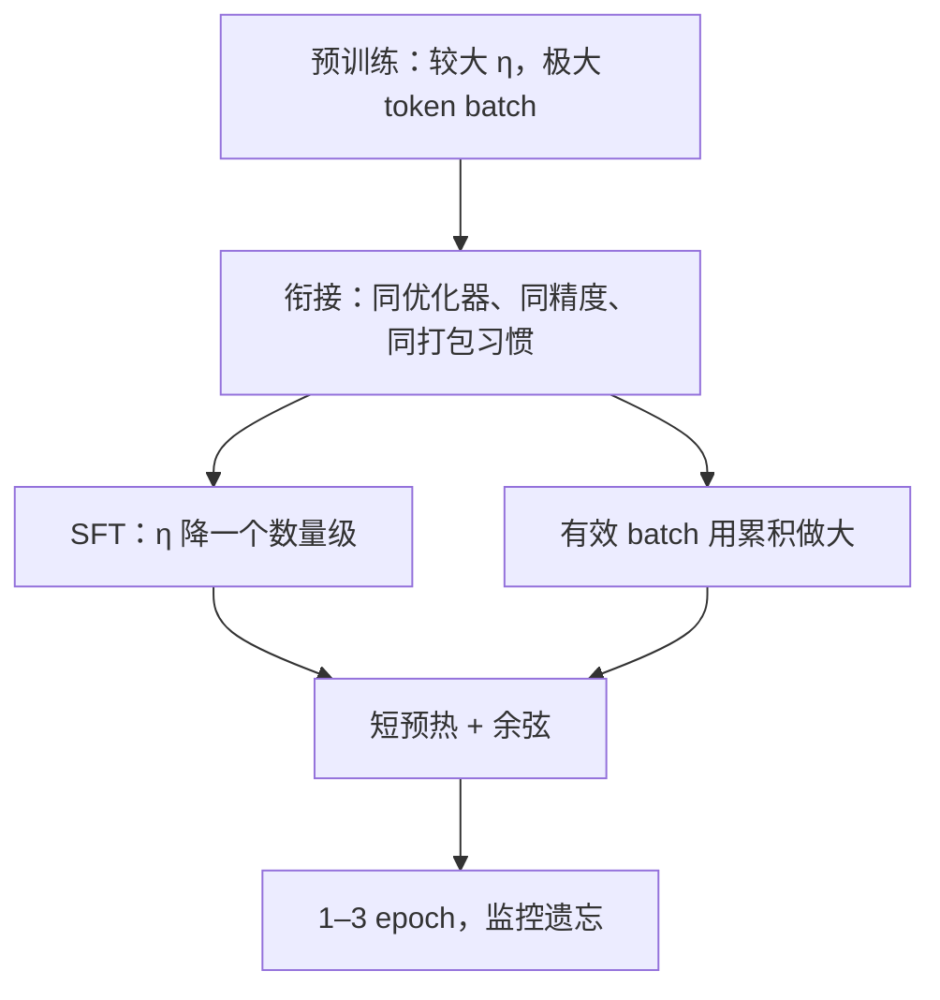

# 全参微调的学习率与批次

指令微调走在已经学好的流形上：学习率要比预训练小一截，有效批次要大到梯度不像单条指令那样抖，日程与优化器则尽量与预训练衔接，而不是另起一套。

<footer>—— 全参 SFT 的工程默认，对照 Ouyang 等 InstructGPT（NeurIPS 2022）与 Touvron 等 Llama 2（2023）</footer>

参数高效方法把更新限制在适配器里，学习率可以相对大胆。全参 SFT 动每一张权重，步子过大就会把预训练特征踩碎，表现为遗忘、校准崩坏、长上下文能力掉一截。步子过小或批次过碎，则在有限的指令数据上走不完该走的方向，或把噪声当信号。本篇只讨论学习率、有效批次，以及二者如何与预训练超参衔接；不讨论 LoRA 的 $\alpha$，也不讨论偏好对齐。Llama 2 把监督微调的初始学习率放到 $2\times 10^{-5}$、余弦衰减、批次 64、长度 4096，是这一默认在公开报告里的一个锚点，不是所有宽度的定理。

## 问题

预训练的学习率服务于「从随机或冷启动特征里长出世界知识」，量级常在 $10^{-4}$。SFT 的数据量小几个数量级，目标却是在已有表示上对齐格式与意图。同一 $\eta$ 会让原本刚好稳定的残差流在指令梯度下迈出过大的一步，尤其是嵌入与末层词预测：这两处对低频词与模板 token 极其敏感。反过来，把 $\eta$ 降到 $10^{-6}$ 又可能在一两个 epoch 内几乎没动，损失降得好看只因为过拟合了当前 batch 的表面 n-gram。

批次的问题同样是尺度错配。预训练用全球数据的大 batch，梯度近似总体方向。SFT 每条样本是一条指令–回答，长度、难度、领域方差都大。微批次 1 或 2 时，梯度被最长的那条或最怪的那条主导，学习率再小也会抖。有效批次（微批次 × 累积步数 × 数据并行）必须大到让一次更新看到任务分布的一个切片，而不是一条样本的 idiosyncrasy。

### 有效批次不是显存里的那个数

显存决定微批次，梯度累积决定有效批次。只报告「batch size=2」而不报告累积，无法复现。token 级与样本级也不同：变长数据若按样本计，长短不均会使每次更新的 token 数漂；按 token 凑满再更新，更接近预训练的「每步固定 token 预算」。衔接预训练，首先是衔接「每步看多少 token」，其次才是衔接学习率数字。

线性缩放规则（批次加倍、学习率加倍）来自预训练的大规模平稳期。SFT 数据又少又噪，把该规则用满容易在大 batch 上迈出相对预训练过大的步。更稳的做法是：先把有效批次提到稳定，再单独用小网格扫 $\eta$，而不是二者锁死比例。

## 方法

一条与公开报告相容的出发点如下。学习率取预训练峰值的大约十分之一到二十分之一，7B–70B 解码器上常见 $1\times 10^{-5}$ 到 $5\times 10^{-5}$。Llama 2 报告的 SFT 为余弦日程、初始 $2\times 10^{-5}$。预热仍然要，但步数短于预训练：目的是让适配到指令梯度的 Adam 二阶估计先稳定，不是再给随机网络找路。衰减接到一个很小的末值或按余弦落到峰值的 10%，避免末期仍用高峰学习率在小数据上震荡。

有效批次以 token 计，应明显大于单条平均长度：例如平均 2k token 的指令，有效批次至少几十条，更好到上百条量级，使一次更新覆盖多种模板与领域。实现用梯度累积填满。指令数据通常只训 1–3 个 epoch；更多 epoch 把学习率再降也难挡背诵。权重衰减低于预训练或关掉，以免在短日程里把 $W$ 往零拉、与预训练范数打架。优化器沿用 AdamW，动量系数不必重发明。

与预训练衔接还包括：相同的混合精度、相同的梯度裁剪阈值量级、若预训练用序列打包则 SFT 不要无故改成每条单独 padding 却不改学习率——有效 token 数会变。Ouyang 等人的 InstructGPT 把 SFT 作为 RLHF 的第一段，同样使用相对保守的监督更新，再把更大的行为改变留给后续阶段；这从另一头说明：全参监督阶段的任务是对准，不是重新预训练。

## 机制

### 小学习率为何保特征

预训练权重已经把注意力与 FFN 推到对自然文本有用的区域。指令梯度在词预测头上很强，会沿残差一路刷到底层。大学习率让底层投影也大幅改写，底层改的是通用特征，于是出现「会跟指令格式、不会做算术 / 不会跟长文」的撕裂。小学习率把更新相对幅度限制在与 $\eta\|\nabla\|$ 相当的一截，深层仍动，但动在微调所需的方向上，来不及把预训练主轴转丢。这不是证明「SFT 不该动底层」，而是承认：在数据少时，底层的信噪比更差，需要更小的步子。

有效大 batch 降低梯度方差。指令数据的方差来源是任务混合：代码、安全拒答、闲聊、工具调用可能同在一个 epoch。小 batch 会在这些模式间来回抽打，Adam 的二阶估计跟不住，表现为损失尖峰与个别 batch 的过拟合。大 batch 把模式平均进同一次更新，学习率才有意义地对应「沿任务混合的方向走」。这与预训练要大 batch 的理由同类，但 SFT 的总体更小，大 batch 同时意味着每个 epoch 的更新次数变少——所以 $\eta$ 不能按预训练比例放大，否则每步又太大。

「与预训练衔接」不是复制每一个超参。精度、优化器、打包、裁剪，属于不该无故改的实现契约；峰值学习率、batch、epoch，属于必须按数据规模改的量。把契约和量混成一句「照抄预训练配置」，会在 SFT 上直接炸特征。

### 批次与学习率的错误耦合

常见错误一：显存不够就减小微批次，又不补累积，有效批次塌掉，于是把学习率也跟着降，训练几乎静止。错误二：用多卡把有效批次抬到数千条，再按线性规则把 $2\times 10^{-5}$ 抬到接近预训练，一轮下来校准崩掉。错误三：按样本 batch 对齐，却混用极长与极短序列，实际 token batch 漂两个数量级，余弦日程名存实亡。对策是日志同时打 $\eta$、有效 token 数、梯度范数；范数爆炸优先查批次与裁剪，再查学习率。

## 边界与工程取舍

全参 SFT 的超参不能直接套到 LoRA 上，反之亦然。LoRA 增量从零起、还有 $\alpha/r$，常用 $10^{-4}$；全参没有这条缩放。把 LoRA 的大学习率抄到全参，是最常见的事故之一。QLoRA 的 4-bit 基座冻结，学习率仍按 LoRA 逻辑，不按本篇。

数据配比会改「多大的 batch 才算大」。安全数据占比高时，小 batch 更容易抽到一整批拒答，模型变得过度拒绝；这要用混合与大有效批次缓解，而不是只降学习率。长上下文 SFT 的真实批次往往更小（长度先吃显存），必须靠累积，否则「长上下文微调」会在优化意义上退化成小 batch 短训。

验证不能只看 SFT 损失。损失下降与预训练能力保持是两张表：指令遵循、通用问答、代码、长文，缺一项都不算衔接成功。学习率偏大时，常常是指令损失很好、通用能力先掉。

### 一套可执行的默认

对已预训练的 7B 级解码器、数万到数十万条指令：AdamW，峰值 $\eta=2\times 10^{-5}$，数百步量级预热，余弦；有效批次用累积做到数十至上百序列，并按 token 尽量对齐；1–2 个 epoch；梯度裁剪与预训练同量级；权重衰减弱于预训练。先跑这条再调，比同时扫 $\eta$ 与 batch 更不容易走进等值线。若必须更激进地改风格，优先加数据与模板一致性，而不是加学习率。

## 小结

- 全参 SFT 的学习率通常比预训练小约一个数量级，以免踩碎已有特征。
- 有效批次要用梯度累积做大，并尽量按 token 而不是只按样本计数。
- 日程保留短预热与衰减；epoch 保持很少，避免在小指令集上背诵。
- 优化器、精度、打包、裁剪与预训练衔接；峰值 $\eta$、batch、epoch 按数据规模重设。
- 不要把预训练的线性缩放规则或 LoRA 的大学习率直接搬过来。
- 监控遗忘与指令损失两张表；只看后者会选出破坏性的大学习率。
- 出处与锚点：Ouyang 等，InstructGPT，NeurIPS 2022；Touvron 等，Llama 2，2023。超参是公开报告中的工程默认，随宽度与数据而变。
