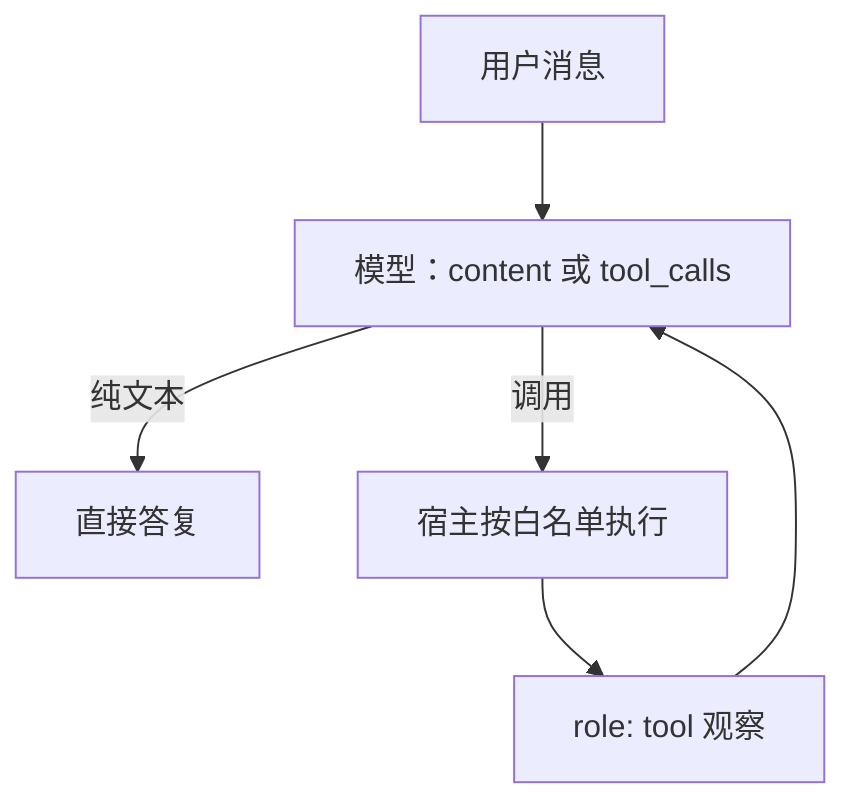

# Function calling

    
把工具写成带 JSON Schema 的函数声明，模型在该调用时产出结构化的名字与参数，而不是在散文里假装自己查过数据库。

    <footer>—— 对照 OpenAI 2023 年 function calling / 后续 tools 字段；Toolformer 则表明模型可以学会何时插入工具调用</footer>

对话模型默认只会续写文本。产品要的却是查库存、跑 SQL、调日历——这些动作发生在模型权重之外。Function calling 把「可调用的副作用」收成一份工具清单：每条有名字、自然语言说明、以及参数的 JSON Schema。模型若决定调用，就不再只写 `content`，而是产出带 `tool_calls` 的助手消息；运行时执行真正的函数，把结果以 `role: tool` 写回，再让模型生成最终答复。它是协议加解码约定，不是新的注意力层。Schick 等人的 Toolformer 证明语言模型能在自监督里学会插入工具调用；OpenAI 兼容的 `tools` 字段则把这件事变成 HTTP 信封上的一等公民，见 [OpenAI 兼容协议](/llm/openai-compat-api)。本篇写三次角色切换、参数如何落地、以及它与自由格式 [ReAct](/llm/react) 的差别。

## 问题

无工具的助手只能用训练记忆回答。记忆会过时，也没有权限去碰用户的私有系统。若只靠提示「请按 `Action: search[...]` 的格式调用」，模型会漏写括号、发明不存在的工具名、把参数嵌进散文。下游用正则去抢救，失败率随工具数量与嵌套参数上升。需要一份机器可校验的契约：工具集合是显式的，参数类型是显式的，调用与观察在消息列表里有固定位置。

另一半问题是把「模型建议调用」和「副作用已发生」混为一谈。模型输出 `get_weather(city="北京")` 只是一段 token；真正的 HTTP 请求必须由宿主执行，并决定超时、鉴权、重试。协议若把这两步画成同一次生成，审计和权限都会乱。Function calling 的最小完备集因此是：声明、生成调用、执行、回填、再生成。缺任何一环，都不是完整的工具使用。

### 信封里的三次角色切换

一次成功的调用在 `messages` 里至少换三次说话人。用户（或系统）给出任务；助手给出 `tool_calls`（`id`、函数名、参数字符串）；工具角色按 `tool_call_id` 回填观察；助手再写给用户看的自然语言。并行调用时，一条助手消息里可以有多个 `id`，随后必须有同样数量的 tool 消息，否则下一轮前缀对不齐。[chat template](/llm/chat-template) 要用与训练一致的分隔符渲染这三类角色；渲染错了，模型会把工具结果当成用户闲聊，或在该输出调用时输出散文。

`tool_choice` 是调度旋钮，不是模型能力。`none` 禁止调用，`required` 强迫至少一次，指定函数名则锁死目标。评测「会不会用工具」时必须声明这一字段；默认 `auto` 下模型可以合理选择不调用，不能据此判失败。

## 方法

请求侧把工具写成 JSON Schema：`name`、`description`、`parameters`（通常是 object，写清 `required` 与类型）。描述要写清副作用与单位，否则模型会用错时区或把用户 ID 填进查询字符串。服务端把这份清单经模板塞进系统前缀，使条件分布看见「当前会话允许哪些名字」。生成时，要么靠提示让模型自由写 JSON，要么用[约束解码](/llm/constrained-decoding)把参数卡在 schema 上，见 [JSON / 结构化输出](/llm/json-schema-decode)。后者能保证 `json.loads` 成功，不能保证参数在业务上合法——城市名拼对、主键存在，仍要工具自己校验。

执行侧按名字做白名单分发，禁止模型指定任意 URL 或 shell。超时与错误应写成工具观察，而不是让网关直接 500：模型需要看到「库存接口 503」，才能改口或换工具。回填后再次请求模型，`tool_calls` 那一轮助手消息必须原样保留在历史上，否则模型不知道自己做过什么。多轮工具循环要设步数上限与重复调用检测，避免查询参数微扰造成的死循环。

### 参数 JSON 与工具选择

参数几乎总是一个 JSON 对象字符串。键名必须与 schema 一致；模型常把 `user_id` 写成 `userId`，或把数字写成带逗号的字符串。约束解码可以钉住键集合，枚举字段可以钉住合法取值。工具选择则是另一层：相关工具太多时，描述会挤占上下文，模型更容易张冠李戴。工程上按意图路由、按用户权限裁剪可见工具，比把一百个函数一次性塞进 schema 更有效。[MCP](/llm/mcp) 把「有哪些工具」从静态请求字段变成运行时发现，但调用语义仍然是这一套名字加参数。

## 机制

模型并没有获得新的作用子。训练（或指令数据）让它在「该用工具」的前缀上把概率质量放到调用格式上；推理时格式被模板与可选文法进一步收窄。调用是否发生，取决于描述、当前对话、以及 `tool_choice`。并行调用能把互相独立的只读查询合成一轮，降低往返；有数据依赖的调用（先搜 ID 再取详情）必须串行，硬并行只会得到空参数。观察写回之后，模型是在 *新的条件前缀* 上继续生成，不是在第一次前向里「想起」了结果。

失败模式集中在三类。名称幻觉：产出不在清单里的函数，宿主应拒绝并回填错误，而不是静默丢弃。参数幻觉：类型对、值假，只能靠工具或下游校验器。过调：明明可以靠已有上下文回答，仍调用搜索，既慢又把噪声文档读进下一轮。这三类都不会被「JSON 合法」消除。与 [ReAct](/llm/react) 相比，function calling 把动作从自由文本槽位收成协议字段，便于鉴权与日志；代价是必须维护 schema 与模板，换模型时要重新对齐工具数据。

把 logits 处理器接到 `arguments` 上，保证的是括号与类型，不是副作用安全。`delete_user` 的 schema 再严格，一旦宿主真的执行，删除就会发生。权限属于执行层，不要指望 schema 替你做授权。

### 并行调用与失败回填

并行时每个调用要有稳定 `id`，观察按 id 对齐，不能按数组下标在重试后错位。部分失败应逐条回填：一条超时、一条成功，模型才能决定是重试还是带着残缺答案继续。不要把整批调用折叠成一句「工具失败了」——信息量不够，下一轮往往会重复同一批调用。流式场景里，`tool_calls` 的参数字符串是逐步拼出来的，客户端应等调用帧结束再执行，避免对半截 JSON 发请求。

## 边界与工程取舍

Function calling 不规定检索、浏览器或代码沙箱怎么实现；那些是工具后端。[混合检索](/llm/hybrid-retrieval) 可以是其中一个函数，但协议不知情。它也不替代多步策略：一次调用不够时，循环是宿主的事，模型只看到消息列表。把循环做成 [ReAct](/llm/react) 还是先写计划再执行，见 [规划 vs 反应式循环](/llm/plan-vs-react)。

不要在系统提示里再手写一套与 schema 冲突的参数说明。不要让模型生成可执行代码当作「通用函数调用」，除非沙箱与资源限制已经单独设计。评测应分开报告：格式合法率、参数校验通过率、任务成功率。只报成功率会把「模型会写 JSON」和「工具真的办成了事」混在一起。兼容层若声称支持 `tools` 却在服务端丢掉该字段，表现为偶发不调用，根因在信封而不是权重。

出处以 OpenAI API 的 tools / tool_choice 说明、Hugging Face chat template 里的 tool 角色、以及 Schick et al., *Toolformer: Language Models Can Teach Themselves to Use Tools*, NeurIPS 2023 为准。不要给「某家闭源模型内部的工具头」编造架构论文。

## 小结

- Function calling 是工具声明、结构化调用、宿主执行、观察回填的协议循环，不是新参数。
- 消息角色必须按 assistant / tool 对齐；模板与训练格式不一致会表现为拒用工具或把观察当闲聊。
- Schema 与约束解码保证参数可解析，不保证值真实、不保证副作用安全。
- `tool_choice`、可见工具集合、步数上限属于调度，应写进评测条件。
- 并行调用按 id 回填；部分失败不要折叠成一句空错误。
- 与自由格式 ReAct 相比，协议字段便于鉴权，但要维护 schema 与兼容层。
- 出处：OpenAI API 参考（function calling / tools）；Schick et al., *Toolformer*, NeurIPS 2023。
