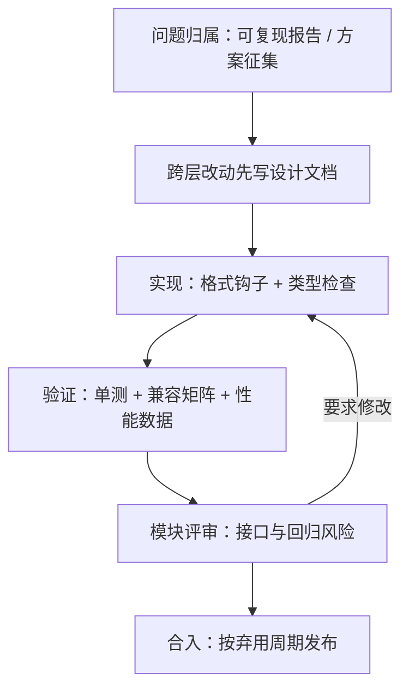

# 贡献流程与收束

读码的终点是改码被合入：走读给了你判断力，流程把判断力兑换成仓库里的提交。

<footer>—— 据 vLLM、SGLang、llama.cpp 等仓库的贡献指南与开发者文档整理</footer>

[上一课](/llm/fw-perf-regression)立了性能报数的协议，本课是全课程最后一课：从读与测走向提交与合入，并给课程收束。发布那一面的版本、分支与报告规范已在开源生态课写过，见 [发布工程](/llm/eco-release-versioning)；本课写源码那一面的流程：一个改动从问题到合入经过哪些关卡，以各仓库当时状态为准。

## 问题

第一次向活跃框架提交的人，败因几乎不在代码：格式被自动检查打回、改动没有issue归属被问「解决什么」、性能优化没有数据被搁置、动了一个大家都在用的接口被要求先写方案。流程关卡的存在理由是仓库的尺度：每月几十上百个改动、数十个平台与后端组合、无法人工回归——贡献流程就是把上一课的验证协议制度化，把走读得来的上下文变成评审者可以快速核对的证据链。

### 关卡链

第一关，问题归属：修 bug 先有可复现报告，加功能先有讨论或方案征集——跨模块的改动（新平台、新注意力后端、调度器行为变化）通常要求先写设计文档再动手，这一步对应走读课定位层次的训练：说清改动落在调度、插座还是账本。第二关，实现与格式：提交前钩子统一格式与类型检查，提交说明写清动机与验证方式，许多仓库要求签署贡献者协议或声明原创。第三关，验证：单元测试覆盖路径，涉及的配置跑兼容矩阵，性能改动必须附上一课协议下的数据。第四关，评审与合入：维护者按模块分工，评审聚焦接口与回归风险；大型重构按弃用周期走，旧接口先警告后移除。

性能改动的常见驳回理由不是「没变快」，而是「没有对照」：单次运行、无基线、协议不一致的数据反而减分。上一课的双跑协议在这关是硬通货，附上固定协议与噪声带的数据几乎总能进入技术讨论。

## 方法

把流程读成**证据链的组装**。每个关卡要的证据不同：问题关要复现，方案关要层次定位与备选路线，验证关要测试与数据，评审关要回归风险说明。高效贡献者的做法是先组装证据再写代码：复现脚本和基准协议在动手前就位，改动描述按「什么、为什么、怎么验证」三段写。这也是全课程方法的收口：走读给层次判断，对照课给结构语汇，回归课给验证协议，流程课把这些兑换成合入。反着读也成立：看一个仓库的贡献指南厚不厚、方案征集活不活跃、弃用周期守不守，能反推它的工程成熟度与演进速度。

## 机制

流程的机制根据与之前每课同源：**把稀缺资源从人工搬向自动化**。格式与类型检查交给钩子，兼容矩阵交给持续集成，性能回归交给基准任务与统计阈值；人工评审只留机器判不了的接口设计与取舍。弃用周期是尺度问题的另一面：用户基数大的仓库不能「顺手改接口」，先警告后移除把破坏性变化变成可计划事件。各仓库流程的差异不是官僚程度不同，而是稀缺资源不同——后端组合多的仓库验证关重，研究驱动的仓库方案关轻。

## 边界

流程以各仓库当时状态为准，门槛与工具持续变动，本课只保「归属、证据、验证、评审」的骨架。流程不能替代判断：走读课的方法仍是根，数据结构比目录名耐用，这条从第一课贯穿到此。本课程到此收束：六个走读给了六种把「迭代、插座、账本」兑现成代码的方式，三课对照给了读任何新框架的三问检查单，两课方法给了动手与报数的协议，本课给了让改动落地的路径。带着这套读法去读下一个仓库——版本会变，骨架不变。

## 小结

- 贡献流程是证据链组装：问题关要复现，方案关要层次定位，验证关要测试与性能数据，评审关要回归说明。
- 先组装证据再写代码；性能数据必须有固定协议与对照，单次无基线的数字反而减分。
- 流程的机制是稀缺资源搬向自动化，人工评审只留接口设计与取舍；流程差异反映各仓库稀缺资源不同。
- 弃用周期把破坏性变化变成可计划事件；贡献指南的厚度可反推工程成熟度。
- 本课程到此收束：六走读、三对照、两方法、一流程；数据结构比目录名耐用，读法跨版本迁移。
- 出处：vLLM、SGLang、llama.cpp 等仓库贡献指南与开发者文档，按流程整理。
