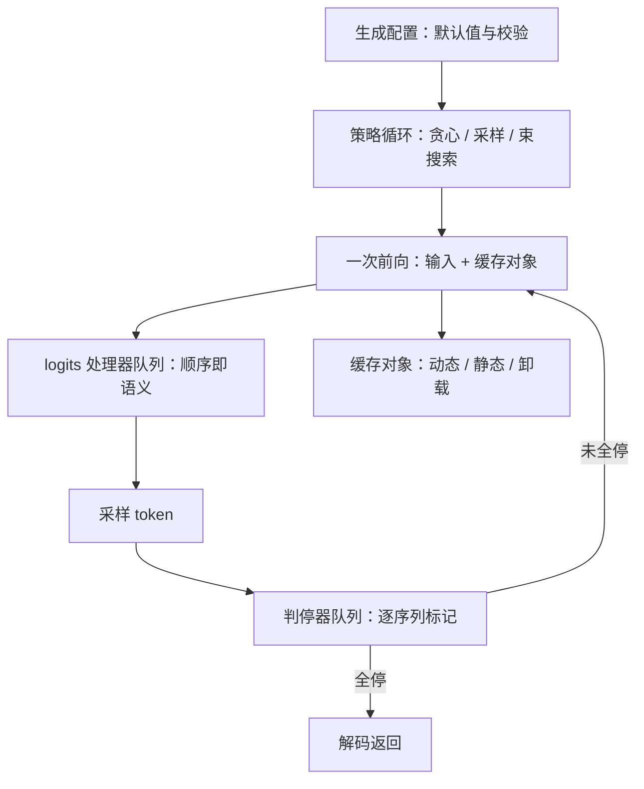
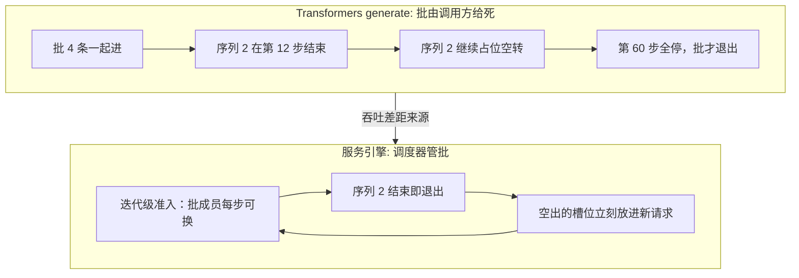

# Transformers generate 走读

最被广泛阅读的推理代码是那个不调度的循环：一代人关于解码的知识，都挂在这棵处理器子类树上。

<footer>—— 据 Hugging Face Transformers 文档与 GenerationMixin 源码整理</footer>

[上一课](/llm/fw-mlc-walkthrough)的执行体沉进编译产物，Transformers 走另一极：没有调度器、没有服务语义，只有一个调用者亲手喂批的生成循环。停止语义已写过——结束符、停用串与长度预算三分，见[停用词与 stop sequences](/llm/stop-sequences)；投机解码的验证循环也已写过。本课进仓库读 generate 这条主干，讲它的分层与数据结构，以仓库当时状态为准。

## 问题

引擎走读完，回到这个库会产生错觉：同样的「采样、判断停、拼输入」循环，凭什么单开一课？差别不在循环，在**谁管批**。引擎里批由调度器按迭代组出、成员按步进出；这里批是调用方给死的：一次调用、一个填好的张量批、一起进一起出，没有准入、没有抢占、没有 KV 会计。走读的问题于是是：在「不调度」这个约束下，代码把全部设计预算花在了哪里，又因为不调度付出了什么。

直觉类比「缓存对象」：模型每生成一个字，都要回看前面所有字算注意力。缓存对象就是把前面每层的「中间算力」存起来别重复算的本子——像读长文时夹的书签，翻到第 100 页不用从第 1 页重读。这代代码做的事，是把这块「本子」从一个裸张量升级成会自我管理（预分配、卸载、分页）的对象族。

### 主干的分层

generate 挂在模型类上，分四层。准备层：校验生成配置，补齐默认值，把输入整理成张量批。循环层：按策略分派到贪心、采样、束搜索或带草稿的验证循环，骨架一致——一次前向、处理 logits、选 token、判停。处理层是它的灵魂：对 logits 逐步施改的处理器队列，与判断结束的判停器队列，都是「小对象按序执行」的管道。缓存层：过去键值被抽成缓存对象族，从逐层追加的动态缓存，到为编译与投机预留的静态预分配缓存，再到分层卸载的变体——缓存对象是这一代代码里最重要的抽象迁移。

## 方法

沿一步走：前向吃输入与缓存，吐 logits；处理器队列按登记顺序收窄分布——温度、top-k、top-p、重复惩罚各是一个对象，**顺序即语义**，调换两项会得到另一种分布；采样选出 token；判停器逐序列检查结束符与长度，结束的序列打上完成标记但留在批里，因为同批其余序列还在跑；流式回调把增量交给调用方。这最后一条正是无调度的代价：先结束的序列占着批位置空转到全批结束，引擎用迭代级准入消掉的空转，这里原样保留。

术语翻译：logits 就是模型对词表里每个词打出的原始分数（几万个数），还没变成概率。top-k 是「只留分数前 k 名」，top-p 是「从高到低累加概率、攒够 p 就截断」。两者都是收窄分布的漏斗——漏斗的先后顺序不同，最后剩下的候选集就不同。

处理器队列的顺序在文档里是推荐而非强制，复现论文采样设置时要逐项核对登记次序：温度在 top-p 之前或之后，支撑集并不相同——这是这个库最常见的研究复现偏差来源之一。

## 机制

为什么它仍是默认载体：每个研究想法都能落成一个处理器或判停器子类，几行代码挂进队列就能出现在下一版论文基线里；循环本身一眼可读，是教学与复现的最小公共分母。为什么它成不了服务：批是调用方的责任，就没有内存会计与准入；缓存对象再精巧，也只是会话内优化，没有跨请求共享与回收；束搜索这类批内分支让「一步的工作量」随序列数变化，调度器更无从谈起。前几课的框架正是对着这两个缺口逐条补齐：准入与记账补在调度器，共享补在缓存抽象。

## 边界

对照要公平：它对标的是「一次调用内的正确解码」，不是吞吐；拿它和引擎比每秒 token 数是口径错误。结束语义与流式挂起的细节在停止课已钉，本课不重述；束搜索的内部重排、草稿验证的接受判据各有专课。类名与方法名近年持续重构，以仓库当时状态为准。本课程用它收拢主流框架单元：从这条无调度的基线出发，vLLM、SGLang、TensorRT-LLM、llama.cpp、MLC 各自的选择才显出形状。

「空转」为什么是真金白银的浪费：假设批里 4 条，一条 10 步就写完、另外三条要写 500 步，那第 11 步到第 500 步里，那条早结束的序列仍在每次前向里占一个批位、占一份显存和算力，只是产出永远被丢弃。批越大越常见，这也是引擎做迭代级调度的第一动机。

## 小结

- generate 是「不调度」的基线：批由调用方给死，同进同出，无准入、无 KV 会计。
- 主干分四层：配置准备、策略循环、处理器与判停器管道、缓存对象族。
- 处理器队列顺序即语义，复现偏差常出在登记次序。
- 结束序列留在批里空转，是引擎迭代级调度所消掉的实物成本。
- 它的价值是可读与可扩展，价值边界就是不服务；读它为了定坐标，不为了上线。
- 出处：Hugging Face Transformers 文档与 GenerationMixin 源码，按源码结构整理。
