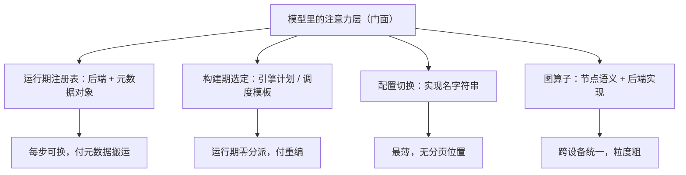

# 内核接口的框架对照

调度器的分歧在进程边界，内核接口的分歧在「谁决定用哪个核」：运行期注册、构建期浇死、配置切换、图算子，四条路各有买主。

<footer>—— 据 Dao 等，FlashAttention，2022；FlashInfer 项目文档与各仓库注意力后端源码整理</footer>

[上一课](/llm/fw-scheduler-comparison)把调度器并排，本课往下走一层，把注意力后端的接口并排。内核内部已各有课：tiling 与 online softmax 见 [FlashAttention 重读](/llm/ak-flashattention-reread)，分页 KV 的核内寻址见 [分页 KV 的内核接口](/llm/ak-paged-kv-kernel)，选型与压测方法见 [内核基准方法论](/llm/ak-benchmark-methodology)。本课不进核，只看框架给核留的**插座**长什么样，以各仓库当时状态为准。

## 问题

读六家仓库的注意力代码，字段几乎相同——查询、键值、页表或缓存、缩放——但「这行代码会跑哪个核」的决定方式完全不同。同一份权重换一家框架，性能差出一截，往往不是核本身快慢，而是插座设计的自由度不同：有的运行期按批形状挑核，有的构建期一次定死，有的让调用方字符串切换，有的把注意力降成图上的一个算子。走读要回答：插座怎么设计，决定了换核的成本由谁在何时付。

### 四条路线

运行期注册是服务引擎的路线：vLLM 与 SGLang 都有后端注册表，注意力层只是个门面，初始化时按平台与配置选好后端，每步前向把批的元数据装成该后端认识的描述对象——vLLM 的后端基类与每后端的元数据类、SGLang 的前向模式枚举都是「元数据即接口」的实例，换核不改模型代码，代价是每步要为描述对象付搬运。构建期定死是编译路线：TensorRT-LLM 在引擎计划里选定上下文与生成阶段各自的核，MLC 靠调度模板加代码生成、必要时外包给现成注意力库，运行期零分派，代价是重编。配置切换是最薄的插座：Transformers 用一个实现名在朴素、缩放点积、FlashAttention 实现间切换，研究友好，但没有分页元数据的位置。图算子路线在 llama.cpp：注意力是构建函数压进图的节点，各后端各自实现同一算子，插座就是算子语义本身。

分页元数据是分水岭：能接纳「键值散在物理页上」这一信息的插座（服务引擎两家）天然与 PagedAttention 兼容；没有这个位置的插座（实现名字符串）想上分页，就得把整层接口重造——这正是引擎与库的分界线，不只是性能差距。

## 方法

对照的方法沿用三问式，换成插座版：一问决定时机——核的选择发生在装批时、初始化时还是编译时；二问元数据形状——分页信息、前向模式、量化描述放在哪个对象里，谁生产谁消费；三问替换成本——换个核要改一行配置、重跑一次初始化，还是重走一遍构建流水线。给一个新框架对号入座后，就能预测它接新核（比如下一代注意力实现）的阵痛会出现在哪一层：接进注册表，还是要动模型定义，还是要用户重编。

## 机制

四条路线的成因回到上一课的同一根轴：**决策放在哪个边界**。运行期注册把决策放在最热的边界上，自由度最大、每步付税；构建期定死把决策推到最冷的边界，热路径零税、但每次变档重付；配置切换把决策交还用户，库方最省、表达力最弱；图算子把决策化进语义，设备可换、粒度最粗。没有一家同时占全四格：服务引擎为了投机解码与混合批，也要在注册表内再做运行期分派；编译路线为了动态形状，也要在计划里留形状桶。插座的最终形态是折中位置的声明，与调度器的进程位置互为镜像。

## 边界

本课只对照注意力插座；矩阵乘、归一化、采样的接口各有自己的形状，不并排。核内部的 tiling、寄存器预算与压测不在本课，方法课与重读课已覆盖。对照对象是主流开源仓库，商用闭源栈的插座只能从文档反推，不做结论。类名与注册方式随版本漂移，以仓库当时状态为准；下一课把同一方法用于 KV 的数据结构，那里没有注册表，分歧反而更裸。

## 小结

- 内核插座四路线：运行期注册、构建期定死、配置切换、图算子，由「谁在哪个边界决定用哪个核」区分。
- 分页元数据有无是引擎与库的分界：没有它的位置，分页核接不进来。
- 决策边界越热自由度越大、每步付税越多；越冷越确定、变档越贵，与调度器位置互为镜像。
- 对照三问：决定时机、元数据形状、替换成本；用于预测新框架接新核的阵痛层。
- 类名与注册方式随版本漂移，以仓库当时状态为准；出处为 FlashAttention（2022）、FlashInfer 文档与各仓库源码。
