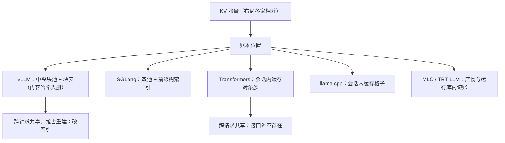

# KV 抽象的对照

键值张量本身没有分歧，分歧全在账本：逻辑到物理的映射握在谁手里，共享与回收就在谁那里成为可能或不可能。

<footer>—— 据 Kwon 等，SOSP 2023；SGLang 前缀树文档；Transformers 缓存对象文档，按各仓库源码整理</footer>

[上一课](/llm/fw-kernel-interface-comparison)对照了注意力插座，本课对照插座底下那本账：KV 的数据结构。机制面已各有课：生命周期与所有权、分页与碎片、前缀共享的簿记，见 KV 课序的 [生命周期](/llm/kv-lifecycle-ownership)、[分页与碎片](/llm/kv-paging-fragmentation)、[前缀缓存](/llm/kv-prefix-cache)，页表与引用计数的出处见 [PagedAttention](/llm/paged-attention)。本课把六家走读对象的 KV 抽象并排，以各仓库当时状态为准。

## 问题

并排时会发现一个反差：张量布局大同小异——逐层、逐头的键值矩阵——可跨请求共享、序列分叉、跨卡迁移这些能力，六家高度参差。能力差异不来自张量，来自**账本**：谁记录「第几个逻辑 token 在哪个物理位置」「这一页还有几条序列指着它」「树里哪段前缀可以指给新请求」。走读要回答：账本握在谁手里，决定了哪些操作是改一行索引、哪些是搬数据。

### 账本放哪

服务引擎把账本中央化。vLLM 用块池加每序列块表，V1 的块以内容哈希入册，相同前缀天然命中同一物理块，前缀缓存就是账本上的一次查册；抢占时记下块表、释放物理页，恢复时按账重建。SGLang 用双池加树：请求到槽位的索引池、槽位到张量的池，前缀树是第三层索引，命中即把新请求的一段槽位指向旧张量，本课不重画树的插入与淘汰。会话库把账本交还调用方。Transformers 的缓存对象族是逐层键值对的容器：动态缓存追加快，静态缓存预分配好喂编译与投机，但它只有一个会话的账，跨请求共享与回收根本不在对象接口里。llama.cpp 把账记在会话内：缓存格子上的位置与序列集合支持同会话分叉，但没有跨会话册页。编译路线里，MLC 的分页缓存是编译产物侧的不透明对象，页表操作沉进产物；TensorRT-LLM 的缓存管理器在运行库内记账，总预算在构建期算定。

「内容哈希入册」是 vLLM V1 账本最值得读的一笔：块的身份由其 token 序列与父块哈希共同决定，前缀命中不需要树结构，沿块表逐块查册即可；这与 SGLang 的树是同一语义的两种索引实现，读码时不要把它们当成两种机制。

## 方法

对照仍用三问式，换成账本版：一问粒度——账的最小单位是页、槽还是整个会话张量，粒度决定碎片与共享的分辨率；二问身份——一个物理块凭什么算「同一段前缀」，指针、内容哈希还是位置掩码；三问交接——序列结束、被抢占、跨卡搬移时，账本上发生哪几笔改动。检查单走完，一个框架的容量公式与故障模式基本可以预读：粒度粗的怕碎片，账在会话内的怕长会话，账在中央的怕单点。

## 机制

账本位置的机制含义沿两条线展开。**共享线**：共享是改索引还是搬数据，完全由「身份怎么记」决定——按位置记账，分叉要复制；按内容记账，分叉是引用加一。**回收线**：有中央账本，才有逐出、水位与抢占后的重建；账在会话内，回收只剩「会话结束整体释放」一种动作。这也回答了概念课留下的伏笔：为什么同样的「开了前缀缓存」，效果天差地别——开不开看开关，命中多少看账本设计。三条对照课串起来，正是框架源码的三层解剖：调度定节奏，插座定快慢，账本定生死。

## 边界

本课对照单实例账本；跨实例的 KV 迁移、PD 分离的交接与云侧计费，在 KV 课序的 [分布式与迁移](/llm/kv-distributed-migration) 与调度课序各有专课，不混谈。量化后的 KV 让「张量布局」也出现分歧，但那是数值课的主题，账本不因字节宽度改形。结构与对象名随版本漂移，以仓库当时状态为准。下一课离开数据结构，回答读完这些之后怎么证明改动没有变慢。

## 小结

- KV 的能力差异在账本不在张量：映射粒度、块身份、交接动作三问定参差。
- 服务引擎中央记账（vLLM 块表、SGLang 双池加树），共享与回收是索引操作；会话库（Transformers、llama.cpp）账在会话内，跨请求能力接口外不存在。
- 按内容哈希与按位置记账是同一语义的两种索引，决定分叉是引用还是复制。
- 容量公式与故障模式可由账本位置预读：粒度怕碎片、会话账怕长会话、中央账怕单点。
- 调度定节奏、插座定快慢、账本定生死；结构名以仓库当时状态为准。
- 出处：vLLM（SOSP 2023）、SGLang 与 Transformers 文档，按各仓库源码对照整理。
