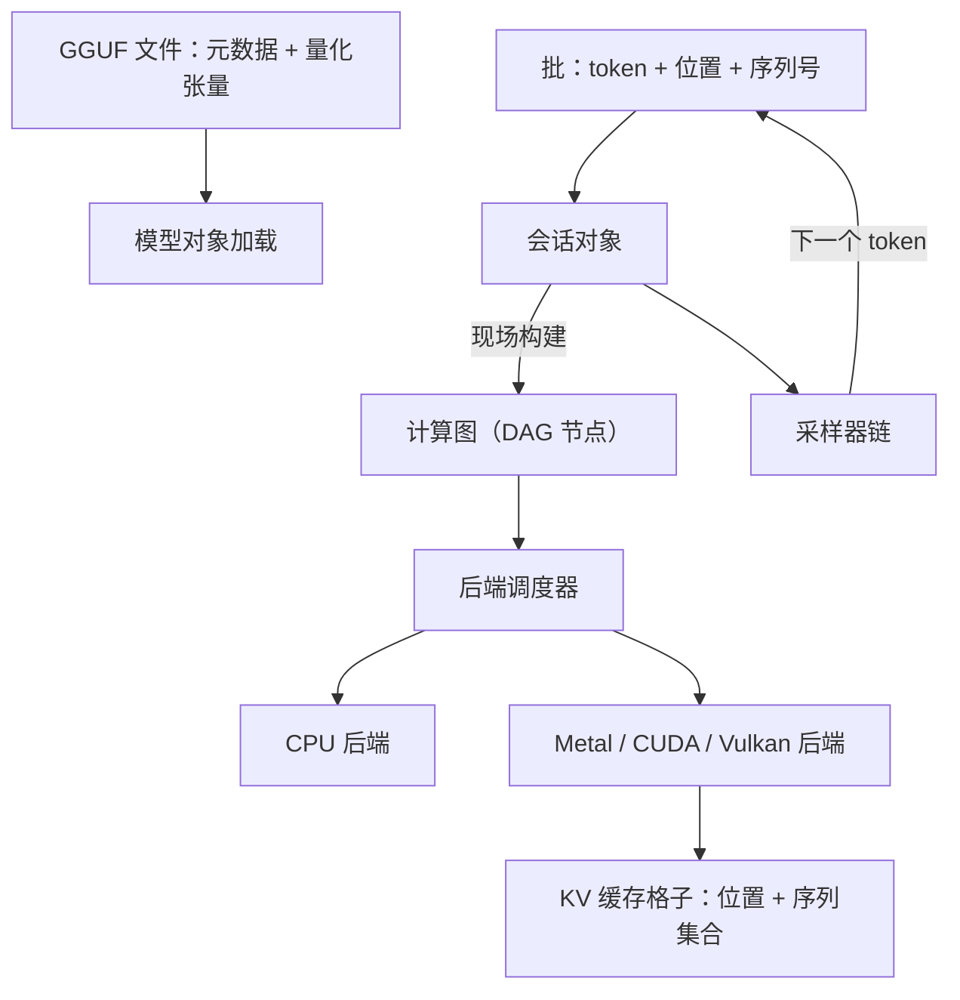
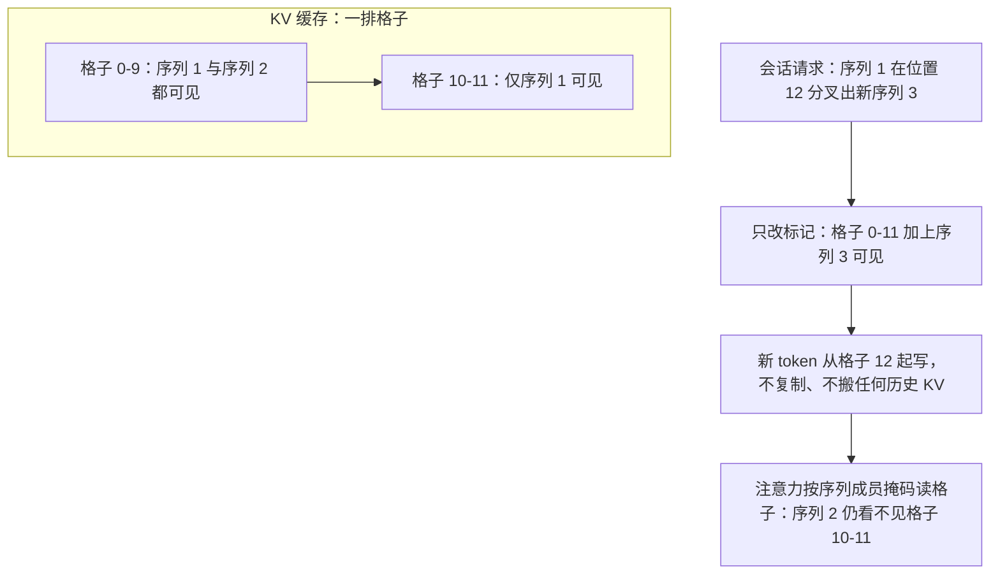

# llama.cpp 走读

没有引擎计划、没有调度进程，每一步都现场画一张计算图——慢工出细活的前提是图本身足够小。

<footer>—— 据 ggml 与 llama.cpp 仓库结构、GGUF 规范整理</footer>

[上一课](/llm/fw-tensorrt-llm-walkthrough)看构建期把内核浇死的路线，llama.cpp 走另一极：不预编译、不依赖 Python，运行时逐步构建计算图。单机本地路径的能力面已写过：量化权重加少依赖的 C/C++ 运行时，见 [llama.cpp / ggml](/llm/llamacpp)，权重容器见 [GGUF](/llm/gguf)。本课进仓库讲两个库的分工与关键数据结构，以仓库当时状态为准。

## 问题

用服务端框架的读法进来同样会落空：这里没有请求对象的生命周期管理，没有跨进程消息，连「调度器」都只是一个简单的槽位表。仓库其实是两个库叠放：底下的张量库 ggml 管张量、后端与计算图，上面的 llama 管模型、词表、采样与缓存。迷路的根源是把两层看混——把会话状态当成张量库的事，或把量化当成模型层的转换步骤。走读先钉分工：ggml 是「怎么算」，llama 是「算什么」。

术语翻译：「计算图」就是把一次前向拆成一串算子（嵌入→注意力→前馈→…）画成的有向无环图（DAG），箭头表示「先算谁、把结果给谁」。可以想象成菜谱的工序单：PyTorch 一类框架边跑边记这张单子，llama.cpp 则每一步重新手写工序单、算完就扔。

### 两库的边界

ggml 侧：张量是带类型与步长的多维数组，量化是张量的**存储类型**而不是转换层，四比特族直接是合法类型；计算图是有向无环的节点图，构建函数逐个压入节点；后端抽象让同一张图落到 CPU、Metal、CUDA 或 Vulkan，跨后端的调度器负责把节点切给各自设备并在接缝处搬数据。llama 侧：模型对象从 GGUF 文件加载权重与超参，会话对象持有缓存与执行状态，批结构把要算的 token、位置、所属序列打包，采样器链把 logits 变成 token。

「量化是存储类型」值得单独翻译：一般框架里，量化像「先解压再使用」的转换步骤；llama.cpp 里 4-bit 权重本身就是一种一等公民的数据类型（如 Q4_K），计算核看到类型直接按 4-bit 的方式算。好比压缩图片不是「用时先解压」，而是显示器原生支持该格式。

## 方法

沿一步解码走。输入批里每个 token 带位置与序列归属，会话按它画一张图：嵌入、逐层注意力与前馈、输出头，注意力节点引用当前 KV 缓存。图交给后端调度器，逐节点分派到设备执行；计算完，会话把新 token 的键值写进缓存格子。缓存是走读的关键结构：一排格子记每个位置的有效位与所属序列集合，注意力按位置掩码读取——「这条序列看得见哪些历史」不是靠连续数组，而是靠格子上的序列成员标记，所以同会话分叉、复制序列这类操作是对格子改标记，不搬数据。

采样在 llama 里是一条可组合的链：贪心、温度、top-k、语法约束各是一个环节，逐级收窄候选集。语法约束作为采样环节挂在链上，这与引擎侧把文法做成逐步掩码是同一件事的两种挂法，见约束解码。

## 机制

运行时画图却不慢，原因是每步的图几乎相同：节点数是层数的线性函数，压图与分派是 CPU 上微秒级的函数表跳转，真正的毫秒花在 GPU 执行上。图当步建当步亡，会话状态全部住在缓存与采样器里，这使「多序列、分叉、续跑」只需正确维护格子标记。量化进存储类型，则省掉了运行期任何反量化调度——核直接按类型分派。单进程单机由此成立：没有跨进程的账要记，槽位表就是全部并发管理，服务示例里每个槽位一条序列，批是槽位的简单拼接。

## 边界

没有迭代级批调度与抢占：槽位一旦占用，整批同进同出，多租户语义不能与 vLLM 对表。跨后端的图切分在异构设备上仍是短板，某些算子会整体落回 CPU。缓存与批的 API 近年重写过，具体结构名以仓库当时状态为准。它不是集群服务的替代品，本课只回答「单机一笔账怎么记」。服务端组批、抢占与多租户的对照留到下一单元。

直觉类比「槽位表」：像餐馆只设 8 张固定桌，来客入座、吃完离座，桌号就是全部管理。没有「等位叫号重新分配」这一层——这是它与 vLLM 那种翻台率至上的引擎最直观的差别，也是它把复杂度留在「一家子用」而做不进「大堂满客」场景的原因。

## 小结

- llama.cpp 是两个库叠放：ggml 管张量、后端与计算图，llama 管模型、词表、缓存与采样。
- 每步现场构建 DAG，后端调度器把节点切给设备；建图成本相对 GPU 执行可忽略。
- 量化是张量存储类型，不是运行期转换层；四比特族直接参与核分派。
- KV 缓存靠格子上的序列成员标记支持分叉与多序列，不靠连续数组假设。
- 单进程、槽位即并发，没有迭代级调度；结构名随版本漂移，以仓库当时状态为准。
- 出处：ggerganov/ggml 与 ggml-org/llama.cpp 仓库、GGUF 规范，按源码结构整理。
