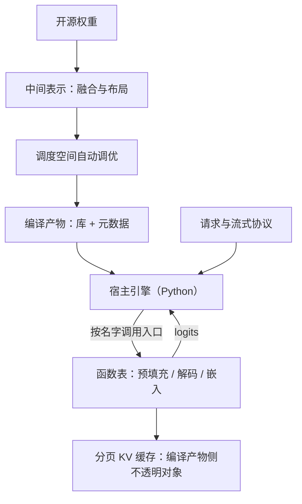

# MLC 走读

编译框架的接口长相反常：运行时最厚的文件不在算计算，而在按名字调用编译产物里那张函数表。

<footer>—— 据 Chen 等，TVM，OSDI 2018 与 MLC-LLM 仓库文档整理</footer>

[上一课](/llm/fw-llamacpp-walkthrough)的手写多后端靠人力覆盖设备，MLC 把这件事交给编译器：同一前端、多份代码生成，概念面已写过——一前端多 codegen、动态序列是 LLM 多出来的编译难题，见 [MLC / TVM 编译](/llm/mlc-tvm)。本课进仓库讲编译管线与运行时的分层，以及编译框架特有的数据结构，以仓库当时状态为准。

## 问题

拿解释器式运行时的读法进来，会发现自己读的文件都在「不干活」：Python 层的引擎类里没有矩阵乘法，只有请求状态机和对编译产物的调用。MLC 的执行体是**编译出来的库**：模型被降成虚拟机字节码加设备代码，调度原语在构建期搜索选定。于是走读的问题与 TensorRT-LLM 课同型——构建期浇死了什么——但多出一问：分页 KV 这种带策略的状态，住进编译产物还是留在宿主语言里。

### 三段管线

第一段编译：从开源权重导入计算图，降到中间表示，做融合与布局改写，对注意力与矩阵乘的调度空间做自动调优，产出共享库与一份元数据描述——显存预算、缓存规模、暴露的函数名都在这份元数据里。第二段打包：模型库、量化后的权重目录与配置放在一起，成为可分发的部署物。第三段运行：宿主侧引擎持有编译产物，把请求翻译成对具名函数的调用。浏览器与移动端走同一套产物，只是宿主换成 WebGPU 或原生运行时，见端侧路径的 [NPU 友好算子](/llm/npu-friendly-ops)。

## 方法

沿一步解码走，锚点是那张**函数表**。编译产物按名字暴露入口：预填充、解码、嵌入、以及缓存管理操作。宿主引擎每步做的事是：把本批的 token、位置与页表装进参数，按名字调用入口，收回 logits。分页 KV 缓存是运行时的关键数据结构，它不是宿主语言的对象，而是编译产物侧的**不透明对象**：分配、淘汰、按页读写都由编译期内实现，宿主只持句柄——策略被写进编译产物，这正是与手写运行时最大的结构差异。请求状态机、流式回调、OpenAI 兼容协议则全在宿主 Python 层，接口形态与 [vLLM](/llm/vllm-architecture) 的异步引擎几乎同构。

元数据文件在打包时就给出显存核算：缓存页数、权重占用、运行时余量一目了然。这把「这个模型在这块卡上放不放得下」从运行期报错提前到部署期检查，是编译路线容易被忽略的工程红利。

## 机制

策略下沉与协议留宿主的分工，来自编译边界的天然切分：张量程序必须静态可生成，所以缓存布局与读写原语被写成编译期代码；请求生命周期要接生态，所以协议、分词、流式留在宿主语言。换硬件时，宿主引擎一行不改，换的是编译目标与产物——这是「可移植」在源码层的精确含义：不是一份二进制跑遍天下，而是一份宿主代码配多份产物。代价同样在结构上可见：优化上限被调度模板与代码生成质量封顶，CUDA 上常借 [FlashInfer](/llm/flashinfer) 这类现成核补足注意力，产物里就会同时存在编译核与库核两条路径。

## 边界

版本敏感处照例注明：中间表示与打包格式随编译器主线演进，函数表入口名以仓库当时状态为准。自动调优的搜索成本落在部署侧，产物的性能方差比手写运行时大；浏览器路径无多租户语义，与服务器引擎不可同表而论。本课不重讲调度原语与张量化，那在 [MLC / TVM 编译](/llm/mlc-tvm)已完成；PD 分离与跨实例迁移这类系统特性不在它的主场。

## 小结

- MLC 是三段管线：编译成库与元数据、打包部署物、宿主引擎按函数表调用。
- 走读锚点是具名函数表与编译产物侧的分页 KV 不透明对象：策略下沉进产物，协议留在宿主。
- 元数据在部署期给足显存核算，容量问题前置，不再靠运行期撞墙。
- 可移植的精确含义是宿主不变、产物随目标重编，而不是一份二进制通吃。
- 优化上限由调度模板与代码生成决定，CUDA 上常以现成注意力库补强；入口名以仓库当时状态为准。
- 出处：Chen et al., *TVM*, OSDI 2018 与 MLC-LLM 仓库文档，按源码结构整理。
