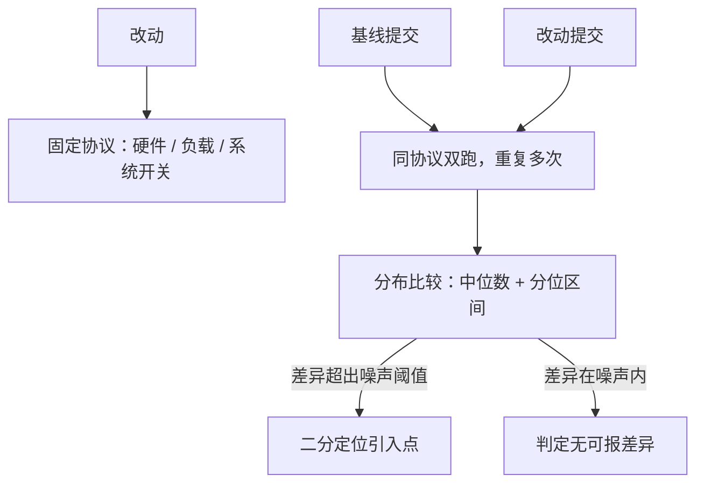
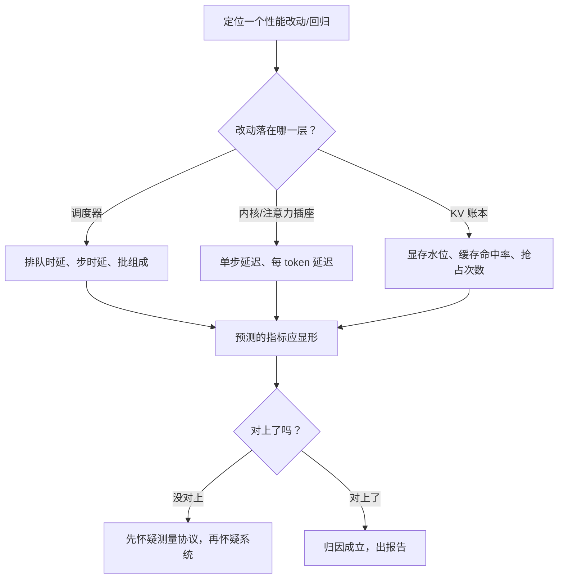

# 性能回归的方法

源码走读的最后一关不是读懂，而是证明：你的改动让系统变快了，而且快得不是噪声。

<footer>—— 据 vLLM 与 SGLang 基准脚本、llama-bench 文档及各仓库贡献指南整理</footer>

[上一课](/llm/fw-kv-abstraction-comparison)以「账本定生死」收拢三课对照。走读之后必然动手，动手之后必须报数，本课写怎么报数才不作弊。方法面已有两块基石：内核级的压测设计见 [内核基准方法论](/llm/ak-benchmark-methodology)，服务指标的合同口径——双分位数、goodput——见 [调度基础与指标](/llm/sch-basics-metrics)。本课把它们接到**仓库场景**：给一个活跃的开源推理框架做改动前后的 A/B，以各仓库当时状态为准。

## 问题

框架性能数字的默认状态是不可比。基准脚本各带默认参数：输入输出长度、请求到达方式、预热轮数、图捕获与编译开关，任何一个默认值变了，吞吐就动。更麻烦的是协变量：同一台机器上批大小随显存水位漂、tokenizer 版本不同导致同一段文本 token 数不同、OpenAI 兼容端点与原生接口的协议开销不同。拿两个版本各跑一次比大小，等于把八协变量装进一个百分比里。回归方法的全部工作是把协变量钉死，让唯一差异落在改动上。

### 钉什么

固定四层。硬件层：同机、同驱动、同显存余量，独占实例，别和别人的任务拼卡。负载层：锁死输入输出长度分布或用固定数据集、到达过程（固定速率还是泊松）、并发数与总请求数；基准脚本把这些写成参数，逐项显式给值，不用默认。系统层：预热到稳态、锁随机种子、记下图捕获与编译开关、量化和注意力后端配置——上一课的账本与插座差异都会从这里漏进来。统计层：每档跑足重复次数，报中位数与分位数区间而不是单次均值，见指标课的双分位合同。

术语翻译「预热到稳态」：进程刚启动的头几步要做懒加载、JIT 编译、显存池初始化，速度远低于正常运行。就像汽车冷启动油耗偏高——上来就测的是「冷车数据」，不是日常水平。先空跑几十上百个请求把系统「跑热」，再开始正式记录。

仓库基准脚本的默认输出常是均值加单次运行——这对回归判定几乎无用：服务端长尾来自批组成与到达抖动，均值会把它抹平。报数前先改统计口径，与报数本身同样重要。

## 方法

流程上分三步。第一步立基线：改动前的提交在同一协议下跑出分布，基线与实验必须**同日同机**，跨日机器状态会漂。第二步双盲比较：不看绝对值看分布，差异超出噪声带才算数；噪声带由重复实验自己估计，不拍脑袋。第三步归因：确认回归后，用二分法在提交历史里定位引入点，定位时再回到走读方法——先看改动落在哪一层，调度、插座还是账本，再预测它该在哪个指标上显形：调度改动先看排队与步时延，内核改动先看单步延迟，账本改动先看水位与命中率。指标与层次对不上，先怀疑测量而不是怀疑系统。

## 机制

这套流程的机制根据是**方差比效应更便宜**。性能效应通常只有几个百分点，而服务端单次测量的方差轻松超过它；唯一划算的办法是压方差：固定协议压系统方差，重复采样压随机方差，分位数保住长尾不被均值吞掉。各仓库把这套东西半自动化了——服务级压测脚本产出吞吐与分位延迟报告，单机基准工具产出每 token 延迟，贡献指南把「附性能数据」写成大型改动的门槛——自动化的是跑，钉协议的仍是人。这也是为什么上一课的走读是性能工作的前置：不知道改动落在哪层，就不知道该盯哪个指标、钉哪些协变量。

数字实例：你的优化预期带来 3% 提升，而同协议重复 10 次的吞吐在 4800–5300 token/s 之间晃（±5%）。单跑一次新旧各一跑出的「+8%」多半是噪声撞上的。想分辨 3% 的效应，噪声带必须先压到 1–2% 以内——这就是「方差比效应更贵」的意思：效应越小，钉协议与重复采样的成本越高。

直觉类比「噪声带」：像用家用体重秤称一封信——秤本身每次读数会差半斤，信只有二两重，单次读数毫无意义。先把秤的抖动范围（噪声带）测出来，信的重量必须超过抖动才能被「看见」。性能基准同理：先量化系统自己的抖动，再谈改动带来了什么。

## 边界

跨仓库横评不在本课范围：默认参数、协议与版本三方不对齐，横评数字没有解释力，跨硬件的方法另见 [加速器比较方法](/llm/accelerator-comparison-method)。内核微基准与端到端服务压测是两层证据，不能互相替代，方法细节在内核方法论课。仓库的基准脚本本身也在演进，参数名以仓库当时状态为准；对只改文档、只改测试的贡献，性能门槛不适用，这引出最后一课的贡献流程。

## 小结

- 框架性能默认不可比：脚本默认参数与硬件、负载、开关、统计四层协变量必须显式钉死。
- 基线与实验同日同机同协议，报中位数与分位区间，噪声带由重复实验自估。
- 回归确认后二分定位，归因时先按改动层次预测指标：调度看排队与步时延，内核看单步，账本看水位与命中率。
- 方差比效应更便宜是全部机制的根：压方差的三件套是固定协议、重复采样、分位数。
- 跨仓库横评无解释力，两层证据不可互替；脚本参数以仓库当时状态为准。
- 出处：vLLM 与 SGLang 基准脚本、llama-bench 与各仓库贡献指南，按实践整理。
