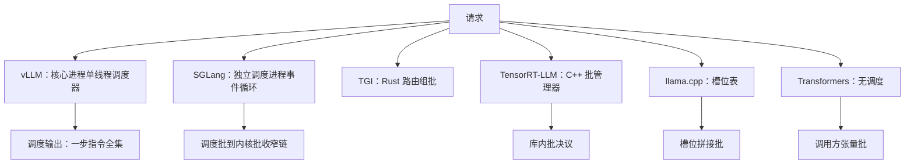
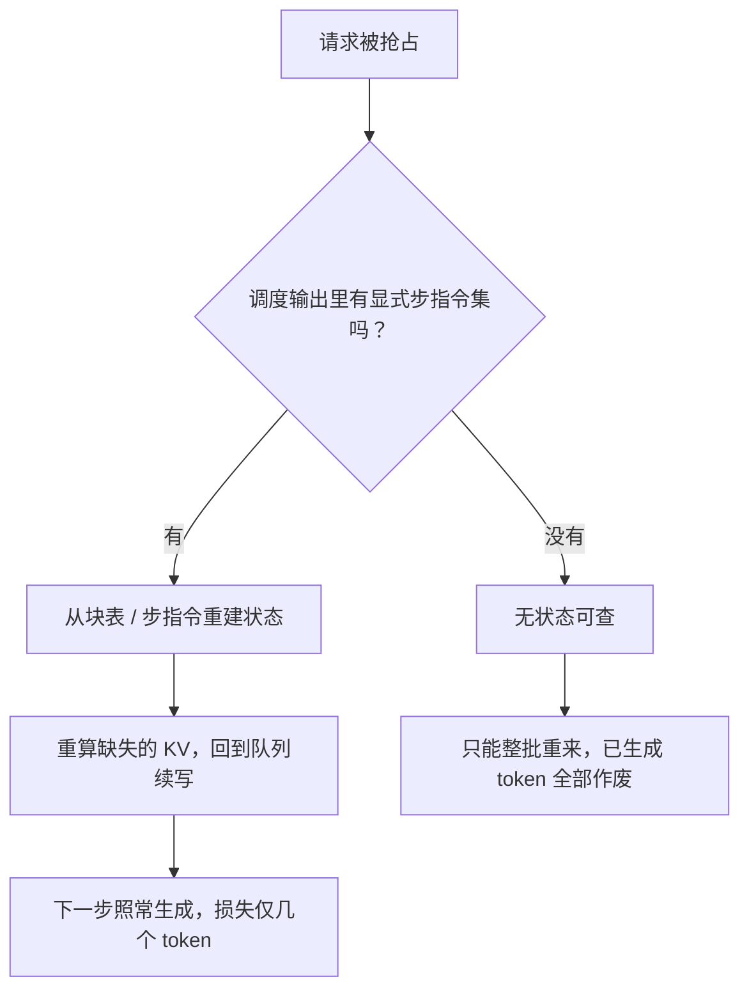

# 调度器的框架对照

六个仓库看完，调度器的问题从来不是「怎么排」，而是它住在哪个进程里、每步吐出什么、丢了算谁的。

<footer>—— 据 Yu 等，Orca，OSDI 2023；Kwon 等，SOSP 2023；SGLang，NeurIPS 2024 及各仓库源码整理</footer>

[上一课](/llm/fw-hf-generate-walkthrough)收在「不调度」的基线上，主流框架单元读毕，进入对照单元。机制面已各有一课：指标与双分位、迭代级组批与 token 预算、抢占与迁移、优先级公平，见调度课序的 [基础与指标](/llm/sch-basics-metrics)、[连续批处理深入](/llm/sch-continuous-batching-deep)、[抢占与迁移](/llm/sch-preemption-migration)，vLLM 调度器的细节另见 [调度器](/llm/vllm-scheduler)。本课把六个走读对象的调度器并排放，只问三件事：住在哪、每步产出什么、丢了谁负责，以各仓库当时状态为准。

## 问题

逐仓读码时每家的调度器都「看得懂」，并排才显出分歧。同一个 Orca 式迭代级调度，在 vLLM 是核心进程里的单线程类，在 SGLang 是独立进程的事件循环加策略函数，在 TGI 拆到 Rust 路由，在 TensorRT-LLM 沉进 C++ 运行库，在 llama.cpp 退化成槽位表，在 Transformers 干脆不存在。分歧不是品味，是**语言与进程边界**的选择：调度器写在哪一侧，决定了谁能改它、它停了谁死、以及它每步要为跨边界付出什么。

### 三问对照

第一问，住在哪。vLLM 的调度器与引擎核心同进程单线程，改动最便宜，审计最直接；SGLang 把它放进独立调度进程，换来组批逻辑不被分词拖累，代价是边界上多一次消息往返；TGI 由 Rust 路由器排队组批，Python 侧只执行，边界横在语言之间；TensorRT-LLM 的批管理器在编译库内部，Python 只是请求应答的壳。第二问，每步产出什么。这是走读过的锚点结构：vLLM 的调度输出是一步指令全集，SGLang 是从调度批到内核批的收窄链，TensorRT-LLM 是运行库内部的批决议，llama.cpp 是槽位拼接的批，Transformers 是调用方给死的张量。第三问，丢了算谁。有显式调度输出与块表的框架能重算恢复——抢占即重算；没有的只能整批重来。

对照时最易张冠李戴的是「优先级」：vLLM 与 SGLang 长期默认先到先服务，排序策略里藏着缓存感知变体；优先级与公平性是调度课序的扩展机制，不能因为某仓库有个参数名带 priority 就认定它实现了加权公平队列。

「迭代级调度」翻译成大白话：模型每算完一步（吐出一个 token）就重新组一次批，新请求插队最多等一步、几十毫秒；老的「请求级组批」要等整批全部生成完才放人，长句会拖住短句几十秒。一步之差，就是吞吐与首字延迟的分水岭。

## 方法

把三问落成读新框架的检查单。读码顺序：先找「一步的产出物」这个类型，它附近就是调度器；再找队列归属的进程，看分词、组批、执行各在哪侧；最后找抢占与恢复的路径，确认「请求丢了算谁」的答案。对照实验则反向操作：固定工作负载与指标口径，只换框架或只换调度参数，观察双分位数的变化——这属于下一单元性能课的方法，此处只立口径。检查单的好处是防背结论：仓库在动，类型名会漂，三问的答案结构比答案本身耐用。

双分位数指 P50 与 P99 两个延迟分位：P50 是「一半请求比这快」，P99 是「最慢的 1% 也要比这快」。调度实验只看均值会被长尾骗——一个被饿着的极端慢请求能把平均值拖高数倍，分位数才能定位到「谁在受苦」。举例：P50 = 200 ms、P99 = 2 s，说明系统对多数人很快，但尾部体验已被调度决策毁掉。

## 机制

并排之后，机制上的共性只有一条：**一步的产出物决定一切**。凡有显式步指令集的框架，抢占、重算、统计、流式回放都围着它长；凡没有的，正确性退回调用方。差异则全在边界位置：边界每往外推一层，调度器的自由度小一分、确定性多一分——TensorRT-LLM 把决议封进库里换热路径，vLLM 把调度器亮在最外层换可改性。没有免费的位置，只有与团队、与部署档位相称的位置。这也解释了为何同机制课在六家里长得不一样：机制课教的是不变量，仓库教的是把不变量放在哪个进程里兑现。

初学者容易以为「抢占」是杀掉请求，实际上 vLLM 的抢占只是把部分请求的 KV 块换出或释放，把显存让给更要紧的批；请求本身回到队列，之后按块表重建、从断点续算。这就是第三问「丢了算谁」的答案来源：有块表就有断点，没块表只好从头再来。

## 边界

以各仓库当时状态为准：SGLang 的重叠调度、vLLM 的多调度器演进、TGI 的维护模式都在变，本课钉的是位置与产出物的类型，不是版本号。多副本、PD 分离、多实例路由属于部署层调度，在调度课序与 SGLang Router 各有专课，本课只对照单实例内部。六个对象也不是全景：商用闭源引擎与端侧系统各有调度答案，方法可迁移，结论不可。

## 小结

- 对照的三问：调度器住在哪个进程、每步产出什么、请求丢了算谁。
- 一步的产出物是共性锚点：显式步指令集撑起抢占、重算与流式；没有它，正确性退回调用方。
- 语言与进程边界决定调度器形态：可改性与确定性沿边界此消彼长。
- 读新框架先找产出物类型，再找队列归属，最后找恢复路径；答案结构比类型名耐用。
- 部署层调度与单实例内调度分层，不在本课混谈；结论以各仓库当时状态为准。
- 出处：Orca（OSDI 2023）、vLLM（SOSP 2023）、SGLang（NeurIPS 2024）与各仓库源码，按对照整理。
