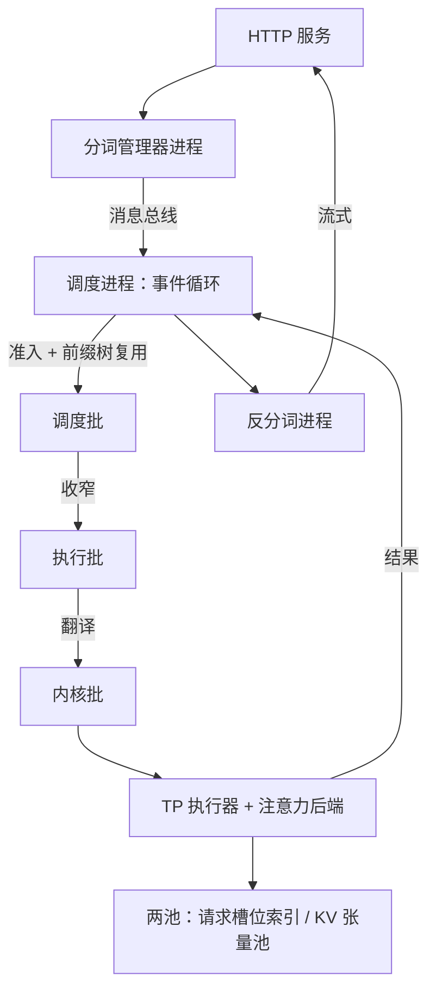

# SGLang 走读

前端把多次生成写成一段程序，运行时就得回答：这些调用共享的 KV 到底放在哪、谁记账。

<footer>—— 据 Zheng 等，SGLang，NeurIPS 2024 与仓库结构整理</footer>

[上一课](/llm/fw-vllm-walkthrough)沿一步迭代走完 vLLM 仓库，锚点是「调度输出」这个每步指令集。SGLang 的仓库多出一维：它的出发点是**语言模型程序**——代理、多轮、few-shot 在前端被写成多次 `gen` 的结构化程序，运行时靠前缀树跨调用复用 KV。程序语义与复用机制已各有课：[SGLang 与 RadixAttention](/llm/sglang) 写共设计，[前缀树](/llm/sglang-radix-tree)写树怎么长瘦。本课进仓库服务运行时，讲进程分层与数据结构，以仓库当时状态为准。

## 问题

把 vLLM 的读法直接套过来会失手。第一，SGLang 把分词与反分词拆成独立进程：HTTP 进程、调度进程、执行进程组之间走消息总线，如果只在调度器文件里找「一步」，会漏掉请求形态在进程边界上被改写两次。第二，同一条请求在源码里有三个化身——调度视角、执行视角、内核视角各是一个批结构，搜「batch」会命中三套字段相近的类。走读要回答：三个化身各自负责什么、为什么必须分化。

### 进程与事件循环

仓库的运行时部分常被称作 srt（SGLang runtime）。HTTP 服务把请求交给分词管理器，后者成批做分词，经消息总线发给每个张量并行组的调度进程。调度进程单线程跑事件循环：收请求、按调度策略从等待队列组新批、把批发给执行器、回读结果再交反分词进程流给客户端。分词被挪出去，是因为它是 CPU 密集的字符串工作，混进调度循环会拉长步时延；这条拆分与 TGI 的 Rust 路由加 Python 推理是同一个直觉，见 [TGI](/llm/tgi)。

## 方法

沿一步迭代走，锚点落在三个批结构的收窄链上。请求对象持有原始输入、采样参数与前缀树引用，是全生命周期身份。调度器每步把若干请求装进**调度批**：这里做准入——先查前缀树能复用哪些 token 槽，再按缓存感知策略排序，等待队列里的复用机会直接决定谁先上场。调度批发给执行器前被收窄成**执行批**：丢掉 HTTP 与排队元数据，只留执行所需的前缀长度、输出位置与 KV 索引。执行器最后把它翻成**内核批**：张量形状、位置编码、注意力后端的元数据。一层比一层窄，任何一层字段对不上，都会在运行期以形状或索引错误暴露。

KV 侧是两池一树：请求到 token 槽位的索引池回答「这条请求第 $i$ 个 token 在哪个槽」，token 槽位到 KV 张量的池回答「槽里的键值张量在哪」，前缀树是第三层索引，决定新请求的哪些前缀可以指向旧槽位。注意力后端按注册表选择——FlashInfer、Triton、FlashAttention 等各挂一套实现，由前向模式区分扩展与解码，与 [FlashInfer](/llm/flashinfer) 的接口课互为表里。

调度策略里的缓存感知项按「最长可复用前缀优先」排序等待请求：这条排序逻辑就写在调度器的策略文件里，读源码时先把策略函数找出来，比顺着调用栈翻更快。

## 机制

三个化身分化的原因是决策与执行分属不同进程：调度批在调度进程里被组出来，执行批是跨进程消息的字面内容，内核批才接触张量。接口在边界处收窄，执行侧因此不必知道排队、复用与统计；投机解码、数据并行这些特性改动大多落在执行视图与内核视图，调度语义不动。前缀树插在准入处而不是执行处，是这套分层的第二个红利：复用与否在组批时就已定价，同一步内新旧请求可以被一视同仁地排进批——这正是「程序级复用」落到调度器里的位置。

## 边界

以仓库当时状态为准：前向模式的枚举、后端注册方式、重叠调度的开启方式都在演进，读的时候以一步迭代的三个批结构为锚，不背字段名。也不把外置路由器当成运行时内部件：多实例的路由、负载与前缀亲和在仓库之外的独立组件里，见 [SGLang Router](/llm/sglang-router)。树的生长、淘汰与引用计数本课不重讲。

## 小结

- SGLang 运行时按 HTTP、分词、调度、反分词分层成多进程，边界上是消息总线，不是函数调用。
- 一步迭代的锚点是三批收窄链：调度批、执行批、内核批，逐层丢元数据、逐层贴近张量。
- KV 是两池一树：槽位索引池、张量池、前缀树索引，复用在准入时定价。
- 进程拆分换来调度循环不被 CPU 字符串工作打断，与 TGI 的前后端拆分同构。
- 读法：先找策略函数与三批结构，再沿执行批进后端；字段名以仓库当时状态为准。
- 出处：Zheng et al., *SGLang*, NeurIPS 2024 与 sgl-project/sglang 仓库，按源码结构整理。
