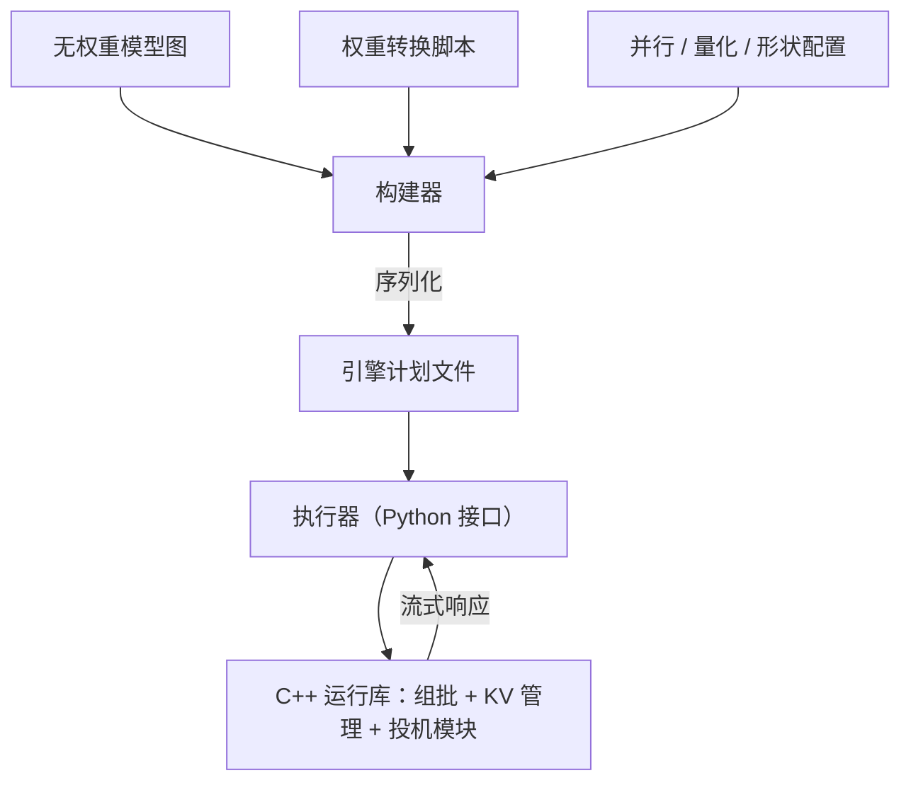
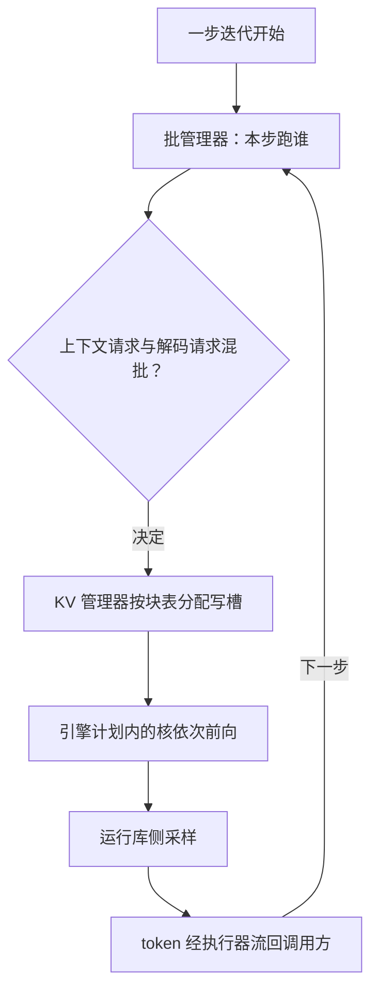

# TensorRT-LLM 走读

有的框架把聪明放在运行期，这一个把聪明浇筑进构建期：内核选择、量化、形状，都在你按下构建按钮时定局。

<footer>—— 据 NVIDIA TensorRT-LLM 官方仓库与文档整理</footer>

[上一课](/llm/fw-sglang-walkthrough)在 SGLang 仓库里看到的是纯 Python 运行时：决策、组批、执行都在解释器里跑。TensorRT-LLM 把重心翻到构建期——能力面已写过：编引擎换峰值、在环推理即服务是它的取舍，见 [TensorRT-LLM](/llm/tensorrt-llm)。本课进仓库讲它的两段式结构与关键数据物，以仓库当时状态为准。它是六个走读对象里版本迭代最激进的，本课只讲不随版本翻面的骨架。

## 问题

按 Python 运行时的读法进来会迷路：仓库里几乎找不到「调度器类」，也找不到逐 token 的采样循环。原因在于它把一次前向的计算图在**构建期**编译成序列化的引擎计划，运行期只剩一个薄薄的执行接口，真正的组批与 KV 管理沉在 C++ 运行库里。于是走读的问题变成两问：构建期把哪些决策浇死了，运行期还留着哪些自由度。

### 构建期：图、权重、引擎三件分离

模型定义目录里，每个支持的结构有一份用框架原语写成的**无权重图**：层怎么摆、并行怎么切、量化怎么插，都是图里的节点。权重转换脚本把开源检查点映射到这张图的名字空间。构建器吃进图与权重配置，产出序列化的引擎计划文件——这一步做完，内核选择、融合、精度路径就不再改变。运行期的执行器持有引擎实例，对外暴露请求应答式接口：提交请求、流式收回增量结果。KV 缓存管理器在运行期按块记账，但块的总预算在构建期由配置算定。

引擎计划绑定形状范围：构建时声明的最大批、最长序列不是建议而是上限，超界请求在运行期被拒。换部署档位要重编引擎——这是「编引擎换峰值」字面上的代价。

「序列化引擎计划」翻译一下：把计算图、选好的内核、融合与量化路径打包成一个二进制文件，加载时不再做任何搜索或编译决策。就像菜谱连火候提前定死、装进饭盒，开餐之后只管照着热——快，但中途换不了菜。

## 方法

走读同样沿一步迭代走，但要在 C++ 侧找锚点。一步的内容是：执行器收进一批请求，运行库里的批管理器决定本步跑谁——上下文阶段的请求与解码阶段的请求如何混批，是它内部的策略点；KV 管理器按块表给本步分配写槽；引擎计划里的核依次执行前向；采样在运行库侧完成，token 经执行器流回。三个关键数据物对应三段：引擎配置记构建期决策，块表记 KV 账，请求应答对象记会话生命周期。投机的草稿验证、逐批日志、每层计时都在运行库挂了钩子，读性能问题的入口在 C++ 侧而不在 Python 侧。

给个数代入 KV 池预算：设每块 16 token、构建期配 4096 块，池子总量就是 $4096 \times 16$ 个 token 槽，再乘层数、KV 头维度与精度字节数折成显存。运行期只能在这笔定死的账内分配，满了就只能抢占或拒绝——预算不是运行期参数。

## 机制

两段式买来的是热路径的确定性。内核在构建期选定，就没有运行期分派开销；批管理与 KV 记账沉进编译后的代码，Python 解释器只留在接口层；FP8、INT4 这类平台量化在构建期作为图变换写进计划，而不是运行期的转换钩子。代价同样清楚：形状、并行、精度任一变化都要重编，工程节奏从「改配置」变成「走构建流水线」。这也是它与前两课的对照点：vLLM 与 SGLang 把调度器放在仓库最显眼处，因为那里每步都在重新决策；这里的调度自由度被压缩进批管理器内部，仓库的复杂度则堆在构建期——图原语、权重映射与引擎配置的数量，才是它的真实表面积。

初学者容易以为换量化精度就是改个开关，实际上 FP8、INT4 在这套架构里是构建期的图变换，写进了引擎计划——不重编引擎就不生效。这一步做错（想在线切精度）会直接撞墙，正确路径是走构建流水线另出一版引擎。

## 边界

本课的骨架描述是版本敏感度最高的一篇：执行器接口的形态、是否走纯运行时路径、PyTorch 后端的地位，仓库都翻过面，以仓库当时状态为准；具体类名不引用。它只覆盖 NVIDIA 平台，跨厂商不是它的主场；也不给这个产品仓库安会议论文，出处口径是官方仓库与文档。逐能力清单见概念课，本课不重列。

## 小结

- TensorRT-LLM 是两段式：构建期把无权重图、权重、量化与形状浇成序列化引擎计划，运行期只留薄接口。
- 调度不在 Python 里：组批、KV 记账、采样沉在 C++ 运行库，走读锚点是批管理器与块表。
- 引擎计划绑定形状上限，换部署档位要重编，这是峰值与灵活性之间的兑换率。
- 与 vLLM、SGLang 对照：仓库表面积在构建期，运行期自由度被刻意压小。
- 版本敏感度全组最高，骨架以仓库当时状态为准，出处是官方仓库与文档。
