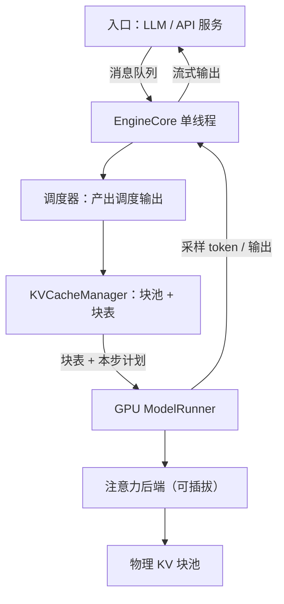
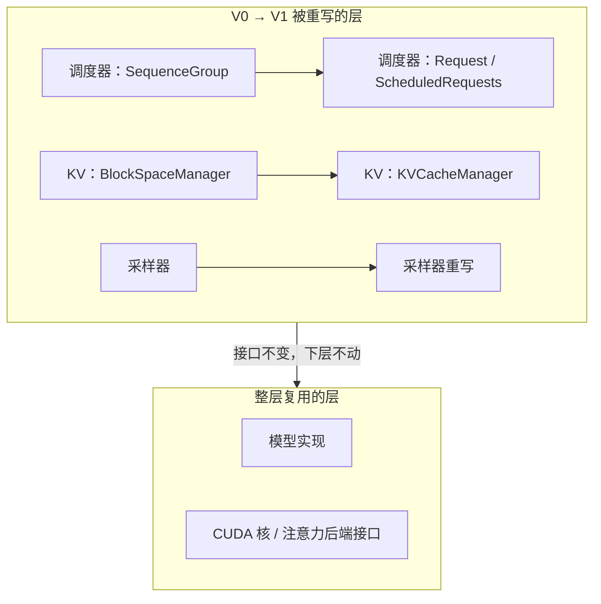

# vLLM 架构走读

读源码不是逐行背诵，是找到那几个被所有路径读写的数据结构——它们定下系统能做什么、改起来要付多少代价。

<footer>—— 据 vLLM 仓库结构与 Kwon 等，SOSP 2023 整理</footer>

[上一课](/llm/eco-map)把开源生态与发布工程收束在发布物那一面：许可、版本、复现报告回答「交付了什么」。深钻层最后一程从交付面转进源码面：推理框架的代码长什么样、为什么长成那样。本课程第一课走读 vLLM。概念层已经写过：[架构四件套](/llm/vllm-architecture)是 SOSP 论文口径，[V1 架构](/llm/vllm-v1)写了 V0 到 V1 的演进，本课进仓库，讲目录分层与关键数据结构，以仓库当时状态为准，不逐行引用。

## 问题

论文给了「中央调度 + 分页 KV + worker」的骨架，打开仓库却先撞上两个落差。其一，仓库不是按论文图组织的：入口、引擎、调度、执行、平台各占一层目录，还有论文里没有的 OpenAI 兼容服务、插件与平台抽象。其二，V0 与 V1 并存过：同一个概念（调度器、KV 管理）在两代里类名与位置都不同，随手搜类名会搜到两套答案。走读要回答的是：哪些层是脊梁、哪些是皮肉，一步迭代在数据结构上留下什么脚印。

### 分层怎么读

入口层收两种调用：离线的 `LLM` 与在线的 API 服务，后者把 OpenAI 兼容协议翻译成内部请求。引擎层是分水岭：V1 把引擎核心 EngineCore 与前端 AsyncLLM 拆成两个进程，中间走消息队列；前端只做分词、流式编排与请求生命周期，核心进程单线程跑调度与执行。调度层产出一步的全部指令；KV 层管块池与块表；执行层是 worker 与模型运行器，注意力后端做成可插拔类族；最底是平台抽象与各硬件插件。判断某一改动落在哪层，先问它改的是「决策」还是「执行」。

「分页 KV」翻译一下：操作系统把内存切成固定大小的页、按页分配，程序不必拿到一整段连续内存；PagedAttention 把这套思路搬进推理，KV 显存切成固定小块（block）按需记账。好处是请求间几乎不留碎片，显存利用率从三成多抬到九成上下。

## 方法

走读的固定动作是**沿一步迭代走**。请求进入后先变成请求对象；调度器每步把可运行请求收拢，产出一个调度输出——V0 里是围绕 SequenceGroup 的调度输出，V1 里是围绕 Request 的 ScheduledRequests——内容包括本步运行谁、每个序列的块表、新 token 写进哪些空槽。KV 侧，V1 的 KVCacheManager 持有块池与每请求块表，V0 的对应物是 BlockSpaceManager；名字换了，「逻辑块号到物理块号」这张映射没换。执行侧，ModelRunner 把调度输出变成张量批，调用注意力后端做一次前向，把采样后的 token 交还核心进程，输出再经前端流给客户端。

SequenceGroup 是 V0 走读时最容易被误读的结构：一个请求在束搜索或并行采样下展开成多条序列，调度与抢占以「组」为单位记账。V1 把这条折叠进 Request 的子状态，读旧代码先认组，读新代码先认请求。

给个数感受块表省下的显存：块大小 16 token 时，一条 3000 token 的序列占 188 个块，最后一块只用 8 个槽、空 8 个，碎片不足 3%；老式连续预留若按最大长度 4096 预留，则白占 1096 个槽位。逻辑块号到物理块号这张映射，就是把「用多少占多少」写进数据结构。

## 机制

这套分层的因果链是「策略便宜、执行昂贵」。调度、块表更新、抢占决策都发生在 CPU 的核心进程里，且 V1 让它单线程：一步一个调度输出，没有锁竞争，也没有第二个作者能在半步插手。GPU worker 不做策略，只按收到的块表执行；这使注意力核不依赖调度方式，也使调度器重写不必碰模型代码——V0 到 V1 重写了调度器、KV 管理器与采样器，模型实现与 CUDA 核却整层复用，就是分层买来的自由。数据结构即接口：调度输出是每步指令的全集，看懂它，等于看懂这一步 GPU 会做什么。

初学者容易以为核心进程「单线程」是性能妥协，其实正相反：一步只产出一个调度输出，没有锁竞争、没有并发改状态的收尾成本，CPU 决策又远快于 GPU 一步前向，瓶颈根本不在决策侧。多线程调度在这里只会引入竞态，换不来吞吐。

## 边界

目录名、类名、进程模型都随版本漂移，本课给的是读法：先找入口，再找「一步的产出物」，顺数据结构走到核；具体名字以仓库当时状态为准。也不要把仓库结构当成论文架构图的一比一还原：服务、插件、平台抽象是工程需要，论文没写。PagedAttention 的页内寻址与调度器迭代节奏已各有一课，本课不重算；多卡时每张卡一个 worker、单一调度器对齐所有卡这一条，从论文到仓库都成立。

## 小结

- vLLM 仓库按入口、引擎、调度、KV、执行、平台分层；脊梁是「核心进程单线程决策，worker 只执行」。
- 走读的锚点是每步的调度输出：V0 围绕 SequenceGroup，V1 围绕 Request 与 ScheduledRequests。
- KV 侧不变量是逻辑块到物理块的块表；V1 的 KVCacheManager 与 V0 的 BlockSpaceManager 同构。
- V0 到 V1 的重写只动调度与 KV 层，模型与核复用，验证了分层的价值。
- 读法不绑定版本：找入口、找一步的产出物、沿数据结构走到核；名字以仓库当时状态为准。
- 出处：vLLM 仓库（vllm-project/vllm）与 Kwon et al., *Efficient Memory Management for LLM Serving with PagedAttention*, SOSP 2023，按源码结构整理。
