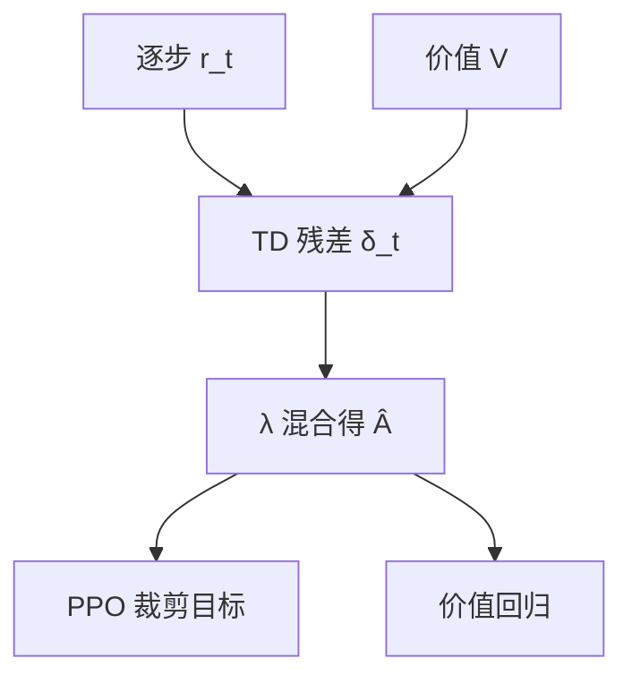

# GAE 与 λ

λ 在一步 TD 与整条蒙特卡洛之间插值：语言模型的地平线很长，这个旋钮决定中间 token 能不能分到终点的对错。

<footer>—— Schulman 等，High-Dimensional Continuous Control Using Generalized Advantage Estimation, ICLR 2016</footer>

[上一课](/llm/token-level-reward)给出逐步 $r_t$ 与终点 $R$。接到 [PPO](/llm/ppo-llm) 时，还要把它们收成优势 $\hat A_t$。缺口是：**纯蒙特卡洛方差太大，纯 TD 又依赖不准的 critic。** Schulman 的 GAE 用 $\lambda$ 做偏差–方差插值。本课只写 $\lambda$ 在 LLM 上的含义，不重推 PPO clip。[GRPO](/llm/grpo) 没有 critic，也就没有 GAE；对照写明。

## 问题

定义 TD 残差 $\delta_t = r_t + \gamma V(s_{t+1}) - V(s_t)$。$\lambda=0$ 时 $\hat A_t=\delta_t$，完全信 critic；$\lambda=1$ 时 $\hat A_t$ 回到折扣回报减 $V(s_t)$，完全信采样回报。LLM 的 $T$ 大、$r_t$ 稀疏，两端都难受：$\lambda=0$ 则早期步只看见塑形项；$\lambda=1$ 则一条长链的噪声抹过所有 token。需要中间值，并且 $\gamma$ 常取 $1$（有限长度、不贴现），于是 $\lambda$ 几乎是唯一插值。

InstructGPT / 常见 LLM-PPO 配方把 GAE 当默认。缺 $\lambda$ 的复现表等于没给优势定义。

### $\gamma=1$ 时 λ 仍有意义

不贴现不等于蒙特卡洛。$\lambda$ 控制的是「向后看多少步 critic 误差」。$\gamma=1,\lambda=1$ 才是满地平线回报。有人把 $\gamma$ 设成 $0.99$ 再配短 $\lambda$，等于故意让远期校验器对开头几乎无影响——若任务是整题对错，这通常是错的。

优势归一化（batch 内减均值除标准差）在 GAE 之后做，改变尺度不改变 $\lambda$ 的相对混合。两者不要互相代替。

## 方法

$$
\hat A_t^{\mathrm{GAE}(\gamma,\lambda)}=\sum_{l=0}^{T-t-1}(\gamma\lambda)^l \delta_{t+l}.
$$

实现：从后往前递推，padding 位 mask。价值 $V$ 只在真实 token 上回归 $\hat A_t+V_{\mathrm{old}}$ 或 $\delta$ 目标。$\lambda$ 常见 $0.95$–$0.99$；长链推理可偏大，让终点 $R$ 传得更远。没有逐步 $r_t$ 时，$r_t=0$（除终点与逐步 KL 外），$\lambda$ 更要偏大，否则中间全是零优势。

GRPO / RLOO 用组内标量优势，相当于每条轨迹一个 $\hat A$，再广播到 token，没有 $\lambda$。若要逐步信用，回到 PPO+GAE，或给 GRPO 显式 $r_t$（上一课）。不要把「GRPO 的组标准差」叫做 $\lambda$。

## 机制

$\lambda$ 减小，优势更局部，对错误 $V$ 更不敏感，但终点对错传不到选题策略的前几个 token。$\lambda$ 增大，长程依赖进来，方差增大，需要更大 batch 或更强归一化。这与控制里的经验相同，只是 LLM 的「长程」是语义决策而不是关节力矩。

价值函数差时，高 $\lambda$ 更安全（少信 $V$）；价值好时，可降 $\lambda$ 降方差。LLM 上 $V$ 往往差，因此配方偏高 $\lambda$。下一课 clip-higher 改的是策略更新幅度，与 GAE 正交，不要用 clip 去补 $\lambda$ 选错。

$\lambda=1$ 且无 $V$（减组均值）就是带基线的蒙特卡洛，接近 REINFORCE / GRPO 精神。

## 边界与工程取舍

没有 critic 就不要假装 GAE。异步 rollout 下 $V$ 与生成策略版本不一致，$\delta_t$ 系统偏，应降低对 $V$ 的信任（提高 $\lambda$）或重算 $V$。价值初始化见后课。$\lambda$ 与逐步 KL 的 $\beta$ 耦合：KL 已很密时，即使 $\lambda$ 小，中间也有信号。

## 小结

- GAE 用 $\lambda$ 在 TD 与蒙特卡洛之间插值；LLM 地平线长，$\lambda$ 决定终点能否传到早期 token。
- $\gamma=1$ 常见；真正的满回报还要 $\lambda=1$。
- GRPO 无 GAE；组优势不是 $\lambda$。
- $V$ 差时偏高 $\lambda$。
- 出处：Schulman 等 GAE, ICLR 2016；LLM 用法见 Ouyang 等 InstructGPT / PPO 实现。
