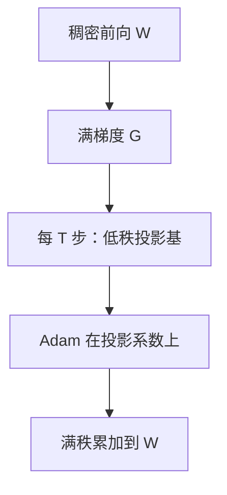

# GaLore

可以不把权重限制在低秩，而把**梯度**投影到低秩子空间里再写 Adam；全参轨迹的显存就能降到接近适配器训练。

<footer>—— Zhao 等，GaLore: Memory-Efficient LLM Training by Gradient Low-Rank Projection，ICML 2024</footer>

[VeRA](/llm/vera) 与 [LoRA](/llm/lora) 都限制**权重增量**的秩。若任务其实需要满秩更新——[学习率课](/llm/lora-vs-full-lr)里 Biderman 等人说 LoRA 学得少——缺口就是：全参的 Adam 状态仍是 2× 参数量。Zhao、Zhang 等人的 GaLore 对梯度做周期低秩投影，$W$ 仍满秩可写，优化器状态按投影秩存。本课写「低秩梯度 ≠ 低秩权重」。不把逐层冻结（[下一课 LISA](/llm/lisa-layerwise)）写成同一算法。

## 问题

全参 SFT / 继续预训练的显存四件套：权重、梯度、Adam 一阶二阶、激活。LoRA 砍掉后三项的主体，却把 $\Delta W$ 锁在 $BA$ 里。有些设定（从预训练中段继续、领域 DAPT、需要高秩改写）LoRA 天花板明显。希望：权重保持 $d_{\mathrm{out}}\times d_{\mathrm{in}}$ 的自由度，但不要为每个元素存两份 Adam。

观察是：训练中一段时间内，梯度矩阵 $G$ 的能量集中在少数奇异方向上。若每隔 $T$ 步对 $G$ 做一次截断 SVD，把 Adam 跑在投影后的低秩系数上，再映回满空间更新 $W$，则优化器状态与 $r(d_{\mathrm{in}}+d_{\mathrm{out}})$ 同阶，而 $W$ 仍能随投影基的更换积累**高秩**变化。

### 投影的是梯度，不是冻结随机 A、B

VeRA 的随机矩阵不随数据变。GaLore 的投影基来自当前梯度的主成分，定期刷新。LoRA 学的是权重因子；GaLore 不引入适配器模块，前向仍是稠密 $Wx$。

论文在预训练与微调上都做了记忆对比：强调可接近全参质量、显存显著低于 8-bit Adam 全状态。它不是量化方法；可与量化叠，但本课只讲投影。

## 方法

对选定线性层的梯度 $G_t$，每隔 $T$ 步计算秩-$r$ 近似（例如左奇异向量 $P$），在窗口内用 $P^\top G$ 作为优化器输入，Adam 状态与投影系数同形，更新再乘回 $P$。$r$ 与 $T$ 是主超参：$r$ 过小截掉有用梯度，$T$ 过长则投影基过期、$T$ 过短则 SVD 太贵。嵌入与范数层可排除在投影外，以免词表更新被过度压缩。

学习率按**全参**逻辑取（$10^{-5}$ 量级做 SFT，$10^{-4}$ 量级做预训练段），不要用 LoRA 的 $10^{-4}$ SFT 默认——参数化是满 $W$。SFT 仍遵守[仅回复](/llm/response-only-loss)与[模板](/llm/chat-template)。

实现要注意与分布式分片一致：投影在每张分片矩阵上局部做，还是聚集后再做，会影响秩的含义。配方应写清。

## 机制

窗口内，更新被限制在当前 $P$ 的列空间，这一段轨迹低秩；窗口切换后 $P$ 变了，新的方向被打开，$W$ 的总变化可以满秩。这与 [ReLoRA](/llm/relora)「合并 LoRA 再重置」是亲戚：都用时间换秩，但 ReLoRA 改的是适配器，GaLore 改的是优化器坐标系。

若真实梯度一直满秩且能量均匀，截断 SVD 会系统性地丢掉一部分更新，收敛慢或偏。指令 SFT 上梯度往往更低秩，GaLore 更舒服；要从随机初始化预训练，需更大 $r$ 或更勤的刷新。

rsLoRA 的 γ 与 GaLore 无关。不要给 GaLore 再乘一份 α/r。显存省在 Adam 状态，不省在权重存储——检查点仍是满 W。

## 边界与工程取舍

推理与全参相同，没有适配器可切换任务。多任务仍要存多份 $W$ 或差分。SVD 周期在超大层上有计算开销，需摊进吞吐。激活显存仍在，长上下文下 GaLore 救不了注意力二次方，那是[长微调课](/llm/long-context-finetune)的问题。

与 QLoRA 比：QLoRA 冻结量化基座；GaLore 训练满精度（或混合精度）稠密权重。目标相反。需要一份可合并的小适配器时用 LoRA/VeRA；需要接近全参的继续预训练显存方案时用 GaLore。

## 小结

- GaLore 将梯度低秩投影后跑 Adam，$W$ 仍满秩，优化器状态按 $r$ 存。
- 周期刷新投影基，使时间上可积累高秩更新。
- 学习率按全参，不按 LoRA。
- 检查点体积仍是满模型；省的是训练时优化器显存。
- 梯度并非总是低秩；预训练与微调的 $r$、$T$ 不能照抄。
- 出处：Zhao 等，GaLore，ICML 2024。
