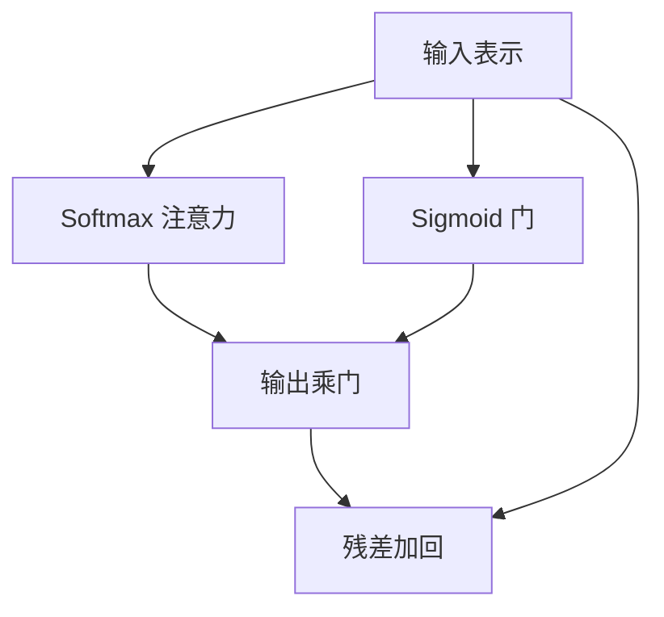

# 门控注意力

在注意力输出上再乘一个由当前表示决定的门，等于给 softmax 权重之外补一条内容相关的幅度；汇到首位置的质量可以被压下去。

<footer>—— Qiu et al., Gated Attention for Large Language Models, 2025；门控单元的前身见 Hua et al., Transformer Quality in Linear Time, ICML 2022</footer>

[上一课](/llm/embedding-pooling)把编码器的位置序列收成句向量，单元转到注意力内部。主干里的 [SDPA](/llm/sdpa) 与 [多头](/llm/mha) 输出直接残差加回，幅度完全由 softmax 行和与值向量决定。本课补门：输出侧或值侧乘 $\sigma(W_g x)$，让「看谁」和「写多强」分开。后课的 sigmoid 注意力会动归一化本身；本课先不动 softmax。

## 问题

Softmax 强制一行权重和为 1。即使所有键都与查询无关，仍有一单位质量要写进残差流，常常灌进首 token 或低信息位置，形成注意力汇。训练基础课里的 logit 增长、sink，优化侧可以压，架构侧缺一条**按查询把整次读取关掉**的通路。FFN 里的 GLU 已经证明门有用，但那是对通道，不是对这次注意力的输出幅度。

Hua 等人的 GAU 把门控与单头注意力揉成一个单元，替换部分 MHA+FFN。Qiu 等人在标准多头上只加输出门，更像补丁。本课以输出门为默认对象，GAU 当作把门前移到单元设计的变体。

不要把门控注意力写成「又一种 SDPA」。缩放点积与 softmax 仍在；门是逐位置的标量或向量，乘在加权求和之后。

## 方法

记 SDPA 输出 $u=\mathrm{softmax}(QK^\top/\sqrt{d_k})V$，再经输出投影。门控写成

$$
y = u \odot \sigma(x W_g),
$$

$x$ 是进入该子层的表示（Pre-LN 下常是归一化后的残差流），$W_g$ 把 $d$ 映到头拼接维度或 $d$，元素为 sigmoid。有的实现按头共享一个标量门，有的按通道。残差仍是 $x+y$；门接近 0 时该子层近似恒等。

GAU 把特征拆成门支路与值支路，注意力在较低维上算，再用门调制，线性项更少。课序上只需记住：门的输入是当前查询侧内容，不是键侧统计。

### 与注意力 dropout 的差别

Dropout 在训练时随机把权重或残差置零，推理关掉。门是确定的、推理仍在，学的是「这一位置需不需要读上下文」。它可以抑制 sink，但不能替代正则。

## 机制

Softmax 决定方向（单纯形上的点），门决定步长。无关上下文时步长应近 0，残差流不被强制写入噪声。汇到首位置的权重即便仍大，乘上门之后写入幅度可变小，后续层更少依赖「把质量堆给 BOS」。Qiu 等人观察到加门后 sink 减轻、部分长上下文指标上升，稳定性来自幅度可学习，而不是改了缩放公式。

梯度上，$\sigma$ 饱和会把 $W_g$ 的更新掐掉，初始化不宜把门推到 0 或 1。与 GLU 相同，门支路需要足够的激活方差，否则子层一出生就关死。

按头设门，等于允许某些头常开、某些头按 token 关闭，和后课「头的功能分化」衔接，但本课不解释头在做什么，只给关闭权。

## 边界

门不降低 $n^2$ 的分数矩阵，也不改 KV 缓存布局；它不是效率技术。若门学成恒近 1，等于白加一组参数。sigmoid 注意力会取消行和为 1，与门控同时用时，「关断」有两条通路，难以归因。GAU 改的是层的模块划分，不能和「MHA 后加一行门」的检查点直接合并。

## 小结

- 门控注意力在 softmax 加权之后用内容门调制幅度，把「看谁」与「写多强」分开。
- 它针对的是行和为 1 导致的强制写入与注意力汇，不改 SDPA 公式。
- 输出门是补丁；GAU 把门收进单元，替换的是模块边界。
- 不省 KV、不降二次复杂度；门饱和会关死子层。
- 出处：Qiu et al., 2025；Hua et al., ICML 2022。
