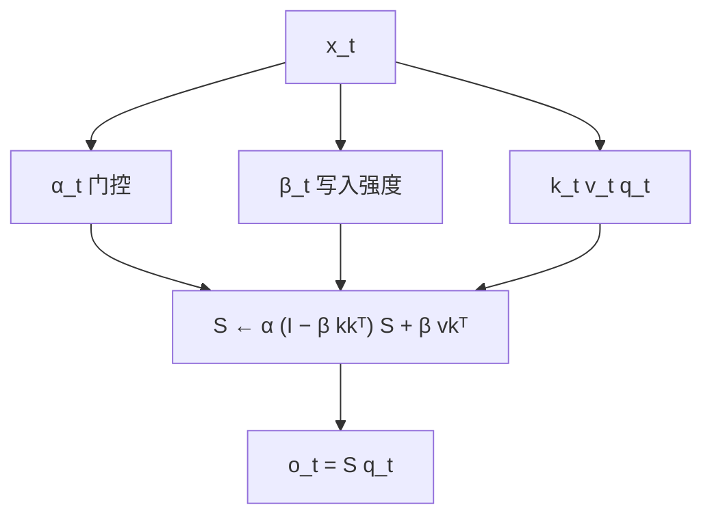

# Gated DeltaNet

    
门控负责迅速清空记忆，delta 规则负责定点改写；两者互补，合在一起才同时有清除与联想。

    <footer>—— Yang, Kautz, Hatamizadeh, Gated Delta Networks, ICLR 2025</footer>

[DeltaNet](/llm/delta-net) 用广义 Householder 做定点覆盖，缺一次把整块过期上下文清掉的手段。[Mamba-2](/llm/mamba-2) 用标量 $\alpha_t$ 衰减整个状态，清得快，改不准。Yang、Kautz 与 Hatamizadeh 把两条更新乘在同一递推里，得到 gated delta rule，并把 Yang 等人 2024 年的分块 WY 算法延到带衰减的情形。实验主场是 1.3B 级语言建模、常识、检索、外推与长上下文，以及与滑窗或 Mamba-2 的混合层。

## 问题

线性状态的容量大约是键维：正交键值对超过维数就开始碰撞。Mamba-2 的

$$
S_t=\alpha_t S_{t-1}+v_tk_t^\top
$$

每次把*所有*联想乘同一个 $\alpha_t$。要忘掉某把钥匙，只能连邻居一起淡化。DeltaNet 的

$$
S_t=S_{t-1}(I-\beta_t k_tk_t^\top)+\beta_t v_tk_t^\top
$$

只改当前键方向，上下文切换时旧场景会残留。S-NIAH 把这拆开：重复合成上下文、只要长程保持时，DeltaNet 到 8K 仍近乎满，Mamba-2 过 2K 就掉；真实文章当草堆、需要过滤时，DeltaNet 在长序列上崩，带门控的模型更好；值从数字换成 UUID、需要记复杂模式时，又是 delta 更强。需要一种更新：$\alpha_t\to 0$ 时整表可清，$\alpha_t\to 1$ 时退回纯 delta。

在线学习视角里，Mamba-2 正则的是 $\|S_t-\alpha_t S_{t-1}\|_F^2$，DeltaNet 正则的是靠近 $S_{t-1}$ 同时对当前键做回归。Gated DeltaNet 把衰减放进正则中心，又保留 delta 的回归项，见表 1 的目标函数对照。

### 测试时 SGD 的权重衰减

把 $S$ 看成快权重，delta 是对 $\tfrac12\|Sk_t-v_t\|^2$ 的一步 SGD。门控相当于给这次 SGD 加数据依赖的权重衰减。Titans 等工作同期也在讨论衰减，本架构的贡献是：衰减与 Householder 更新仍能走紧凑 WY + 分块 GEMM，而不是退回逐步循环。

## 方法

门控 delta 规则：

$$
S_t=S_{t-1}\bigl(\alpha_t(I-\beta_t k_tk_t^\top)\bigr)+\beta_t v_tk_t^\top.
$$

$\alpha_t\in(0,1)$ 数据依赖。实现上把 Yang 等人对 Householder 乘积的 WY 表示乘进每步衰减：块内仍用下三角解 $T_{[t]}$ 构造伪值，块间状态先按块的累积 $\alpha$ 缩放再应用 $P_{[t]}$。训练以分块并行为主，推理逐步递推，状态大小 $d_v\times d_k$，与序列无关。

混合：Gated DeltaNet 层与滑窗注意力交错，或与 Mamba-2 层交错。前者补局部精确对齐，后者补另一种遗忘动态。作者报告混合同时提高训练吞吐与任务分——吞吐来自部分层更便宜或更好融合，不是因为理论复杂度又降一档。

## 机制

### 两种失败模式各管一段

$\alpha_t$ 接近 0：Householder 项被压掉，状态近似重置，适合文档边界、主题切换。$\alpha_t$ 接近 1：回到 DeltaNet，适合在稳定话题里改一个事实。$\beta_t$ 仍控制当前键方向改多少。没有 $\alpha$ 时，DeltaNet 原文也承认外推弱，因为缺少显式衰减；Gated DeltaNet 把这当成设计动机而不是事后补丁。

S-NIAH-2（数字针）4K 上 Gated DeltaNet 92.2，DeltaNet 18.6，Mamba-2 56.2；S-NIAH-3（UUID）2K 上 84.2 对 DeltaNet 47.0、Mamba-2 47.6。短合成针上 DeltaNet 仍极强，说明门控不是在所有检索上都单调更好，而是补「该忘的时候忘」。语言建模与常识上作者称全面超过 Mamba-2 与 DeltaNet；读表时应对齐 1.3B、同一数据，不要和 7B Transformer 混排。

混合滑窗不等于「再加一层 softmax 救检索」。窗是局部精确地址，循环状态是压缩过去。分工与 Griffin / Jamba 同类，只是循环核换成 gated delta。评测应分别报纯循环与混合。

### 硬件路径继承 DeltaNet 分块

没有 WY，Householder 连乘要物化 $d\times d$ 状态在每一步，IO 打满。紧凑表示让块内是对 $C\times C$ 下三角的操作加 GEMM，与 GLA 的 chunkwise 同一套占用。把门控「吸收」进块端衰减向量，避免在内层再串行乘 $\alpha$。这是这篇作为系统论文的资格：规则简单，能训才算数。

## 边界与工程取舍

头维受 SRAM 限制时，状态容量仍可能不够，召回任务会先坏。作者在 DeltaNet 文中已提示可用分块对角 Householder 换更大有效维；Gated DeltaNet 同样受这条硬件界约束。$\alpha_t$、$\beta_t$ 同时数据依赖，优化可能学成「总是衰减」或「从不衰减」，需要看门控分布，不能只看平均损失。

Kimi Delta Attention 等后续用通道衰减；Gated DeltaNet-2 再把擦除与写入解耦。读 2025 年 ICLR 这篇，不要把后继的通道门写进来冒充原文。混合架构的 FLOPs 与延迟要单独测：滑窗层会重新引入随窗长增长的 KV。

不要用它替代 NSA/DSA 那种仍保留 softmax 尖峰的稀疏注意力。线性状态再会改写，也没有任意位置的精确地址。长上下文理解榜上的领先，相对的是 Mamba-2 / DeltaNet，不是相对满注意力 Transformer 的针测满分。

外推与检索要分开读。DeltaNet 缺衰减，训短测长时旧状态清不掉；加上 $\alpha_t$ 之后，外推曲线接近其他带遗忘的线性模型，但遗忘过猛又会伤 S-NIAH-1 那种「几乎不用过滤、只要记住」的设定。超参若把 $\alpha$ 的先验推向过小，模型会变成短记忆 Mamba-2，delta 项形同虚设。训练日志里应同时看 $\alpha$、$\beta$ 的均值与饱和比例，不能只看验证损失。

混合架构里，滑窗层的 KV 仍随窗口线性增长，部署时缓存策略要按层类型分叉：循环层存 $S$，窗层存一段 KV。把所有层当成同一种状态压缩，会在窗层上写错缓存。与 MiniMax 式「七层线性加一层 softmax」同类，只是线性核从 Lightning / 普通线性换成 gated delta。质量声明必须写清混合比例，纯 Gated DeltaNet 的数字不能冒充混合模型。

代码入口在 NVlabs/GatedDeltaNet 与 Flash Linear Attention 的 `gated_delta_rule`。复现应对齐 chunk 大小与是否短卷积，这些实现细节会改变「1.3B / 100B token」量级的数字。

## 小结

- Gated DeltaNet 在 delta 更新前乘数据依赖 $\alpha_t$，既能整表遗忘又能定点改写。
- S-NIAH 显示：纯 delta 擅保持、纯门控擅过滤，合在一起在真实草堆与复杂值上更稳。
- 训练沿用并扩展 Householder 的分块 WY，才能在 GPU 上扩到十亿参数。
- 与滑窗或 Mamba-2 混合是原文推荐的产品形态，不是纯循环的失败声明。
- 状态容量仍受头维与 SRAM 限制；后续工作才解耦擦除/写入通道。
- 对照是线性循环家族，不是二次 softmax 的延迟替代品。
- 出处：Yang, Kautz, Hatamizadeh，*Gated Delta Networks: Improving Mamba2 with Delta Rule*，ICLR 2025，arXiv:2412.06464。
