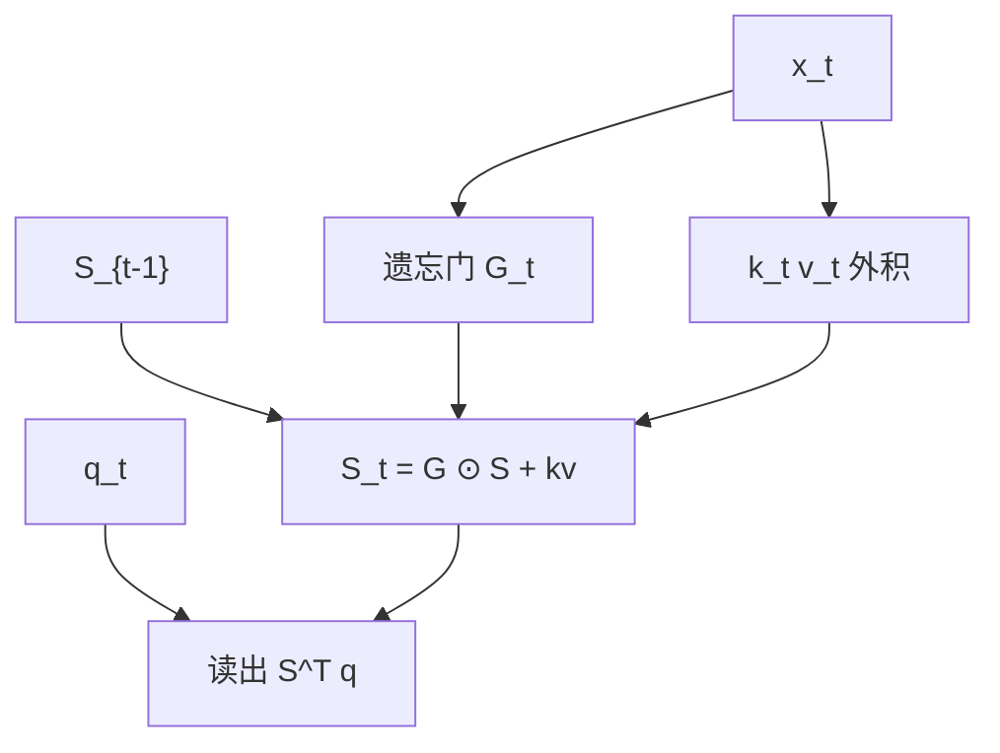

# 门控线性注意力 GLA

在线性注意力的状态更新上乘一个数据依赖的遗忘门，得到可并行训练的门控线性 RNN。

<footer>—— Yang et al., Gated Linear Attention Transformers with Hardware-Efficient Training, ICML 2024</footer>

[上一课](/llm/state-space-duality)把对角 SSM 与线性注意力对上。[线性注意力](/llm/linear-attention) 的状态 $S_t=S_{t-1}+\phi(k_t)v_t^\top$ 只有加法，没有遗忘。[选择性扫描](/llm/selective-scan) 的 $\overline{A}_t$ 是遗忘。本课在注意力记号里把门写回来：GLA。它是线性核族里与 Mamba 选择最接近的一支，后课 HGRN、delta rule 再换门的形状与更新规则。

## 问题

纯加性线性注意力状态单调累积，噪声 token 写进去就出不来，长上下文被灌满。SSM 用 $\overline{A}_t$ 衰减。缺口是：在 $S_t$ 这种矩阵状态上，用向量或标量门做**逐维遗忘**，并保持分块并行（门必须落在结合结构里）。Yang 等人把这层接到 Transformer 块的注意力槽位，FFN 仍在，故名 GLA Transformer。

[门控注意力](/llm/gated-attention) 乘在 softmax 输出上，二次复杂度仍在。GLA 的门在线性状态内部，复杂度仍线性。对象不同。

[RetNet](/llm/retnet) 用固定衰减 $\gamma$，不是数据依赖门。GLA 的门随 $x_t$ 变，更接近 Mamba 的 $\Delta_t$。

## 方法

矩阵状态

$$
S_t=G_t\odot S_{t-1}+k_t v_t^\top,
$$

$G_t=\sigma(W_g x_t)$ 广播到 $S$ 的形状（按行、按列或标量，实现各异）。查询读出 $o_t=S_t^\top q_t$（或带核特征 $\phi$）。$G_t$ 若只依赖 $t$ 而非过去的 $S$，更新对 $S$ 仍是仿射加逐点缩放，分块扫描仍可用：块内把缩放吸收进转移。

训练用分块并行形式；推理逐步更新 $S$，状态大小 $\Theta(d_k d_v)$ 或按头计。这比 KV 表的 $\Theta(n d)$ 在长 $n$ 时小，比对角 SSM 的 $\Theta(N)$ 大——GLA 用矩阵状态换表达力。

### 与 SSD 对角通道

对角 SSM 每通道一个标量状态；GLA 每头一份矩阵。对偶仍可写，但生成元更宽，召回上通常强于很窄的对角 SSM，弱于满 softmax。硬件上矩阵状态的扫描对 SRAM 更饿，块宽要更小心。

## 机制

遗忘门把「选择」从 SSM 的 $\Delta$ 翻译成注意力读者熟悉的 $G_t$。$G_t\approx 0$ 重置记忆，$G_t\approx 1$ 长期保持。因为读出是 $q^\top S$，保持的是键值外积的加权和，仍是线性检索：不能在状态里做二次匹配。门控改善的是信噪比与有效记忆长度，不是突然获得 softmax 那种竞争。

多头让不同头学不同遗忘时间尺度，类似 S4 多时间常数，但由数据决定而非只由初始化。

输出侧再加 GLU 式门是另一条通路，常与状态门一起出现。消融时要分开：一个改记忆，一个改写入残差的幅度。

## 边界

状态是 $d\times d$ 级时，头数一多，推理状态可以接近中等上下文的 KV。GLA 的胜负手是「$n$ 很大且 $d_k$ 受控」。核特征 $\phi$ 仍要选，选不好门再强也是一团糊。下一课 HGRN 把状态收回到更 RNN 的分层门，而不是外积矩阵，容量形状又不同。

## 小结

- GLA 在线性注意力的矩阵状态上加数据依赖遗忘门，可分块训练、逐步推理。
- 它对应 SSM 选择在注意力记号下的版本，不是 softmax 输出门。
- 状态体积 $\Theta(d_k d_v)$ 介于对角 SSM 与 KV 表之间。
- 线性读出仍无二次匹配；门控改善信噪，不消除召回上限。
- 出处：Yang et al., ICML 2024。
