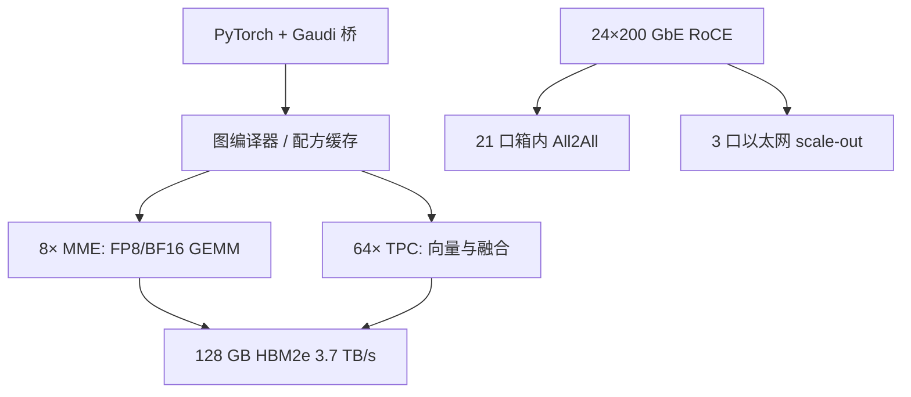

# Gaudi 3

    
计算在两颗 die 上的 MME 与 TPC，扩展却走片上 RoCE：机箱内与机柜间用同一套以太网 RDMA，而不是再学一条专有交换协议。

    <footer>—— Intel Gaudi 3 AI Accelerator White Paper；Intel Gaudi 架构与软件套件文档</footer>

Habana 被 Intel 收购后的第三代训练/推理加速器是 Gaudi 3。白皮书与 `docs.habana.ai` 把它写成：双计算 die、8 个矩阵乘引擎（MME）、64 个 TPC、24×200 Gbps RDMA NIC、128 GB HBM2e、约 3.7 TB/s 带宽、FP8 与 BF16 矩阵峰值约 **1.8 PFLOPS**（白皮书对比表常列 1835 TFLOPS MME）。软件是 Intel Gaudi 套件：图编译器、TPC 库、**HCCL** 集合通信、PyTorch 桥。本篇按公开材料写芯片与以太网扩展对 LLM 的含义，不把某次演示的 tokens/s 写成通则。CUDA 核不能直接跑；算子要么在 MME/TPC 上有路径，要么回落到 CPU。

## 问题

GPU 集群通常是 NVLink 域内 scale-up、InfiniBand/以太网 scale-out 两套语义。Gaudi 的产品主张是：**片上集成 RoCE v2**，机箱内 scale-up 与跨机 scale-out 用同一套 RDMA over Ethernet，可经标准以太网交换机互连。代价是要在以太网的拥塞、ECN、与集合算法上达到专有交换的逐步延迟，这对 decode 的张量并行比预训练 AllReduce 更苛刻。

第二问是精度。Gaudi 3 的 MME 支持 FP8（E4M3 与 E5M2）、BF16、FP16、TF32、FP32，累加进 FP32。白皮书写第五代 MME **片上 FP8 输入缩放**，减轻 TPC 做 scale/unscale 的负担。没有这条，FP8 训练会退化成「TPC 量化 + MME 当 BF16 用」。推理同样：表头 1.8 PFLOPS 是矩阵引擎吃到 FP8/BF16 时的数，不是任意 PyTorch 算子的数。

### 白皮书对比 Gaudi 2

公开对比（白皮书表格，OAM 形态）：BF16 MME 从 432 到 1835 TFLOPS；FP8 MME 从 865 到 1835（Gaudi 3 上 FP8 与 BF16 矩阵峰值同档）；TPC 从 24 到 64；HBM 从 96 GB / 2.46 TB/s 到 128 GB / 3.7 TB/s；片上 SRAM 48 MB→96 MB；网络 600 GB/s 双向 → 1200 GB/s 双向量级；主机接口 PCIe Gen4×16 → Gen5×16。制程叙述为相对 Gaudi 2 的 7 nm，Gaudi 3 走 TSMC 5 nm。PCIe 卡形态（HL-338 一类产品简介）另给 600 W、128 GB、FP8 E4M3/E5M2 等列，以当时产品简报为准。

1.8 PFLOPS 与 1835 TFLOPS 是同一量级的矩阵峰值，不同材料四舍五入不同。向量 TPC 峰值低一个数量级（白皮书 BF16 vector 约 28.7 TFLOPS）。注意力里的 softmax、Layernorm、RoPE 若落在 TPC 或未融合，屋顶线立刻从 MME 换成 TPC/SRAM。

## 方法

训练与推理都经 Gaudi PyTorch 桥：图中可加速子图下发到设备，编译配方缓存；不支持的算子在 CPU 上执行——这是静默慢的主因。执行模式包括 Lazy 与 Eager+`torch.compile`；文档曾建议优先 Lazy，并提示 Lazy 将弃用。分布式用 HCCL（NCCL 风格 API）。HCCL 可以走 Gaudi 集成 NIC 做 scale-up+scale-out，或 scale-up 走集成 NIC、scale-out 走主机网卡。

网络划分（HLS-3 八卡箱文档）：每卡 **21 个 200 Gbps 口做箱内 scale-up**（对七张卡全互连，相当于每条连接 3 口），**3 个口做 scale-out**。单向 scale-up 约 525 GB/s、双向约 1050 GB/s；单卡 scale-out 双向约 150 GB/s；整箱 scale-out 双向约 1200 GB/s。集合常分层，把箱内与箱外流水线化。规划张量并行时，逐步通信应尽量留在 21 口那一域；数据并行副本可以走 scale-out。

### FP8 与推理工作点

MME 的 FP8 片上缩放对应 NVIDIA TE 里「scale 是 GEMM 元数据」那一层，但是厂商自己的配方，不是 `transformer_engine.DelayedScaling`。E4M3/E5M2 与 OFP8 编码对齐的是格式宽度，检查点与 NVIDIA FP8 仍可能布局不同。推理 decode 看 3.7 TB/s 与 128 GB：70B BF16 权重大约 140 GB，单卡放不下，需要 TP 或权重量化；FP8 权重大约减半，单卡容量故事才成立。prefill 才有资格接近 1.8 PFLOPS。媒体解码器（白皮书 14 个）与 LLM 文本服务无关，不要写进 tokens/s 分母。

## 机制

双 die 把 MME/TPC/HBM 做成统一内存视图（文档称 128 GB unified HBM），软件按一张加速器编程，不必手工切 die——这与需要显式双 die 调度的某些 GPU MCM 不同。TPC 是 VLIW SIMD，承担 GEMM 之外的 DL 算子；融合质量决定中间张量是否进出 HBM。SRAM 96 MB、白皮书另列很高的片上带宽，用来喂 MME 的 tile，而不是当 70B 的权重缓存。把 FlashAttention 式的「在 SRAM 里重算注意力」搬到 Gaudi，取决于 TPC 库是否已有对应融合，而不是 96 MB 这个数字本身够不够装下一层 KV。

以太网 RDMA 的机制是：没有 NVSwitch 的专有链路层，拥塞控制、ECMP 与交换机缓冲成为逐步延迟的一部分，交换机选型因此进入推理容量规划，而不是只出现在数据中心网络组的表格里。预训练大 microbatch 可以靠带宽填满；decode 的小消息 AllReduce 对尾延迟敏感。HCCL 分层是为了让箱内满带宽与箱外 3 口重叠。把 NCCL 的 NVLink+IB 调参经验原样搬来，会调错网卡与队列对。

Gaudi 软件套件含 TPC SDK，可写自定义核。没有对应融合时，常见失败是某层在 CPU 上跑、HBM 利用率看起来很低。Profiler 应先问：子图是否全部在设备、HCCL 走的是集成 NIC 还是主机 NIC。

## 边界与工程取舍

### 以太网统一扩展的适用边界

生态小于 CUDA：vLLM / 量化核 / FlashAttention 变体要等 Intel 或社区移植。PyTorch 桥的支持矩阵随版本变，Eager+compile 曾仅覆盖部分模型。不要用 H100 的 TE 配方直接 `to('hpu')`。安全与驱动栈走 Intel Gaudi 文档，不是 `nvidia-smi`。HCCL 走主机网卡做 scale-out 时，集成 NIC 的 3 口闲置，逐步延迟模型要按主机 RDMA 重写，而不是按白皮书 24 口峰值。

何时考虑 Gaudi 3：要以太网统一扩展、128 GB 级 HBM、FP8 MME、已接受 HCCL/PyTorch 桥。何时留在 GPU：依赖 CUDA 内核生态、需要 NVL72 那种 72 卡专有域、或 decode 延迟已在 IB 上仍吃力还想再换一套未验证的以太路径。与 [Trainium2](/llm/trainium2-inferentia2) 类似，这是「编译器+专用核」加速器，不是另一块能跑 Marlin 的 GPU。箱内 21 口全互连适合把张量并行留在八卡域内；专家并行的 All-to-All 若漏到 3 口 scale-out，decode 会按以太网小消息付费。

白皮书里相对「80 GB 竞品」的容量对比是 2024 年语境；Blackwell 192 GB 出现后不要再把 128 GB 写成行业最大。PCIe 卡与 OAM 的 scale-up 拓扑不同，口数划分以对应平台指南为准。HL-338 一类 PCIe 形态的 scale-out 可能改走主机 NIC，与 HLS-3 八卡箱不是同一张网络图。

出处：Intel *Gaudi 3 AI Accelerator White Paper*（MME/TPC/HBM/NIC、FP8 片上缩放、与 Gaudi 2 表）；Intel Gaudi Architecture 文档（RoCE 集成、1.8 PFLOPS / 128 GB / 3.7 TB/s）；Network Configuration（21+3 口划分）；Intel Gaudi Software Suite（图编译器、HCCL、PyTorch 桥）。产品简报 HL-338 用于 PCIe 形态 TDP 与接口。

## 小结

- Gaudi 3：双 die、8 MME + 64 TPC、128 GB HBM2e、约 1.8 PFLOPS FP8/BF16 矩阵峰值、24×200 GbE RoCE。
- Scale-up 与 scale-out 共用片上以太网 RDMA；八卡箱内用 21 口，对外 3 口。
- FP8 路径依赖 MME 片上缩放与编译器融合，不是 `tensor.to(fp8)`。
- 不支持的 PyTorch 算子会静默落 CPU；验收看设备时间线而不是仅 loss。
- 与 CUDA 量化/注意力核生态不互通。
- 出处：Intel Gaudi 3 白皮书与 habana 架构 / 网络 / 软件文档。
