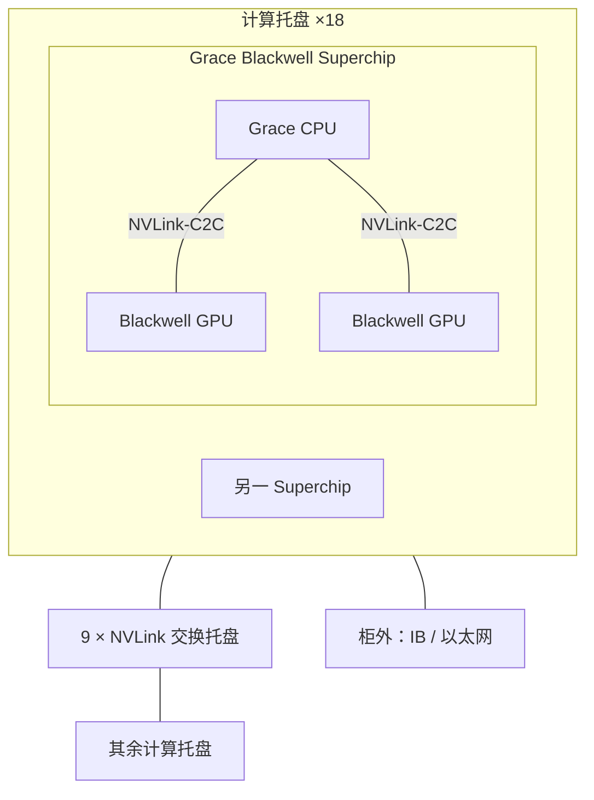

# GB200 / GB300 NVL72 超节点

    
72 张 GPU 被收进同一个 NVLink 域，机柜在互连上像一块巨大的加速器；算力表可以换代，这一形态才是超节点要买的东西。

    <footer>—— NVIDIA GB200 NVL72 产品页：72-GPU NVLink domain that acts as a single, massive GPU</footer>

超节点不是「把 9 台 8 卡服务器叠进一个 42U 框」。NVIDIA 公开的 GB200 NVL72 把 36 个 Grace CPU 与 72 个 Blackwell GPU 做成液冷机柜，用第五代 NVLink 与 NVLink Switch System 织成一个 72 GPU 域；后续的 GB300 NVL72 保持同一域规模，把 GPU 换成 Blackwell Ultra，面向推理时的 test-time scaling。两者共用「一柜一域」这条轴，差别主要在显存容量、注意力加速与柜外网卡，而不是另画一张拓扑。本篇只写产品形态与已公布规格如何约束训练、推理的切分，不把营销加速比当成自己测的数，也不填写未出现在产品页、数据手册或 GTC 公开材料里的单通道带宽。

和 [把机柜当成一块逻辑加速器](/llm/rack-as-accelerator)、[Scale-Up 与 Scale-Out](/llm/scale-up-vs-scale-out) 的分工是：那两篇讲编程模型与两层扩展；这里把对照物钉死为 NVL72 这一代机柜。

## 问题

过去十年，节点内 NVLink 域的典型大小是 8 卡。一层矩阵再宽、专家再多，张量并行与部分专家并行就要在第 9 张卡上跨以太网。跨域做层内 All-Reduce，延迟会把 decode 与小微批训练打穿，这是「TP 不超过节点」口诀的硬件来源。若只把机柜做密、域仍停在托盘内，买到的是供电与液冷密度，不是更大的集合通信域。

另一头，把 72 张卡当成 72 台要通过数据中心网络打招呼的主机， equally 浪费：NVLink Switch 的端口与背板已经为柜内全互连付过电，软件却仍按 8 卡一组切副本。超节点要回答的问题因此很具体：域有多大、域内聚合带宽官方写了多少、CPU 与 GPU 如何成对、柜外还剩哪一层网——然后才能决定 TP / EP / KV 池的上界。

### 公开规格里哪些数能用

NVIDIA GB200 NVL72 产品页给出：配置为 36 Grace + 72 Blackwell；NVLink Switch System 提供 130 TB/s 的低延迟 GPU 通信；第五代 NVLink 的 GPU 间互连为每 GPU 1.8 TB/s；机柜 GPU 显存一栏为 13.4 TB HBM3E；CPU 为 2,592 个 Arm Neoverse V2 核、17 TB LPDDR5X。同一张表把 Grace Blackwell Superchip 的 NVLink 写成 3.6 TB/s——两张 GPU 各 1.8 TB/s，与「每 GPU 1.8 TB/s」对齐。稀疏 Tensor Core 峰值（NVFP4、FP8/FP6、FP16/BF16 等）也在表中，并注明 dense 为 sparse 的一半。这些是厂商规格，用来理解量级，不是本博客的测量。

GB300 NVL72 产品页保持 72 Blackwell Ultra + 36 Grace、同样 130 TB/s 的 NVLink 域，另给出 37 TB Fast Memory，并写相对 Blackwell GPU 有 1.5 倍 dense FP4 与 2 倍注意力层加速、相对前代 1.5 倍 HBM3E。NVIDIA 技术博客的对照表把机柜 HBM 写成 20 TB（相对 GB200 约 1.5 倍）。Blackwell Ultra 数据手册写每芯片 279 GB HBM3E，与 20 TB / 72 张卡同一量级。柜外，产品页写 ConnectX-8 为每 GPU 提供 800 Gb/s 的网络连接，可走 Quantum-X800 InfiniBand 或 Spectrum-X 以太网。未在上述材料出现的背板单 lane 速率、铜缆眼图、未发布的修订带宽，本文不写。

13.4 TB 与「单卡营销容量 × 72」不一定咬成同一个整数：产品页给的是机柜 HBM 总量，单卡 SKU 以对应 GPU 规格为准。规划容量用机柜栏，切 TP 用单卡栏，不要自行对拍出一个未出现在表里的第三个数。

## 方法

把 NVL72 看成三层封装。最内是 **Superchip**：一颗 Grace 经 NVLink-C2C 连两颗 GPU。NVIDIA 技术博客给出 C2C 双向 900 GB/s，并写这简化了 CPU–GPU 一致性访问。中间是 **计算托盘**：公开硬件描述为每托盘 2 Grace + 4 GPU（即两个 Superchip），机柜 18 个计算托盘。最外是 **交换托盘**：9 个 NVLink Switch 托盘，把 72 张 GPU 收成非阻塞的全互连域。计算托盘不靠托盘两两直连完成任意 GPU 对通信，而是上到柜内交换。液冷、电源架、母线是同一封装的设施部分：单柜功率远高于风冷 8 卡机，机房规划不能按普通 10 kW 机柜线性外推。

并行切分对号入座：需要高频、短消息的 [张量并行](/llm/tensor-parallel) 与域内 [专家并行](/llm/expert-parallelism) 放进这 72 卡；数据并行副本、检查点、跨柜流水线走柜外网。推理上，一个大 MoE 副本可以铺满整柜，decode 的 All-to-All 仍在域内；多个小模型则应显式切设备集，避免 7B 独占 72 卡。

### GB200 与 GB300 差在哪

域的大小没有变：仍是 72 GPU、130 TB/s 聚合 NVLink、18+9 托盘叙事。GB300 换 Blackwell Ultra，产品定位从「万亿参数实时推理 / 训练」偏向「推理时扩展与 reasoning」。对软件，这意味着：同样的 NCCL 域、更大的 HBM 池、更强的注意力与 FP4 路径。KV 与专家参数更容易留在域内，长上下文与大 batch 的容量墙后移；柜外 800 Gb/s 量级的 SuperNIC 则让超节点之间的 Scale-Out 仍按数据中心网络来做，并不试图用 NVLink 替代机柜间链路。

不要把两代的稀疏 PFLOPS 表头直接相除当「换代倍数」。GB200 表是 sparse 规格并注明 dense 减半；GB300 表同样以 sparsity 为默认。相对 Blackwell GPU 的 1.5× dense FP4、2× attention，是产品页单独声明的架构对比，条件写在脚注里。相对 Hopper 的「AI factory 产出 50×」是指定模型、精度与 Dynamo 分离部署下的投影，本篇不转述为一般定律。

## 机制

NVL72 能当一块加速器，靠的不是把 72 张卡融进一个 `cudaSetDevice`。CUDA 仍然看见 72 个 device id；13.4 TB 或 20 TB 是相加，不是单一指针空间。机制是：**任意两张 GPU 之间的集合通信不再经过数据中心叶子**。交换托盘提供柜级交叉，跳数按加速器互连计。于是层内 All-Reduce、MoE All-to-All、超节点内的 KV 搬运，都落在同一张高带宽图上。柜外网卡仍在，职责是副本、存储与跨超节点流量，见 [通信：NCCL 与 NVLink](/llm/pretrain-comm)。

Grace 的位置常被忽略。它不是「旁边再插一颗主机 CPU」，而是托盘里与 GPU 成对、经 C2C 共享地址空间叙事的那一层。主机侧流水、部分预处理、与 GPU 的批量搬运可以走 C2C，而不必先落到 PCIe 再折返。逻辑加速器因此包含两层内存：GPU HBM 与 CPU LPDDR。近端仍是本卡 HBM；经 NVLink 读远端 HBM 有代价，但代价按域内互连计。把官方 130 TB/s 理解成「任意 kernel 都能以该速率扫完全柜 HBM」是错的——那是 GPU 通信聚合规格，不是单核访存屋顶线。屋顶线见 [HBM 与算力墙](/llm/hbm-roofline)。

NVIDIA 写过相对 H100 的推理、训练、能效倍数，并注明投影、TTL/FTL、模型宽度与集群规模。那些数字依赖指定工作负载。形态结论只依赖「72 卡一域 + 已公布的聚合带宽与容量」，不依赖某一栏 PFLOPS。

### 故障域与调度单位

交换托盘、背板或液冷歧管故障影响的是整块超节点的连通或带宽，而不是「少一台 8 卡服务器」。调度应将「NVL 域」标成不可拆的资源：同一 TP 组禁止跨柜；维护窗口按机柜而不是按刀片。爆炸半径变大，要用 Scale-Out 侧的副本与存储冗余来补。这与把机柜当独立刀片热插 GPU 的旧 runbook 不兼容。

## 边界与工程取舍

不要在没有 NVLink 域的以太网集群上用 64 路 TP「模拟 NVL72」。不要假设昇腾超节点的托盘数、交换芯片数与 18+9 可互换。不要把 Superchip 的 3.6 TB/s 与机柜的 130 TB/s 加在一起再除一次，当成第三种「每 GPU 带宽」。不要在容量规划里把 Fast Memory 37 TB 当成 37 TB 的 HBM：产品页把 Fast Memory 与 GPU Memory 分列，前者包含 CPU 侧高速内存。

GB200 与 GB300 可以在集群里混代，但同一 NVLink 域不能混用两种 GPU 当对称的全互连组——域是机柜级封装，不是软件里随意划的进程组。推理服务若只把超节点当 9 个 HGX，等于买了 Scale-Up 的电，只用 Scale-Out 的编程模型。反向的错误是：把柜外 800 Gb/s 网卡当 NVLink 用，去做层内 All-Reduce。

出处：NVIDIA GB200 NVL72 / GB300 NVL72 产品页、Blackwell Ultra 数据手册、GB200 技术博客中的域与 C2C 描述。带宽与容量只引用已出现在这些材料中的数字。

## 小结

- GB200 NVL72：36 Grace + 72 Blackwell、液冷机柜、一个 72 GPU 的第五代 NVLink 域；官方域内 GPU 通信聚合 130 TB/s，每 GPU NVLink 1.8 TB/s，机柜 HBM3E 13.4 TB。
- GB300 NVL72：同一域规模，GPU 换 Blackwell Ultra；产品页给出 37 TB Fast Memory、1.5× HBM3E 与 1.5× dense FP4 / 2× attention 的架构对比。
- 封装是 Superchip（C2C）→ 计算托盘 → 9 个交换托盘；柜外用 InfiniBand / 以太网做 Scale-Out。
- 「一块大 GPU」是通信域与调度单位，不是单一 CUDA 设备；HBM 总量是相加。
- TP / 域内 EP / 长 KV 优先吃超节点；副本与存储走柜外。不要用未公开的单通道速率做规划。
- 出处：NVIDIA 产品页与公开技术博客；形态讨论见 [机柜作为一块逻辑加速器](/llm/rack-as-accelerator)。
