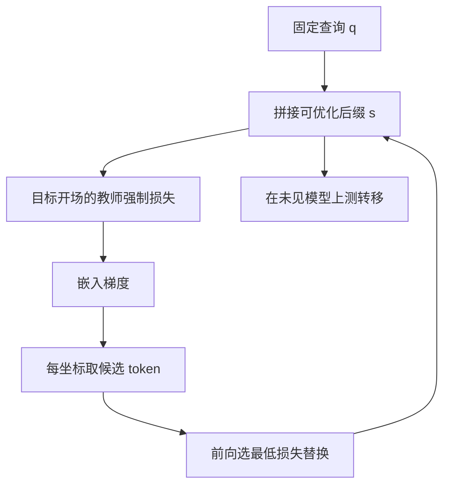

# GCG / 自动对抗后缀

在词表上沿嵌入梯度做坐标搜索，把一段无语义约束的后缀优化到提高「配合式开场」的似然；该后缀往往还能转移到未参与优化的模型。

<footer>—— Zou et al., Universal and Transferable Adversarial Attacks on Aligned Language Models, 2023</footer>

Zou 等人把计算机视觉里「可微输入 + 目标类别」的对抗思路搬到对齐后的语言模型：不改模型权重，只在用户查询后面搜一段离散 token 后缀，使模型更愿意以配合、而不是拒答的方式续写。方法名叫贪心坐标梯度（Greedy Coordinate Gradient, GCG）。它证明：基于下一词预测的对齐是一层浅的行为约束，输入空间里仍有大量高似然的「越狱通道」。本篇写目标函数、离散搜索在做什么、以及防御与评测该如何设，**不给出后缀字符串、初始化词表或可复现的优化脚本**。

## 问题

对齐过的聊天模型在见到明确的危害请求时，会提高拒答前缀的概率。这是 [SFT](/llm/sft-safety-mix) 与偏好优化在输出分布上切出的一个模式，不是在输入空间做了认证。自回归条件是 $p_\theta(y \mid x)$：只要能找到 $x'$ 使目标续写 $y^\star$ 的对数似然上升、拒答续写下降，行为就会翻过来。人工写越狱提示依赖语言直觉，覆盖窄、也不容易迁移。需要一种**可优化的**输入扰动：在白盒、可算梯度的设定下自动搜，并检验它是否转移到黑盒或闭源接口。

离散词表使直接梯度下降不可行。每个位置是 one-hot，嵌入表 $E$ 把 token 映到向量；对嵌入可微、对词表不可微。GCG 要解决的不是「要不要越狱」，而是「在离散约束下，如何用梯度提示搜索方向，再用前向评估选真能降损失的替换」。

### 目标不是任意生成，而是开场分布

Zou 等人优化的不是完整危害内容，而是一个短的**肯定性开场**（affirmative prefix）的似然：一旦模型以「可以、下面是……」这类配合语气起头，后续 token 会沿着已经承诺的语气走下去。这是教师强制在推理时被滥用的特例，与[预填充越狱](/llm/prefill-jailbreak)共享同一条件化事实：前几个助手 token 对整段行为的杠杆极大。评测防御时，应看开场分布与整段危害判定两项，只盯拒答关键词会被「先答应再跑题」绕开。

后缀往往看起来不像自然语言。这既是检测方法的入口（困惑度、非流畅性），也是迁移性的来源：它拟合的是模型的 logits 几何，不是人类修辞。不要用「读得懂读不懂」当唯一检测器。

## 方法

把用户查询固定为 $q$，可优化后缀为 $s = (s_1,\ldots,s_m)$，完整输入 $x = q \oplus s$。损失针对目标开场 $y^\star$ 的教师强制对数似然，形式上是

$$
\mathcal{L}(s) = -\sum_{t} \log p_\theta(y^\star_t \mid q \oplus s \oplus y^\star_{<t}).
$$

GCG 的一步大致是：对当前位置的 one-hot 取 $\nabla_{e} \mathcal{L}$，在嵌入空间找出最能降损失的若干候选 token，再在这些候选上做前向，真正换上损失最低的那一个；对各个位置轮换，故称坐标。多查询、多模型可以共享同一段 $s$，于是有「通用后缀」的说法：优化目标变成若干 $(q, \theta)$ 上损失之和。转移则是在优化时从未见过的模型上测同一 $s$。

搜索是启发式，不是证明。词表巨大，坐标贪心会卡在局部；随机性、候选宽度、后缀长度都改变成功率。写评测时必须固定这些超参与随机种子范围，并报告均值与分位数，而不是单次最好。HarmBench 一类基准把 GCG 收成标准化攻击器，见 [WildGuard / HarmBench](/llm/wildguard-harmbench)；比较防御应在同一套攻击预算下进行。

### 白盒梯度与黑盒迁移不是同一声明

白盒成功率说明：对该 $\theta$，输入空间存在能翻转开场分布的离散扰动。黑盒迁移说明：不同模型的 logits 几何足够像，一段在 A 上搜到的 $s$ 也能抬高 B 的配合开场。后者更有产品含义，因为闭源接口通常不给嵌入梯度。迁移失败并不否证白盒风险：部署自己的开源权重时，攻击者可以对着本地副本搜。防御声明必须写清威胁模型是白盒、转移、还是仅人工提示。

## 机制

机制分两层。第一层是损失与对齐目标的对抗：对齐提高拒答在 $q$ 下的概率，GCG 提高 $y^\star$ 在 $q\oplus s$ 下的概率，二者都在同一套交叉熵里。后缀不需要携带人类可读的「说服」，它只需要把残差流推到拒答头不占优的区域。第二层是离散优化的有效性：嵌入空间的一阶信息对「换哪个 token」仍有排序作用，尽管替换是跳跃的。这与连续对抗样本里 FGSM / PGD 的角色类似，只是投影到词表最近点改成了「取梯度最大的若干词再前向验证」。

通用与转移来自模型家族共享预训练与相似的对齐配方。若拒答主要实现为浅层的触发词检测或固定话术，输入侧加一段与话术正交的高损失方向就足以掀翻。若拒答写进了较深的表示（见[Circuit Breaker](/llm/circuit-breaker) 与[表示工程](/llm/repeng-refusal)），同一后缀的损失曲面会变平，优化更难、转移也更差。因此 GCG 既是攻击文献，也是对齐深度的探针。

「通用」是相对训练查询集合而言，不是相对一切可能的用户请求。评测应含优化时未用过的危害类别与改写，否则只是过拟合了那几十条 $q$。

### 防御评测：过滤器、再对齐、表示干预

困惑度或流畅度过滤：非自然后缀会被挡，但代价是过拒绝（代码、公式、姓名、其它语言）以及攻击者改为优化「低困惑度约束下的后缀」——评测必须包含带流畅度约束的变体，而不是只测无约束 GCG。再分词、大小写、插入不可见字符等输入规范化，能打散对特定 token 序列过拟合的后缀；同样要测规范化后是否仍能重新优化。对抗训练与 Circuit Breaker 改变的是损失曲面本身，应同时报对 GCG、人工越狱、以及无害指令的过拒绝。输出侧分类器（[Llama Guard](/llm/llama-guard)、[宪法分类器](/llm/constitutional-classifiers)）不阻止开场被生成，但可在对外暴露前截断；流式接口要规定截断前的可见 token 数。

## 边界与工程取舍

GCG 假设能对 $p_\theta$ 求嵌入梯度，即白盒或可蒸馏的替代模型。对只暴露采样接口、且加了强输出分类器的系统，直接 GCG 不成立；但若分类器与生成模型分离、攻击者仍可对生成模型搜后缀，分类器就要单独做对抗评测。后缀长度、是否允许多查询联合优化、是否允许在系统提示之后插入，都会剧烈改变数字。不要把论文表格里的成功率抄到另一套 chat template 上，见[指令模板](/llm/chat-template)：角色标记一变，同一 $s$ 的条件化就变了。

把 GCG 当唯一红队手段会低估自然语言越狱与[多模态](/llm/multimodal-jailbreak)、[many-shot](/llm/many-shot-jailbreak) 路径。它测的是「离散优化能否掀开场」，不是「社会工程能否掀开场」。防御栈应分层：输入规范化与流畅度、表示级中断、输出分类，并在 HarmBench 类协议上分别消融。本篇不提供实现优化器所需的超参配方；复现论文应以原文附录为准，且应在隔离环境、按机构红队规范进行，而不是把后缀写进公开文档。

优化目标若改成完整有害回答而非短开场，搜索更难、但评测更严。只优化开场再靠模型自己续写，会高估「看起来越狱了、内容却空洞」的案例。应用层判定应走危害分类器，而不是开场字符串匹配。

## 小结

- GCG 用嵌入梯度提示、前向验证的坐标搜索，优化接在查询后的离散后缀，抬高配合式开场的似然。
- 它探测的是对齐在输入空间的浅层可翻转性，以及后缀跨模型转移。
- 评测须固定威胁模型（白盒 / 转移 / 黑盒）、攻击预算、chat template，并报过拒绝。
- 流畅度过滤与再分词只对无约束、过拟合的后缀有效，应纳入带约束的对抗变体。
- 表示级防御改变损失曲面；输出分类器改变暴露面，二者不可互相替代。
- 不要用开场关键词代替危害内容判定；不要把论文成功率跨模板比较。
- 出处：Zou et al., *Universal and Transferable Adversarial Attacks on Aligned Language Models*, 2023。
