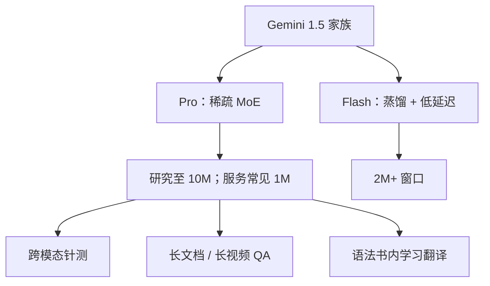

# Gemini 1.5 长上下文

    
在至少一千万 token 的上下文里，下一 token 预测仍在改善，跨模态检索召回仍接近完美；生产上把百万级窗口变成可服务的多模态模型。

    <footer>—— Gemini Team，Gemini 1.5: Unlocking multimodal understanding across millions of tokens of context，arXiv:2403.05530</footer>

Gemini 1.5 技术报告（2024 年 3 月初版，后有修订）把**超长上下文**写成这一代的主命题，而不是把 1.0 Ultra 再堆密参数。家族含 **1.5 Pro**（相对同年 2 月 Pro 的更新）与更轻的 **1.5 Flash**。Pro 是稀疏 **MoE Transformer**，用路由把输入送到参数子集，从而在总参数变大时保持每 token 计算可控；Flash 是面向 TPU 服务的解码器，注意力与前馈可并行，并对 Pro **在线蒸馏**，用更高阶预条件优化。二者原生多模态，文本、图像、音视频可交错。研究侧把上下文推到 **10M** token：文本针测约 7M 词、音频约 107 小时、视频约 10.5 小时（1 fps）。生产常见是 1M 量级窗口。报告**没有给出专家数、总参数或激活参数**，本篇也不补。

## 问题

2024 年初公开窗口大致是 GPT-4 Turbo 128K、Claude 3 生产 200K。超长文档、整仓代码、数小时录像若切块 + RAG，会丢掉需要跨段绑定的推理，且检索器本身会错。报告要证明两件事：诊断任务上「针」在百万到千万长度仍能取回；现实任务上长文档 QA、长视频 QA、长音频 ASR 超过「短窗口模型 + 外挂检索」。另一件事是效率：1.5 Pro 在多数核心基准上达到或超过 **Gemini 1.0 Ultra**，训练与推理计算却显著更少——长窗口若只能用 Ultra 级稠密模型，服务不可行。

Flash 的问题是延迟：同样 2M+ 级窗口与多模态，必须给高 QPS 路径一条更小、更快的模型。报告用蒸馏而不是另训一个无关小模型，来减少质量回归。

### 针测满分不是长上下文推理

NIAH 只要求找回插入的秘密。1.5 Pro 在文本/视频/音频上到 1M 近乎完美（&gt;99.7% 量级），10M 文本仍约 99.2%；相对 Claude 2.1 在 200K 的 98%，Pro 在 200K 报 100%，并维持到 530K。Flash 到 2M 三模态几乎完美。这些是诊断上限。报告同时做多跳、长文档问答，并承认最难的「把相距很远、又彼此相似的多条事实合起来」在 10M 上仍未完全解决。读 1.5 必须把图 1 的绿格子和真实 QA 分开。

Kalamang（使用人数少于 200）的 MTOB 设定：把约 500 页参考语法、词典和约 400 条平行句全部放进上下文，让模型学英→Kal 翻译，质量接近用同一材料学习的人。这是长上下文内学习，不是预训练里见过该语言。几乎无网页存在，用来降低污染借口。

## 方法

架构公开到这一层为止：Pro 为稀疏 MoE，条件计算来自 Google 一长串 MoE 文献；1.5 还包含「使 10M 理解不掉点」的结构改动，但**没有**把层公式、窗口注意力图案或专家表写进可复现附录。Flash：解码器、注意力与 FFN 并行（报告引用 PaLM 类做法）、从 Pro 蒸馏。服务表：1 万字符输入时 Flash 在英/日/中/法上输出最快；英语超过 650 字符/秒，比当时测过的 Claude 3 Haiku 还快约 30% 以上。

评测分诊断与现实。诊断：长序列负对数似然——Pro 在长文档上到 1M、代码上到 10M 仍改善，1.0 Pro 约在 32K 饱和；Flash 文档到 1M、代码到 2M。对 NLL 拟合幂律，10M 处出现偏离。现实：长文档/视频 QA，即便给对照模型外挂检索，1.5 Pro 仍全面更好（报告口径）。核心非长上下文能力（数学、科学、代码、多语言、图像/视频/图表）上，Pro 相对 1.0 Pro 在 50 项里 44 项更好，Flash 41 项；并给出分域平均提升百分比。负责任部署与模型卡在附录。

### 模态是交错的，不是三个窗口

10M 可以几乎五天音频、或《战争与和平》十倍以上、或 Flax 仓库量级代码、或 10.5 小时 1 fps 视频。因为原生多模态，这些可以混在同一前缀。针测按模态分别插针；真实任务则要求在录像里对齐口播与画面再回答。ASR 长音频是另一张表，不要用文本 NIAH 代替。生产 1M 与研究 10M 的服务成本差几个数量级，API 档位以 Google 当时文档为准。

## 机制

MoE 的机制是总参数与每 token FLOPs 解耦：路由只激活子集。报告用这一点解释「比 1.0 Ultra 省很多计算却对上质量」。长上下文的机制在公开文本里是「一系列架构改动 + 训练/服务基础设施」，**不足以**复现注意力核。能确定的经验规律是：NLL 随位置在很长一段上仍降，说明模型在用远距离统计，而不只是局部窗口；10M 幂律偏离说明外推有墙。蒸馏让 Flash 继承 Pro 的长窗行为，但代码 NLL 只画到 2M，不要把 Pro 的 10M 曲线抄给 Flash。

相对 RAG：外挂检索把「找对段落」从模型内部分出。1.5 的主张是部分任务上内生长窗已超过检索增强的短窗模型。这不废除 RAG——延迟、价格、隐私仍可能要求切块——只是把「窗口太短所以必须 RAG」从技术必然变成成本选择。

不要给 1.5 Pro 填专家数或「激活 22B」之类来路不明的数字。报告只说稀疏 MoE 与条件计算。Flash 是否稠密，文中写 transformer decoder 与蒸馏，未给出与 Pro 对等的 MoE 句子；不要断言 Flash 的专家布局。

### 与 Claude 3 / GPT-4 Turbo 的窗口对比

报告把 10M 写成相对 Claude 3.0 200K 与 GPT-4 Turbo 128K 的代际跳跃。针测对照 Claude 2.1 的 200K。这些是 1.5 报告写作时的公开窗口，随后 Claude 与 GPT 都拉长过；历史对比应钉死 2403.05530 用的对手版本，不要用 2025 年的 1M Claude 去改写 1.5 的「代际」修辞。

## 边界与工程取舍

无参数、无训练 token、无具体稀疏度。10M 是研究评测长度，不是所有 API 用户的默认配额。针测用秘密数字/短语，对抗性相似事实的多跳仍难。Kalamang 展示的是语法书内翻译，不是任意低资源语言的零成本习得。视频 1 fps 会丢掉帧间事件；小时级理解不等于动作定位到百分之一秒。服务上 KV 随长度涨，MoE 省的是层内 FLOPs，不是自动省缓存；长请求的墙钟与计费是产品约束。

把 1.5 写成「只有长上下文、核心能力弱」与报告的 44/50 项相反；写成「10M 已解决长推理」又与报告自己的难任务保留段相反。Flash 的卖点是速度与价格，质量以报告相对 1.0 Pro/Ultra 的表为准，不要用 Pro 的 10M 视频数字代替 Flash。

出处：Gemini Team，*Gemini 1.5: Unlocking multimodal understanding across millions of tokens of context*，arXiv:2403.05530。参数量与专家表未公开。

## 小结

- Gemini 1.5 Pro：稀疏 MoE 多模态，研究上下文至 10M，针测近乎完美；核心基准对标或超过 1.0 Ultra 且更省计算。
- Flash：从 Pro 蒸馏的低延迟档，2M+ 窗口，输出吞吐公开表上领先。
- 针测、NLL 幂律、长 QA、MTOB 语法书翻译是四类不同证据，不可互相替代。
- 不公开参数与专家数；生产窗口以当时 API 为准，常为 1M 而非 10M。
- 出处：arXiv:2403.05530。
