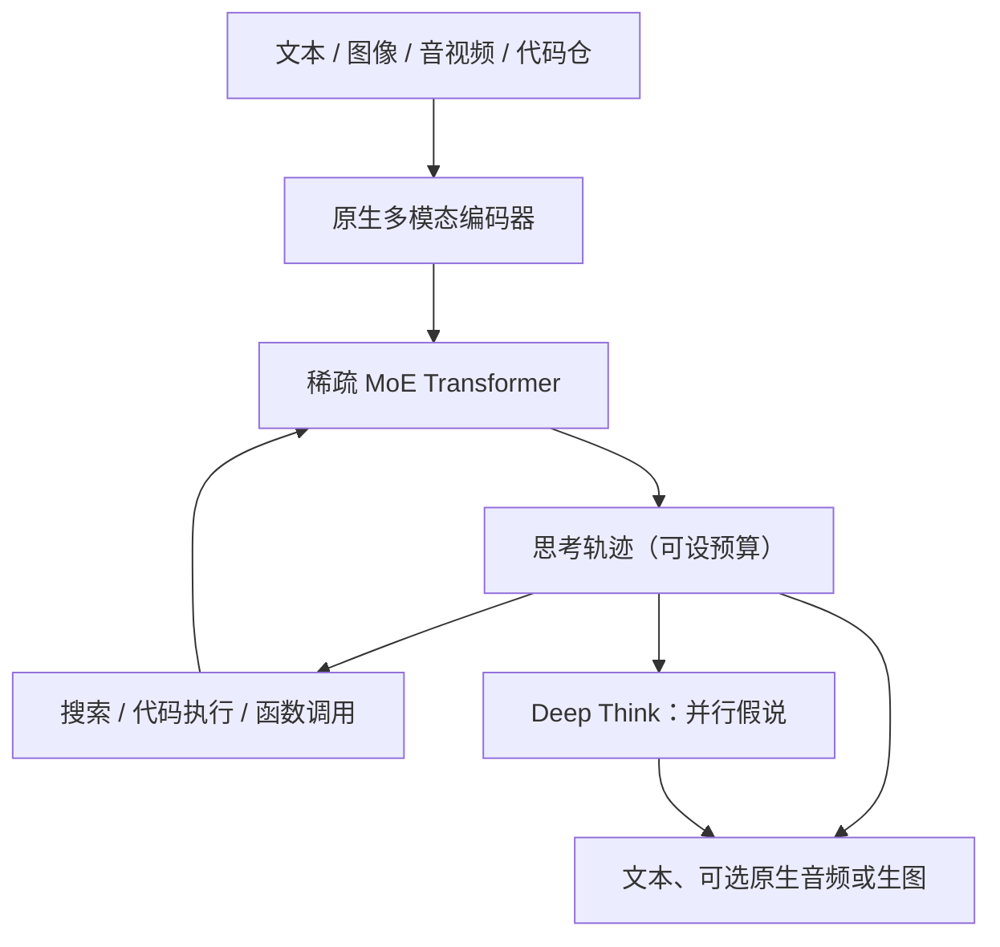

# Gemini 2.0 / 2.5

    
Gemini 2.X 系列都按原生多模态来训，支持超过一百万 token 的长上下文，并带原生工具调用；2.5 再把「思考」做成可随推理预算缩放的一等能力。

    <footer>—— Comanici 等，Gemini 2.5 技术报告，arXiv:2507.06261</footer>

Google 在 2024 年 12 月推出 Gemini 2.0，2025 年春季把主线收到 2.5。相对 1.5 的叙事中心是「能读一百万 token」，2.X 的公开主轴变成三件叠加：**原生多模态进出**、**推理期思考与预算**、**面向智能体的工具与长视频**。架构上 2.5 报告写明是稀疏混合专家 Transformer，但专家个数、层宽、激活量**公开信息有限**，不得用传言填表。本篇按官方博客与 2.5 报告整理可核对的产品与机制，不把未写入这些文本的层数表写成规格。

## 问题

1.5 已经证明百万级上下文和原生多模态输入可以做成可用产品，但默认解码仍是「问完立刻答」。一旦题目需要多步规划、对照长视频或整仓代码，把推理算力全部压进一次前向，质量会被时间预算卡住。2.0 要回答的是：同一套助手能否在对话里原生调搜索与代码执行、输出图像或语音，而不是外挂一串专用模型。2.5 进一步问：思考能否变成默认路径，并用 token 预算在延迟与正确率之间滑动，而不是再维护一套「聊天权重」和一套「推理权重」。

第二个问题是服务分层。旗舰、工作马、低延迟轻量必须落在同一条 Pareto 曲线上，否则开发者每次换档都要重写提示与安全策略。2.X 用 Flash / Flash-Lite / Pro 覆盖这条曲线；实验模型（2.0 Pro、原生生图、Deep Think）则用来探能力上限，再决定是否并回主线。

### 不要把 2.0 的实验档写成 2.5 的默认规格

2.0 Flash 在 2024 年 12 月以实验接口放出，随后有 Thinking 变体、2025 年 2 月的正式版与 Flash-Lite，以及实验性的 2.0 Pro（当时宣传过更大的上下文上限）。2.5 Pro 才把思考做成系列默认；2.5 Flash 是带可控思考预算的混合推理档。2.0 Flash 在 2.5 报告里被明确写成**非思考**的日常快模型。把「2.0 Pro 的两百万上下文」直接抄到 2.5 Pro 的产品卡上，或把 Deep Think 当成所有 2.5 调用的默认，都是错位。

2.5 Pro 公开上下文常见口径是约 104 万 token、最大输出约 6.5 万；2.0 Pro 实验档曾宣传 200 万。数字随 API 版本变，引用应钉模型 ID 与文档日期，不要混成一张永恒表。

## 方法

2.5 报告把 2.X 收成一条家族：2.5 Pro（最强思考与代码）、2.5 Flash（混合推理、可控思考预算）、2.0 Flash（低延迟非思考）、2.0 Flash-Lite（更便宜的吞吐档）；后来还有 2.5 Flash-Lite 预览。输入侧覆盖文本、图像、音频、视频与代码仓库量级的上下文；输出在 2.5 上扩展到原生音频对话，2.0 Flash 实验过原生图像生成与交错图文。工具方面，2.0 起强调原生函数调用、代码执行与搜索，而不是只靠提示词模拟。

### 思考、预算与 Deep Think

过去 Gemini 在用户问题后立刻写答案，推理期算力几乎固定。思考模型用强化学习训练成：在作答前可以消耗成千上万次前向，先在内部写推理轨迹。2.0 Flash Thinking（2024 年 12 月）是这条配方的实验；2.5 把思考接到所有模态与百万上下文上，并由模型自己决定想多久。开发者还可设思考预算，用内部 token 数换 AIME、LiveCodeBench、GPQA 一类曲线上的点。Deep Think 是 2.5 Pro 上的增强推理模式：并行产生多种假说并互相批评，再合成最终答案；I/O 2025 宣布，随后以 Ultra 订阅与有限每日次数放出。它比普通思考更贵、更慢，报告把它和奥赛级数学、竞赛代码、多模态基准绑在一起，而不是日常聊天的默认开关。

训练基础设施上，2.5 是首个在 TPU v5p 上训成的家族，同步数据并行跨多个 8960 芯片的 pod、跨数据中心。稀疏 MoE 用来把总容量与每 token 计算拆开。视觉侧把每帧 token 从较密的设定压到约 66（相对先前约 258），使百万上下文里能装约三小时视频。音频侧加入因果表示以支持流式对话。这些是报告写明的工程方向；具体专家数、路由 $k$、是否共享专家，**公开信息有限**。

「原生工具」指训练分布里包含调用—观察—再生成，而不是推理网关事后解析自然语言。工具失败、超时、改名仍会让轨迹崩；这和开源侧的 [function calling](/llm/function-calling) 是同一类工程问题，只是权重闭源。

## 机制

思考改变的是条件计算：答案分布条件于一条可被预算截断的内部序列。预算过小，行为接近 2.0 Flash 的直答；预算过大，KV 与延迟按思维长度涨，简单分类题会被写成冗长内心独白。Deep Think 再把单条思维链换成多假设并行，机制上接近测试时扩展，而不是再训一个更大的稠密核。报告强调思考与百万上下文、多模态输入是同一套权重上的组合，因此「对三小时视频先想再答」在产品上是合法路径，代价是账单与安全面同时变大。

稀疏 MoE 的机制仍是「容量走专家、费用走激活」。没有公开 $k$ 与专家表，就不能把它写成 Mixtral 式 8 选 2 或 DeepSeek 式细粒度。能写的只有：2.5 用稀疏化解释相对 1.5 Pro 的质量跳跃，并用训练稳定性文献暗示 MoE 深模型仍然难训。长上下文方面，2.5 在 LOFT、MRCR、VideoMME 一类更难的内部与公开集上相对 1.5 做 hill-climbing；针检索过关仍不等于能综合万 token 约束，只说明存在高分取回路径。

事实性从 1.5 的「忠实于提示里的文档」扩到多模态、长上下文与模型自己检索到的网页。2.0 被写成 Google 侧第一代按 AI Overviews / AI Mode 产品预期去训接地的家族。接地格式好，不保证检索器给对文档——这与企业 RAG 是同一边界。

### 实验档如何并回主线

2.0 Pro 实验验证了更强代码与当时最大窗口；原生生图验证了对话式改图与多语迁移；Flash-Lite 验证了「同能力集、更低延迟」可以单独成档。并回 2.5 之后，窗口与思考默认以 2.5 文档为准，实验数字只作历史。Pokemon 一类智能体演示说明长上下文 + 工具 + 思考可以组合成持续环境，不是单独一项基准分数。

## 边界与工程取舍

层数、头数、词表、训练 token 配比在 2.5 报告里仍大量缺席。任何「Gemini 2.5 有多少专家」的具体整数，若找不到报告或模型卡，就应标**公开信息有限**。Deep Think 的安全评测显示内容安全与语气客观性好于普通 2.5 Pro，但对无害请求的拒答率更高——增强推理不是免费的服从性。思考默认开启会抬高 Flash 档的费用；产品必须把预算接到明确 UX，不能假设用户会关思考。

百万上下文的 KV 与预填充算力仍按长度二次或线性（取决于实现）涨。把整仓或三小时 4K 视频无压缩塞进窗口，先打的是账单而不是模型智力。原生音频与生图各有自己的安全与水印策略，不能用纯文本拒答表覆盖。API 模型 ID、退役日期与 Arena 分数随快照变，引用应写版本。

不要把 2.5 报告里的稀疏 MoE 一句话回写到 1.5 或 1.0 的架构传说上。每一代公开的是不同粒度的句子；1.5 的长上下文专文与本篇互补，不互相提供层数。

## 小结

- Gemini 2.0 把原生工具、多模态输出（生图 / 音频实验）和 Flash 分层铺开；2.5 把思考做成默认可预算能力，并公开稀疏 MoE 与 TPU v5p 训练。
- 2.5 Pro / Flash 常见窗口约 1M token；思考预算用内部 token 换推理质量；Deep Think 是并行假说的高成本模式，不是所有调用的默认。
- 每帧视觉 token 压缩使约三小时视频能进同一窗口；专家个数与激活量公开信息有限。
- 实验档（2.0 Pro、原生生图、Flash-Lite）的数字不得直接当作 2.5 稳定规格。
- 出处：Comanici 等，*Gemini 2.5: Pushing the Frontier…*，arXiv:2507.06261；Google DeepMind / Google 关于 Gemini 2.0 与 2.5、Deep Think 的官方博客。不编造未公开的专家表。
