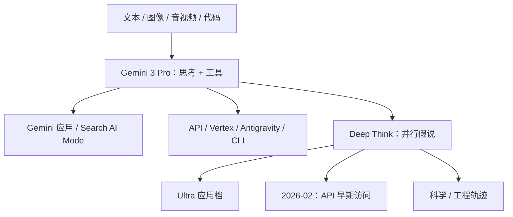

# Gemini 3 / Deep Think

    
Gemini 3 是我们迄今最智能的模型，把推理、多模态与智能体能力叠在同一条产品线上，让想法可以直接变成可交互的东西。

    <footer>—— Pichai / Hassabis / Kavukcuoglu，A new era of intelligence with Gemini 3，2025-11-18</footer>

[Gemini 2.0 / 2.5](/llm/gemini-2) 把思考做成可预算的默认路径。2025 年 11 月 18 日 Google 把主线收到 **Gemini 3**：当天以 **Gemini 3 Pro** 预览铺到 Gemini 应用、Search 的 AI Mode、AI Studio、Vertex AI，以及新的智能体开发环境 Google Antigravity。**Deep Think** 在同一篇介绍博文里被写成增强推理模式，先给安全评测方，再于 12 月 4 日进入 Ultra 订阅，2026 年 2 月 12 日再发一版面向科学与工程的大升级。层数、专家个数、激活量在官方博文与模型卡口径里**公开信息有限**，不得用传言填表。

## 问题

2.5 已经能在百万上下文上先想再答，但产品默认仍是「一个检查点、一套思考预算」。一旦题目跨过竞赛数学、长视频、整仓代码与真实实验设计，单条思维链的测试时算力不够用，用户还要自己判断何时打开更贵的模式。3 要回答的是：同一代旗舰能否同时当多模态理解、vibe coding、长程规划助手，并把**并行假说式**的 Deep Think 从 2.5 Pro 的实验开关做成可订阅、后来可走 API 的专用档。

第二条是分发。Google 第一次在发布当天就把新一代接进 Search 的 AI Mode；开发者侧要同时服务 CLI、Antigravity 里的编辑器—终端—浏览器智能体，以及 Vertex 上的企业流量。缺的不是又一个 Arena 分数，而是**思考签名跨轮次可校验、媒体分辨率可调、工具与结构化输出可组合**的接口形状。

### 不要把 Deep Think 写成所有 Gemini 3 调用的默认

发布日叙事把 3 Pro 写成「迄今最智能」的日常旗舰，把 Deep Think 写成「再往前推一档」的增强模式。12 月 4 日的应用更新说明：Ultra 用户在模型下拉里选 Thinking，再在提示栏打开 Deep Think，提交后通常要等数分钟。2026 年 2 月 12 日的升级明确写给科学、研究与工程——题目往往没有单一标准答案、数据不完整——并第一次向部分研究者与企业开放 Gemini API 的早期访问。把 Pro 的 Arena 分、Flash 后来的低延迟档、Deep Think 的奥赛级分数混成一句「Gemini 3 超过某闭源旗舰」，没有信息量。

3 Pro 发布日给出的窗口口径是约 100 万输入 token；开发者博文写预览价在 20 万 token 及以下提示上为每百万输入 2 美元、输出 12 美元。后续 Flash / 3.x 快照会改价与退役日期，引用应钉模型 ID 与文档日期。

## 方法

能写进方法栏的，是官方博文承认的**产品计算图与评测协议**，不是一张未公开的专家表。3 Pro 被写成原生多模态推理模型：输入覆盖文本、图像、音视频与代码仓量级上下文；输出以文本为主，并强调用代码生成高保真可视化。思考侧引入 `thinking_level` 一类控制，开发者博文还要求更严格地校验 **thought signatures**，以免多轮对话丢掉内部轨迹。媒体侧允许更细的分辨率参数，用视觉保真换延迟与费用。

### Deep Think：并行假说，而不是把 Pro 再训大一号

发布日测试口径：Deep Think 相对 3 Pro，无工具 Humanity’s Last Exam 从 37.5% 到 41.0%，GPQA Diamond 从 91.9% 到 93.8%，带代码执行的 ARC-AGI-2 到 45.1%（ARC Prize 核实）。2026 年 2 月升级把同一模式接到更脏的科研题：无工具 HLE 48.4%，ARC-AGI-2 84.6%（基金会核实），Codeforces Elo 3455，并宣称达到 2025 年 IMO 金牌水准，以及 IPhO / IChO 笔试金牌水准、CMT-Benchmark 50.5%。机制句在 LinkedIn / 应用更新里写得很短：多轮迭代推理、同时探索多种可能性，像专家头脑风暴。这与 2.5 报告里「并行产生假说再互相批评」是同一类对象，但 3 的 Deep Think **没有**另发一篇与 2.5 同等级的技术报告来规定假说条数、是否共享 KV、奖励是过程还是结果。

3 Pro 发布日的其它公开分数，应用来对照、不要当永恒规格：LMArena 1501 Elo，MathArena Apex 23.4%，MMMU-Pro 81%，Video-MMMU 87.6%，SimpleQA Verified 72.1%，WebDev Arena 1487 Elo，Terminal-Bench 2.0 54.2%，SWE-bench Verified 76.2%。Antigravity 把智能体提到独立表面，并接 2.5 Computer Use 与图像编辑模型；那是产品编排，不是 3 的层宽。

2 月升级举过 Rutgers 数学审稿找逻辑漏洞、Duke 晶体生长配方、Google 硬件侧的零件设计，以及草图到可 3D 打印文件。这些是早期测试者故事，不能外推成「Deep Think 已替代实验室仪器」。

## 机制

3 相对 2.5 能说清的机制差分，首先在**测试时计算的分档**。Pro 的思考是同一套权重上的预算；Deep Think 被产品写成更贵、更慢、面向 Ultra / 白名单 API 的专用模式。并行假说提高的是探索宽度，不是把稀疏 MoE 的专家数乘一个公开整数——专家表仍未写进介绍博文。长上下文仍按百万 token 卖：能把讲座、比赛录像、手写食谱和整页论文塞进同一条件，但 KV 与预填充账单仍随长度涨。

智能体侧，发布日用 Vending-Bench 2 证明更长地平线上的工具一致性；Gemini Agent（Ultra）把规划接到收件箱与本地服务预订。开发者博文把客户端 bash、托管 bash、Search grounding 与 URL context 跟结构化输出组合，使「取网页再吐 JSON」成为合法路径。这些改变的是工具环与接口校验，不是新的注意力公式。

### 安全评测先于 Deep Think 铺开

介绍博文称 3 是当时 Google 做过最完整安全评测的一代：迎合下降、提示注入抵抗、网络误用防护，并按 Frontier Safety Framework 做关键域测试，合作方包括 UK AISI 以及 Apollo、Vaultis、Dreadnode 等。Deep Think 特意晚几周给 Ultra，是因为增强推理会同时抬高双用途能力与拒答曲面——2.5 时代已经出现过「想得更深、无害请求拒答率更高」。没有模型卡里的专家表，就不能把安全结论回写成某一层的稀疏度。

## 边界与工程取舍

架构表公开信息有限。任何「Gemini 3 有多少专家 / 多少激活」的整数，若找不到模型卡或报告，就应标未证实。Deep Think 的 2025-11 分数与 2026-02 分数不是同一快照：后者明确写了科学导向的升级，引用必须写日期。思考 token 计入上下文并按输出计费，把 Deep Think 当日常聊天默认会先打账单。Antigravity、Search 生成式 UI、草图转 3D，各自有自己的安全与版权面，不能用纯文本拒答表覆盖。

后续还有 3 Flash、3.x 与 3.8 Flash 一类快照；本篇停在 3 Pro 发布叙事与 Deep Think 两条官方时间线。不要把 2.5 报告里的 TPU v5p 训练句未经核实地抄到 3 上。

出处：Google，*A new era of intelligence with Gemini 3*（2025-11-18）；*Start building with Gemini 3*（同日）；Gemini 应用更新 2025-12-04 / 2026-02-12；*Gemini 3 Deep Think: Advancing science…*（2026-02-12）。参数量未公开。

## 小结

- Gemini 3 于 2025-11-18 以 3 Pro 预览铺开；Deep Think 是增强推理档，12-04 进 Ultra，2026-02-12 升级并开 API 早期访问。
- 公开卖点是多模态理解、vibe / 智能体编码、百万上下文与 Search 当天接入；架构表公开信息有限。
- Deep Think 用并行假说换奥赛级与科研题分数，延迟以分钟计，不是 Pro 的默认开关。
- 评测必须标明是否 Deep Think、是否带工具 / 代码执行、以及快照日期。
- 出处：上述 Google / DeepMind 博文与应用更新。不编专家表。
