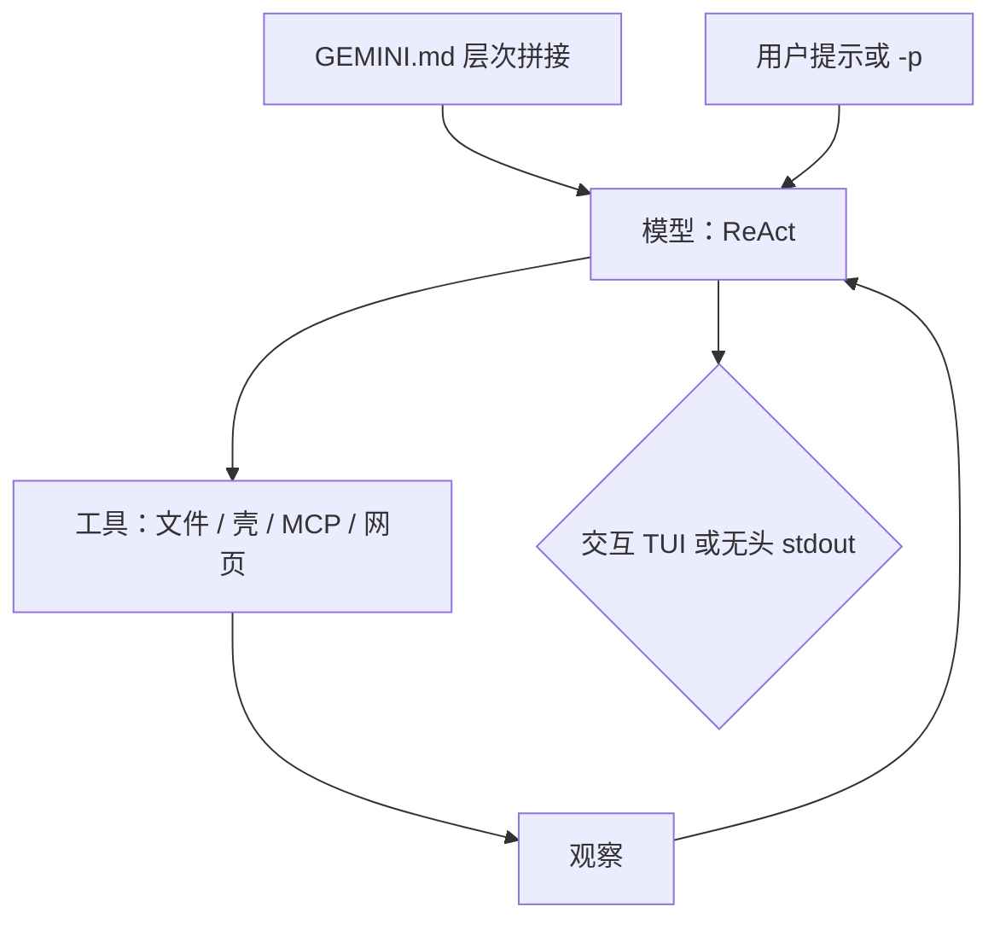

# Gemini CLI

    
在终端里跑同一条「推理—行动」循环：读项目上下文、调工具、观察结果，直到任务结束；无头模式只是把这条循环的出口改成 stdout。

    <footer>—— Google，Gemini CLI 官方文档（geminicli.com）与 Cloud 文档中的产品说明</footer>

Gemini CLI 是 Google 开源的终端智能体（Apache 2.0），把 Gemini 模型接到本地项目：理解代码、改文件、跑命令、接 MCP，并用 `GEMINI.md` 持久化规范。Google Cloud 文档把它描述为带内置工具与本地/远程 MCP 的 ReAct 循环，既擅长编码，也可用于内容、研究与任务管理。配额可来自 Gemini Code Assist 各版本（与 agent mode 共享），或用 Gemini API 密钥按量付费。本篇按官方文档写上下文层次、无头接口与安全边界。不写越权自动化或攻击步骤。

## 问题

把网页聊天里的 Gemini 用到仓库上，缺三样东西：工作区状态、工具执行、可脚本化的退出码。IDE 里的 Gemini Code Assist agent mode 解决了编辑器内循环，但 CI、SSH 会话与纯终端工作流仍需要一个进程内代理。Gemini CLI 的定位是：**同一模型家族、同一套工具哲学，接到 stdin/stdout 与项目目录**。

开源带来可审计与可改，也带来版本碎片。文档明确支持扩展、Hooks、Skills、检查点、沙箱、策略引擎、模型路由与回退。企业有单独的配置面。未付费档与 Google One 用户一侧，文档曾提示 CLI 将由 Antigravity CLI 替换的时间表——引用时要看你所读文档的更新日期，不要把已宣布的产品迁移忽略掉。

### 上下文必须分层，否则每个提示都在重教一遍

官方把 `GEMINI.md` 当作指令性上下文：风格、架构、禁止事项。层次是：用户全局 `~/.gemini/GEMINI.md`；工作区与父目录中的项目文件；工具访问某路径时再即时扫描该目录及其祖先（直到受信任根）。所有找到的文件拼接后随每次提示发给模型。页脚显示已加载的上下文文件数，便于发现「为什么它突然守另一套规范」。`/memory show` 打印拼接原文；改完文件后 `/memory reload` 强制重扫。大文件可用 `@path` 导入拆开。`settings.json` 里可以改上下文文件名列表，例如同时承认 `AGENTS.md`。

安装默认 `npm i -g @google/gemini-cli`，细节与系统要求见 Installation 页。认证可选 Google 登录、API 密钥或企业/Cloud 配置；无头服务器把认证 URL 写到临时文件一类机制以文档为准。Cloud Shell 里可免额外安装使用。

## 方法

交互运行 `gemini`。内置工具覆盖读文件、改文件、壳命令、网页搜索与抓取、待办拆分等；MCP 在 `settings.json` 的 `mcpServers` 里配置，或用 `gemini mcp` 子命令增删。传输支持 stdio、HTTP、SSE。Skills、Hooks、Extensions 把领域流程与生命周期脚本打成可分发单元。Plan mode 限制为只读规划；Subagents 把子任务派给专门代理。Sandboxing 隔离工具执行；Policy engine 做更细的执行控制。`.geminiignore` 排除不该进上下文的路径。Trusted folders 决定哪些目录享受较高权限。

无头模式在非 TTY 或传入 `-p` / `--prompt` 时触发，一次跑完退出。`--output-format json` 给出最终回答、用量与错误；流式 JSONL 则有 init、message、tool_use、tool_result、error、result 等事件。退出码：0 成功，1 一般/API 错误，42 输入错误，53 轮次上限。管道把 stdin 当上下文，stdout 接下游——官方自动化教程用它写提交说明一类脚本。这与 Claude Code 的 `-p`、Codex 的 `exec` 同属「Unix 过滤器」合同。

### 与 Code Assist、Cloud 配额的关系

Google Cloud 文档写明：Gemini Code Assist Standard / Enterprise 的安全与隐私实践覆盖到 CLI；各版本提供的配额在 CLI 与 VS Code agent mode 之间共享。也可以只用 API 密钥按量。企业配置页覆盖托管环境的控制面。隐私与培训数据是否使用，以你所签的产品条款为准，不要把消费级登录的假设抄到 Vertex 企业合同上。模型选择、思考预算与温度在 Model configuration 里调；路由与回退是可用性机制，不是「自动换更强模型刷分」。

## 机制

ReAct 把「下一步该调什么工具」交给模型，而不是写死脚本。`GEMINI.md` 改变的是每一次调用的系统侧条件，使风格与禁区成为稳定先验。JIT 上下文让子目录规范只在代理真的走进去时才加载，控制 token。MCP 把外部系统映射成工具，skills 则提供程序知识——前者是能力边界（能调用什么），后者是方法（该怎么用）。Hooks 在循环的固定点跑确定性代码，降低「忘了格式化」的方差。

无头模式不改循环语义，只改 I/O：没有人点审批时，必须靠事先配置的信任目录、沙箱与策略引擎决定能否执行。退出码让 make 与 CI 能把代理失败当成构建失败。检查点与 rewind 把长会话变成可回放状态，避免唯一真相锁在 TUI 滚动缓冲里。

开源仓库是 github.com/google-gemini/gemini-cli，文档站点 geminicli.com/docs。命令、设置键与 JSON schema 以该站点 Reference 为准。第三方教程里的别名与隐藏 flag 不构成合同。

### 开源代理的安全合同

工具执行等于在用户权限下跑程序。官方提供沙箱、可信文件夹、忽略文件与策略引擎，就是承认提示词拦不住危险命令。本篇只描述这些开关的存在与分工：沙箱隔离执行，策略细粒度允许/拒绝，忽略文件减少密钥进上下文。不要在未隔离环境里对 CLI 关闭所有护栏。Skills 与 MCP 来自第三方时，应视为安装软件：审计依赖与网络出口，而不是因为「只是 markdown」就信任。

## 边界与工程取舍

产品线在移动：文档中出现过面向部分用户的 CLI 替换时间表，也出现过实验性的 Plan mode / Subagents 标记。写集成代码要锁文档日期与 CLI 版本。免费额度与 Code Assist 配额共享，突然 429 可能来自 IDE 里另一条 agent 会话。Gemini 3 在 CLI 上的支持有单独说明页，模型名与工具能力不要假设与 AI Studio 聊天完全一致。

相对 Claude Code：后者多表面与付费订阅绑定更深，CLI 与桌面/Web 传送是一等能力。相对 Codex CLI：Gemini CLI 默认开源可自建，沙箱实现与审批 UX 不同。评测「终端代理写代码」必须冻结模型、CLI 版本、是否沙箱、是否 MCP。Cloud Shell 预装不能代表本机权限模型。

出处：Gemini CLI 文档 https://geminicli.com/docs/ （含 GEMINI.md、headless、MCP、sandbox、policy）；Google Cloud《Gemini CLI》产品页；仓库 google-gemini/gemini-cli。引用写交互还是 `-p`，以及上下文文件集合。

## 小结

- Gemini CLI 是开源终端 ReAct 代理，接 Gemini 模型、本机工具与 MCP。
- `GEMINI.md` 按全局 / 项目 / JIT 层次拼接；可用 `/memory` 检查与重载。
- `-p` 与 JSON/JSONL 输出提供无头合同与退出码，便于 CI。
- 沙箱、可信文件夹与策略引擎是执行护栏；Skills/MCP 按安装软件来审计。
- 配额可能与 Code Assist agent mode 共享；产品迁移时间表以文档为准。
- 出处：geminicli.com 与 Google Cloud 官方说明。
