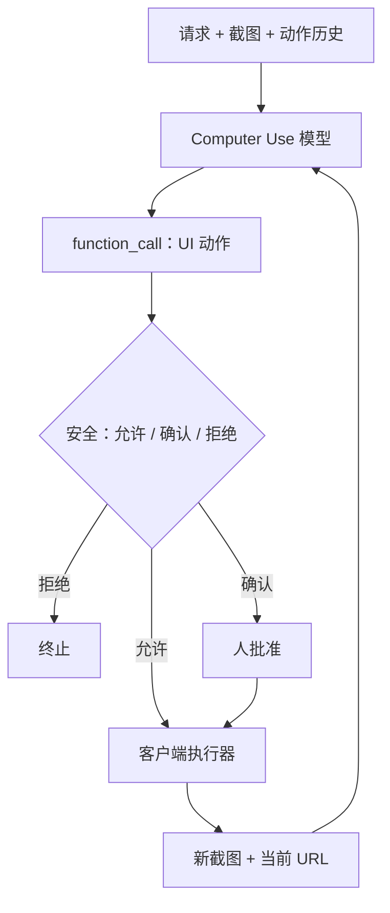

# Gemini Computer Use

    
把计算机使用做成 API 里的工具循环：输入是用户请求、环境截图和近期动作，输出是一次 UI 函数调用；客户端执行后再把新截图与 URL 送回。

    <footer>—— Google DeepMind，Introducing the Gemini 2.5 Computer Use model，2025 年 10 月 7 日</footer>

2025 年 10 月 7 日，Google DeepMind 通过 Gemini API 放出 **Gemini 2.5 Computer Use**：在 Gemini 2.5 Pro 的视觉与推理之上训练的专用模型，用来驱动「像人一样点、打、滚」的界面代理。能力暴露为 `computer_use` 工具，必须在客户端循环里跑，而不是一次补全就结束。官方强调浏览器为主，移动端有迁移迹象，**尚未针对桌面操作系统级控制做优化**。本篇写工具循环、动作表与公开评测。只讨论合法自动化（自己的界面测试、公开基准环境）；不写攻击、越权、绕过验证码或破解登录。

## 问题

结构化 API 覆盖不了「填表、拉筛选、在登录后的后台里点几下」这类工作。测试与运营需要代理看见当前 GUI 状态再选动作。若把完整桌面控制与浏览器控制绑成同一模型，动作空间、安全策略、延迟预算会互相拖累。Google 的产品切分是：先做一个浏览器优化的专用模型，用同一套坐标动作去点网页；移动端用自定义动作集做泛化实验；桌面 OS 明确不在当时优化范围——这与 OpenAI CUA 在 OSWorld 上报分的设定不同。

专用模型还带来路由问题。2025 年 10 月的预览是独立模型名（`gemini-2.5-computer-use-preview-10-2025`），开发者要在「主推理模型」与「计算机使用模型」之间交接上下文。后来的 Gemini 3.x 文档把 computer use 收成通用模型上的工具，并增加每步 `intent`。写系统时必须声明调用的是 2.5 独立预览还是后续内建工具，否则延迟与分数表会对不上。

### 客户端必须实现执行器

模型只出函数调用，不碰真实浏览器。宿主用 Playwright 等自动化库执行允许的动作，把视口坐标从模型的归一化网格（文档中的 0–999 或后续 0–1000 标尺）映射回像素，再截图。没有执行器就没有代理。安全决策可以夹在「模型提议」与「真正执行」之间：官方描述推理时安全服务按步评估，高风险动作要求用户确认或直接拒绝。开发者还可用系统指令收紧「购买、改系统完整性、医疗设备」一类行为。这些是策略挂钩，不是评测项。

2.5 Computer Use 主要优化浏览器；AndroidWorld 上的 69.7% 是同一 API 循环换移动动作、关掉浏览器动作后的 Google 自测。不要把它写成「已经是桌面 OS 代理」。OSWorld 在当时模型卡里标为尚未支持。

## 方法

循环输入：用户请求、当前截图、近期动作历史；可选地从完整 UI 动作表里排除某些函数，或加入自定义函数。模型分析后通常返回一次 `function_call`（点击、输入、滚动等），有时附带「请终端用户确认」。客户端执行后，把**新截图与当前 URL**作为函数响应送回，直到任务完成、出错、安全响应终止或用户停下。2.5 预览的遗留动作包括 `click_at`、`type_text_at`、`scroll_at` / `scroll_document`、`navigate`、`go_back` / `go_forward`、`hover_at`、`drag_and_drop`、等待与搜索等；坐标是网格整数。3.x 文档在动作上增加解释性 `intent` 字段。

评测表混合了官方榜、Browserbase 对齐脚手架、以及 DeepMind 自测。模型卡口径（2025-10-07）：**Online-Mind2Web** 官方榜 69.0%（Operator 对照约 61.3%）；Browserbase 测得 65.7%，对照 Claude Sonnet 4 约 55.0%/61.0%、OpenAI Agent 约 44.3%。**WebVoyager** 官方榜 88.9%（Operator 约 87.0%）；Browserbase 79.9%，对照约 71.4%/69.4%/61.0%。**AndroidWorld** Google 测 69.7%，对照约 56.0%/62.1%；OpenAI 侧因无桌面/移动对齐而未测。Browserbase 的 Online-Mind2Web 还报过约 225 秒量级的中位任务延迟。引用必须写清「官方榜 / Browserbase / 自测」三列，禁止混成一行「SOTA」。

### 延迟与质量要一起报

官方卖点是「浏览器控制质量领先且延迟更低」，依据是 Browserbase 上 Online-Mind2Web 的质量—延迟图，而不是 WebArena 离线表。WebVoyager 在线站点会漂；Online-Mind2Web 用多数票人类判断，pass@1 对随机种子敏感。AndroidWorld 证明动作表可换表面，不证明桌面文件管理、系统设置与浏览器是同一策略。内部已用于 UI 测试、Project Mariner、Firebase Testing Agent 以及 Search AI Mode 的部分代理能力——这些是部署叙述，不是基准数字。

## 机制

归一化坐标让同一策略能在不同分辨率的视口上运行：模型在抽象网格上点，执行器按当前宽高还原。代价是映射误差与滚动偏移。截图加 URL 回传，使模型能把「地址栏状态」与像素一起条件化，减少纯视觉对 SPA 路由的误判。安全服务在模型外按步拦截，等于把策略从权重里拆出来：换系统指令不必重训。`intent`（3.x）把每步理由结构化，便于日志与人审，不改变动作语义本身。

与 [OpenAI Operator](/llm/openai-operator) 的 CUA 相比：两者都是看屏循环，但 Gemini 2.5 预览把「浏览器专用模型 + API 工具」作为交付物，OSWorld 不在合同内；CUA 博客同时报了 OSWorld 与 WebArena。与 [Browser-use](/llm/browser-use-agent) 相比：后者默认把页面编成带索引的可交互元素给任意骨干 LLM；Gemini 路线是专用视觉—动作模型出坐标。混用 DOM 索引与纯坐标的分数不能直接比。

安全控制包括按步安全服务与系统指令。文档列举的高风险例子含破坏系统完整性、绕过 CAPTCHA、控制医疗设备等——那是拒绝类，不是实现指南。本篇不讨论如何绕过这些策略。

## 边界与工程取舍

### 独立预览模型与内建工具不是同一份权重

把 2.5 Computer Use 的 Online-Mind2Web 69.0% 写到后来某代 Flash 的 computer use 工具上，是张冠李戴。上下文窗口、是否与搜索接地共用一次推理、动作表是否含桌面，都要按当时文档核。预览模型优化浏览器，用它去扫桌面设置面板属于合同外。执行器若把模型输出的任意坐标点击到未授权源，责任在宿主白名单，不在模型卡。

评测对抗性页面与提示注入：官方提到可选的截图扫描与确认门，细节见系统卡与 API 文档。本篇只把它们登记为架构上的中断点。合法范围是：自己的预发环境、公开演示页、基准站点。对外部生产系统做未授权操作，或把代理当漏洞扫描器，都不在本篇方法里。

出处：Google DeepMind 博客 *Introducing the Gemini 2.5 Computer Use model*（2025-10-07）；Gemini 2.5 Computer Use 模型卡；API 文档 *Computer use*。Browserbase 列为第三方对齐评测。后续 3.x 工具化以当时 Google AI for Developers 文档为准。

## 小结

- Gemini 2.5 Computer Use 是浏览器优先的专用模型，经 `computer_use` 工具在客户端循环中调用。
- 输入为请求、截图、动作史；输出为 UI 函数调用；执行后回传新截图与 URL。
- 公开分数要分官方榜与 Browserbase：Online-Mind2Web 约 69.0% / 65.7%，WebVoyager 约 88.9% / 79.9%，AndroidWorld 自测 69.7%。
- 当时未优化桌面 OS；不要用 OSWorld 上的别家分数来「击败」这篇模型卡。
- 出处：DeepMind 2025-10-07 博客与模型卡；评测含 Online-Mind2Web、WebVoyager、AndroidWorld。
