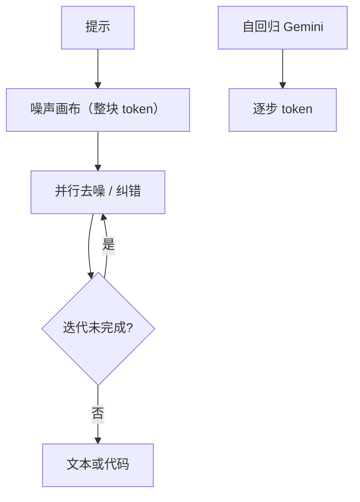

# Gemini Diffuse 扩散推理

    
扩散模型学习把随机噪声收成连贯的文本或代码，像我们在图像与视频里做的那样；实验演示比我们当时最快的模型显著更快，编码质量与之相当。

    <footer>—— Google DeepMind，Gemini Diffusion 介绍页与 2025-05-20 博客</footer>

公开名称是 **Gemini Diffusion**，不是单独的产品线「Gemini Diffuse」。2025 年 5 月 20 日 Google 博客把它写成实验研究模型：文本扩散，演示可申请 waitlist，并声明会继续用多种方法降低 Gemini 延迟。DeepMind 模型页给出与 **Gemini 2.0 Flash-Lite** 的外部榜对照，以及「不含开销的采样速度 **1479** tok/s、开销 **0.84** s」。2026 年 6 月 10 日同一研究脉络下，官方另发开权实验模型 **DiffusionGemma**，并写明建立在 Gemma 4 与 Gemini Diffusion 研究之上。本篇只引用这些官方页，**不编 Gemini Diffusion 的参数量、层数或是否已进 Gemini 生产默认路由**。

## 问题

自回归解码在单请求上吃带宽：每步装一遍权重，只产出一个 token。云上靠大 batch 还能喂饱芯片；演示与 IDE 补全往往 batch=1，加速器空转。图像扩散已经把「整幅并行、逐步去噪」做成主流；语言若仍只能左到右，延迟墙与「生成中途无法改前面的字」会一起留下。Google 要回答的工程问题是：用扩散做文本，能否在**编码质量不弱于当时最快 Gemini 档**的前提下，把采样吞吐拉到每秒千 token 以上。

官方没有把 Gemini Diffusion 写成 ChatGPT 竞品级通用助手。DeepMind 页强调：相对自回归，扩散可对整块 token 迭代、生成中纠错，编辑与代码更对口。科学与多语榜上 Flash-Lite 仍明显领先。产品问题因此是双轨：研究演示证明速度；生产质量仍可能走自回归 Gemini，扩散作为低延迟实验。

### 「Diffuse」不是已发布的型号名

检索与口语里会出现 Gemini Diffuse。对照 Google 博客与 DeepMind 域名 `gemini-diffusion`，官方英文是 Diffusion。没有公开的「Diffuse」系统卡或 API 模型 id。写文档时用 Gemini Diffusion；若标题沿用 Diffuse，必须在正文把命名差声明清楚，避免被当成第三个检查点。

SWE-Bench Verified 在 DeepMind 表里是 *非智能体、单轮编辑、提示最长 32K*：Diffusion 22.9%，Flash-Lite 28.5%。不要与带工具、多轮的 SWE 脚手架横比。

## 方法

公开方法是产品级描述，不是可复现配方。DeepMind：「不是直接预测文本，而是逐步把噪声收成输出」；「一次生成整块 token」。博客类比图像/视频扩散。没有公开噪声类型（高斯潜变量还是离散掩码）、步数、是否块内半自回归。能写的推理循环只有：从噪声画布出发 → 多步并行更新 → 收敛成文本/代码。访问方式是实验 demo + waitlist，不是 Vertex 上的 GA 端点。

### 官方对照表（pass@1，无多数投票）

Flash-Lite 走 AI Studio `gemini-2.0-flash-lite` 默认采样。编码：LiveCodeBench v6 30.9% / 28.5%；BigCodeBench 45.4% / 45.8%；LBPP v2 56.8% / 56.0%；HumanEval 89.6% / 90.2%；MBPP 76.0% / 75.8%。科学 GPQA Diamond 40.4% / 56.5%；数学 AIME 2025 23.3% / 20.0%；推理 BIG-Bench Extra Hard 15.0% / 21.0%；多语 Global MMLU Lite 69.1% / 79.0%。速度：表下注「所报评测上的平均采样速度」。这组数字定义了「匹配编码、更快、通用推理与多语仍落后」的合同。

### 开权后续：DiffusionGemma 不是同一权重

2026-06-10 Google 博文：DiffusionGemma，Apache 2.0，26B MoE、激活约 3.8B，块大小公开为 **256 token** 并行，H100 上 1000+ tok/s，RTX 5090 上 700+ tok/s，量化后可进约 18GB。质量明确低于标准 Gemma 4；生产仍建议自回归 Gemma 4。双向注意力利于填空、编辑、数独一类「后面也影响前面」的任务。云上高 QPS 时优势下降。这是可下载的实验模型，用来外推 Gemini Diffusion 的服务形态，**不能**当成 Gemini Diffusion 的开源版——官方只说「built upon … Gemini Diffusion research」。双向注意力与 256 token 块是 Gemma 开权合同里的数；Gemini Diffusion 页面从未给出块大小，禁止把 256 回写进闭源演示。

## 机制

扩散推理的机制是把 decode 从「带宽墙、每步一 token」换成「算力墙、每步一块」。块越大、步数越少，越能喂满 GPU；质量与可改写次数对赌。整块双向可见，使模型能闭合括号、修前面的错，这是 DeepMind 页「更连贯、可迭代 refinement」的来源。代价是：训练目标、位置编码、缓存语义都与 KV cache 自回归栈不兼容；现成 vLLM 连续批处理要另写去噪循环。DiffusionGemma 开发者指南后来写明与 vLLM 团队合作——那是 2026 开权模型的工程，回头不能写成 2025 年 Gemini Diffusion 已开源服务核。

1479 tok/s 明确 *excluding overhead*；0.84 s 是开销。端到端用户延迟是两者之和，再加安全过滤。Brendan O'Donoghue 等在外围采访里提到编程任务可到约 2000 tok/s 量级，那不是 DeepMind 表内数字，引用需降级为非页面来源。

### 不要写成 Gemini 生产默认

博客结尾仍在谈更快的 2.5 Flash Lite。Diffusion 是研究轨。没有官方声明它替换 Flash / Pro。评测对照物是 2.0 Flash-Lite，不是 2.5 Pro。把「DeepMind 最快演示」写成「Gemini 用户现在都在用扩散」，与公开文本不符。

## 边界与工程取舍

### 演示吞吐不是生产 SLA

1479 tok/s 绑在「所报评测、不含开销」上。换成长上下文、带检索或计算机使用，开销项会涨，扩散是否仍划算没有官方表。Waitlist demo 的安全过滤、分词、prefill 都算进 0.84 s 那一类墙钟，用户体感不是纯采样速度。把 DeepMind 页的编码接近 Flash-Lite 外推成「已替代 2.5 / 3.x 生产模型」，与博客自己仍在预告更快自回归档矛盾。

无参数、无步数、无训练 token。Waitlist demo 不能当 SLA。GPQA / Global MMLU 的差距说明速度档编码不等于通用旗舰。DiffusionGemma 的 26B/3.8B 与 256 token 块是开权模型的数，禁止回写进 Gemini Diffusion。本地加速依赖高算术强度；官方脚注写 Apple Silicon 统一内存未必能看到相对 Gemma 4 的同样加速。

出处：Google，*Gemini Diffusion is our new experimental research model*，2025-05-20；DeepMind `deepmind.google/models/gemini-diffusion`；DiffusionGemma 博文 2026-06-10。参数量未对 Gemini Diffusion 公开。

与 [Mercury](/llm/mercury-diffusion-lm) 对照：两者都是商用/实验室级扩散 LM，但 Mercury 卖 API，Gemini Diffusion 在官方页仍是 experimental demo。质量表的对照物也不同，不要拼成一张「扩散 vs 扩散」总榜。

## 小结

- 官方名是 Gemini Diffusion；「Diffuse」不是单独发布的型号。
- 公开合同：实验演示、1479 tok/s（不含开销）、编码接近 2.0 Flash-Lite，科学与多语落后。
- 2026 年 DiffusionGemma 是开权后续，权重与 Gemini Diffusion 不是同一发布。
- 无架构表、无生产默认承诺。
- 出处：上述 Google / DeepMind 页面。不编假 arXiv。
