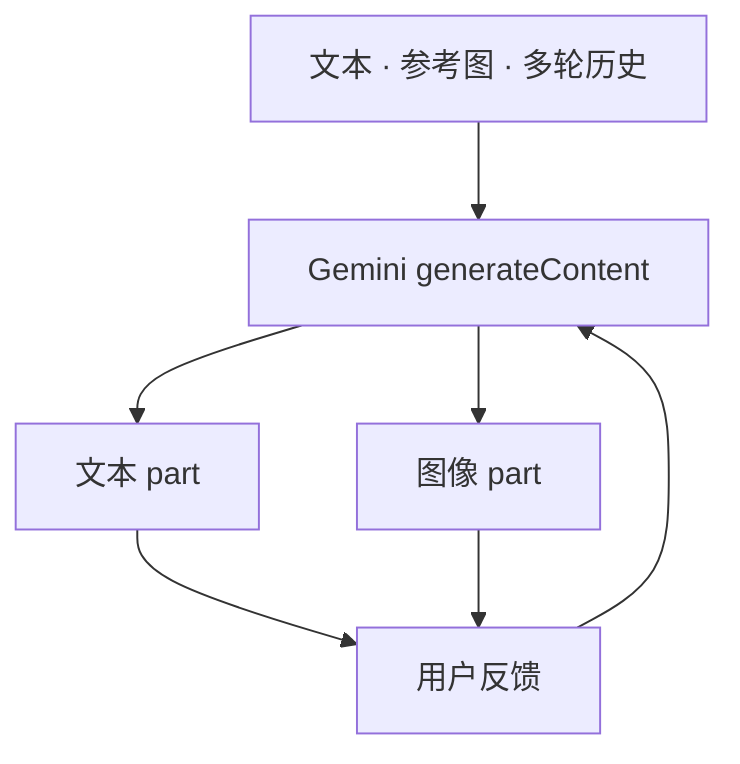

# Gemini 原生图像生成

    
同一个 Gemini 在一次 generateContent 里交错输出文本与图像：多模态输入、推理与语言理解用来「画出对的图」，而不是另调一只只会文生图的模型。

    <footer>—— Kampf 与 Brichtova，Experiment with Gemini 2.0 Flash native image generation，Google Developers Blog，2025-03-12</footer>

[Gemini 1.0 报告](/llm/gemini-native-mm) 把家族写成原生多模态理解，图像输出走离散图像 token 的研究表述。产品上，开发者长期用 **Imagen** 专用接口出图。2024 年 12 月 Google 向信任测试者开放 Gemini 2.0 Flash 的**原生图像输出**；2025 年 3 月 12 日 Kat Kampf、Nicole Brichtova 的开发者博客把它放到 AI Studio 与 Gemini API 实验档 `gemini-2.0-flash-exp`，配置 `response_modalities` 含 Text 与 Image。卖点不是更高分辨率竞赛，而是：**对话里改图、故事与插图交错、用世界知识画食谱步骤、较长文字渲染**。2025 年 8 月 26 日 Gemini 2.5 Flash Image（对外绰号 Nano Banana）把该能力做成当时的质量档；[Nano Banana 2](/llm/nano-banana-2) 是 2026 年 2 月的 Flash 图像后续。本篇写「原生」相对专用图像模型的合同。闭源只引官方博客与文档。

## 问题

专用扩散模型（Imagen、[Flux](/llm/flux-dev) 等）在静态提示上很强，但应用要的是：**多轮「把杯子改成蓝色、文字不要拼错」**、以及图文混排（步骤说明夹插图）。级联方案是 LLM 写提示再调 Imagen，主体与约束在两次采样间漂移，延迟与账单是两次。原生输出把图像当成与文本同类的模型模态：同一上下文里的修改指令作用在上一张图的表示上，而不是重新猜一个提示词。

第二个问题是事实与排版。食谱、示意图、海报长文，需要语言理解与世界知识，而不仅是风格。3 月博客写 2.0 Flash 用推理与世界知识「create the right image」，并承认知识是宽而浅的，不是完备知识库。文字渲染被列为相对竞品的内部评测优势，用于广告与请柬——这是产品主张，没有把内部基准表公开为可复现排行。与理解侧原生多模态不要混：能看图不等于能稳定出图；1.0 报告的图像 token 叙述也不能当成 2025 API 的实现证明。

### 调用合同从 generateImages 换成 generateContent

Imagen 路径是专用 `generate_images`（或 Vertex 上的同类）。原生路径是普通内容生成：模型名是 Gemini，响应里是文本与图像 part 交错。迁移意味着改方法名、改响应解析、改安全过滤落点。Google 后来把 Imagen 标为弃用并引导迁到 Nano Banana 家族（文档写明关停日程以当时页面为准）。写集成时要冻结：实验档 2.0、预览档 2.5 Flash Image、以及 3.1 Flash Image 是三代产品名，不要把 2026 年的 4K 规格写进 2025-03 的实验博客。

3 月文的代码示例用 `gemini-2.0-flash-exp` 与 `response_modalities=["Text", "Image"]`。这是实验 ABI。生产模型 id 以当时 Gemini API 图像生成文档为准。

## 方法

官方列举四类擅长：交错故事与插图并保持角色场景；自然语言多轮编辑；用世界知识生成「正确」的说明性画面；较长文本画在图上。输入可以是文本、图像或多图，输出按模态配置。安全：Gemini 应用侧后来强调可见水印与 SynthID；开发者 API 的水印与审核以当时安全设置文档为准。定价按图像输出 token 计（2.5 Flash Image 发布稿曾给出每张约 1290 output token 的口径），与纯文本档不同，账单设计要把出图当一等成本。

与 Imagen 的分工（在弃用公告之前）：Imagen 走高保真、多候选、摄影级静态资产；Gemini 原生走出图+改图+说明的对话。应用不该默认「永远更强」。8 月 2.5 Flash Image 博客写用户喜爱 2.0 的延迟与成本，但要求更高画质与创意控制，于是单独出图像档——说明原生不等于永远用同一个 Flash 聊天权重出电影级海报。

### 交错输出是产品机制，不是保证每段都有图

「讲故事并配图」依赖模型在合适的边界插入图像 part。应用必须按 part 类型渲染，不能假设整段是 markdown。失败模式：该出图时只出文字、文字与图不一致、角色在第 3 张漂移。评测应分：单张提示遵从、多轮编辑一致性、图文交错对齐、文字可读性。不要用单张 FID 代替多轮一致性。Arena 类偏好分要写模型 id 与日期。

## 机制

机制上，原生意味着图像解码条件来自与文本共享的 Gemini 表示与思维链，而不是独立扩散网络只看 CLIP 文本嵌入——**具体是否共享骨干、是否潜空间扩散，官方未作为可复现规格公开**。能确定的是接口：同一请求、同一上下文窗口、图像作为生成模态。多轮编辑把上一张图作为输入图像，指令作为文本，形成视觉上的指令跟随。世界知识来自 Gemini 预训练与（后续档的）检索接地，用于「这个装置大概长什么样」，不是 CAD。文字渲染把语言头与图像头的对齐做成卖点，失败仍常见于小字与长段。

与对话式聊天的关系：出图占用上下文与输出预算，长会话同样腐烂。出图后应把图像作为后续轮的条件，而不是只把「已生成」四个字留下。Agent 若把原生出图当工具，要限制次数与审核，避免被间接注入成批量外发图。

1.0 报告里的离散图像 token 是 2023 年研究描述。2.0 Flash 实验博客不引用该公式。不要把 Parti/DALL-E 谱系强行接成 2025 API 的实现图。

### 原生降低级联缝，不消除安全与版权

同一模型更易保持角色，也更易在对话中被要求生成未授权肖像或误导信息图。水印（SynthID）与政策过滤是产品层。知识错误会画成一本正经的假示意图——博客已写知识非完备。高风险领域（医疗图示、官方标识）需要人审或禁用。

## 边界与工程取舍

### 实验档、图像专用档、聊天默认档要分名

2025-03 是 2.0 Flash 实验原生出图。2025-08 是 2.5 Flash Image / Nano Banana，面向质量与编辑。2026-02 是 Nano Banana 2 / 3.1 Flash Image，面向把 Pro 能力降到 Flash 速度。聊天应用里默认哪一档，以当时 Gemini 应用说明为准。开发者应钉模型 id，而不是钉绰号。Imagen 关停日程出现在 Gemini API 文档时，迁移核对：方法、响应 part、价格、审核。

不要把 Gemini 原生出图写成已经替代所有设计工具：印刷级 4K、品牌手册、精确布局仍可能需要专用模型或人工。与实时视频理解分流：Live API 默认出的是语音，不是每秒一张海报。

出处：Kampf & Brichtova，Google Developers Blog，2025-03-12；Fortin 等，*Introducing Gemini 2.5 Flash Image*，2025-08-26；Gemini 1.0 报告 arXiv:2312.11805 仅作理解侧对照。图像文档与 Imagen 弃用说明以 ai.google.dev 当时页为准。

## 小结

- Gemini 原生图像生成把图当作 generateContent 的输出模态，支持交错图文与多轮编辑。
- 2025-03 实验档确立接口；其后图像专用 Gemini 档提升质量，绰号 Nano Banana 系。
- 相对 Imagen：同一上下文改图与世界知识是差，不是自动更高保真。
- 无公开像素级架构；水印与审核属产品层。
- 出处：Google Developers 2025-03-12 与 2025-08-26 博客。
