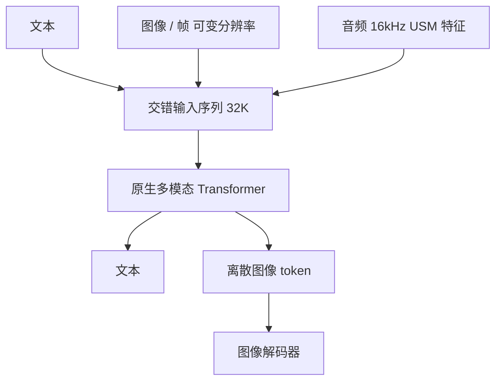

# Gemini 原生多模态

Gemini 从一开始就在图、音、视频与文本上联合训练，目标是每个模态上都能打到专有系统的水平，并且在同一条交错序列里做跨模态推理，而不是先训语言模型再把视觉当外挂。

<footer>—— Gemini Team，Gemini: A Family of Highly Capable Multimodal Models，arXiv:2312.11805</footer>

Google 2023 年 12 月的 Gemini 1.0 报告把家族写成 **Ultra / Pro / Nano**，上下文 **32768**，输入为文本与交错的自然图、图表、截屏、PDF、视频帧与音频，输出为文本，并可用离散图像 token 出图。视觉编码谱系写明受 Flamingo、CoCa、PaLI 启发，但**模型从一开始就是多模态**，不是冻结文本 LLM 再插交叉层。Nano 给出参数：蒸馏得到 **1.8B / 3.25B**，4-bit 部署。Ultra / Pro 的层数与 MoE 结构未公开。本篇只写 1.0 报告里的「原生」主张与可引用评测口径；Gemini 1.5（arXiv:2403.05530）的百万上下文与稀疏专家是后文，不把 1.5 的窗口写进 1.0 的 32K。

## 问题

2023 年的多模态产品多数是「强文本模型 + 视觉适配器」：Flamingo 冻 LLM，GPT-4V 的公开技术细节不足以当配方，开源 LLaVA 明确是后接。这条路的风险是跨模态推理浅——模型会描述图，却难以在同一条上下文里把草算笔迹、口播和表格对齐成一步推导。音频若先 ASR 成字再进 LLM，重音、重叠、未成词的线索被丢掉。视频若只抽一帧，时间推理变成看图。

原生多模态要回答的是：联合训练会不会变成「样样稀松」？报告用专有对照表主张不会：Ultra 在他们列出的 32 项里 30 项当时领先，20 项多模态基准全部刷新，并第一次把 MMLU 推到「人类专家」叙事（见下）。问题从「要不要外挂」换成「联合训练如何编码各模态、如何证明单模态没有塌」。

### 原生指训练图，不保证公开层表

报告可复述的编码事实有限。视频：在长上下文里放**均匀抽样的帧**（视频理解实验常用 16 帧），帧可与文本、音频交错。音频：以 **16 kHz** 的 Universal Speech Model（USM）特征直接进入，而不是强制转写。分辨率可变，细粒度任务多花计算。图像输出走离散图像 token（DALL-E / Parti 谱系），理解侧不是必须经过同一套码本才能读图——报告没有把 Chameleon 式「单一稠密词表、无独立图像头」写成 Gemini 的实现约束。[Chameleon](/llm/chameleon) 自己也指出：Gemini 更像早期融合加**独立图像解码**。

Nano-1/2 的 1.8B/3.25B 是报告里少数公开的参数量。不要给 Ultra 编层数或专家数。Gemma 声明继承 Gemini 研究，并不等于 Gemma 2B 的结构是 Ultra 的缩小版。

## 方法

预训练数据：网页、书籍、代码，以及图像、音频、视频，多语。SentencePiece 在全部语料抽样上训词表，非拉丁文字切得更短。训练与推理走 TPU 与 Pathways 一类基础设施，报告不给出集群规模。后训练：SFT + RLHF，产品面分成 Gemini 应用与 Gemini API 两条，再混入专家整理的图文垂直数据。工具 / 扩展在内部旅行规划与视频发现偏好测试上，带工具的模型约 78% 轮次更受欢迎（排除平局）——这是产品叙事，不是多模态编码公式。

### 评测口径必须拆开

文本：Ultra 的 MMLU **90.04%** 来自 uncertainty-routed CoT（多样本思维链，共识过阈值才投票，否则回退贪心）；标准 5-shot 约 **83.7%**。把 90 写成「5-shot 已经专家级」是错引。多模态：MMMU **62.4%**（当时相对前一最佳约 +5 分）。视频：少样本 caption 与零样本 QA，YouTube 类集合按 2023 年 11 月仍公开的视频评。音频：Pro 在 ASR/AST 上对照 USM 与 Whisper；FLEURS 训练集聚过的要单独声明，去掉 FLEURS 后 Pro 仍可报一个 WER。Nano-1 在多数 ASR 集上超过 Whisper，这是端侧档的主张。

## 机制

联合训练让同一套参数在图、声、字上共享表示：物理卷上的手写推导可以和符号推理用同一套激活，而不经过「先 OCR 成字、再当纯文本题」的硬接口。交错序列提供时间与模态的共同位置轴——烹饪示例里口播问题与灶台照片交替，模型要在音频里听问题、在图像里看熟度。视频理解被收成「帧的时间序列 + 文本」，16 帧是评测协议不是光学上限。离散图像 token 使出图与写字可以交错，但独立解码器意味着生成图像不必与理解编码器共享量化误差，这与 Chameleon 的单一码本不同。

32K 的机制用合成检索（键值埋在上下文头、长填充后询问）和长文档 NLL 随位置下降来辩护：Ultra 全窗取值约 98% 准确。这只说明窗口被用到，不说明视频以帧计可以无损塞满 32K。

### 和适配器派、和 1.5

LLaVA / IDEFICS2 是强单模态骨干的后融合；报告把原生写成从零联合，不提供可复现的 token 配比。1.5 把上下文拉到百万级并引入稀疏专家，用来解决「32K 装不下小时视频 / 代码库」；那是另一篇报告的对象。不要用 1.5 Flash 的延迟表解释 1.0 Ultra 的 MMMU。

「20 项多模态基准全部 SOTA」是 1.0 报告自己的表，含内部与外部集、含不同 shot。对外引用应落到 MMMU、具体视频集、具体 ASR 集，并写 shot 与日期。

## 边界与工程取舍

层表、数据配比、图像 tokenizer 细节未公开，工程上不能「按论文复现 Ultra」。原生多模态不自动等于开源权重。安全与责任章节是部署约束：图到文、视频到文的影响评估走内部流程，不能当架构消融。音频 16 kHz 特征仍是前端选择，麦克风阵列与说话人分离不在报告里。视频 16 帧协议会错过短时动作；产品抽帧策略与论文评测可以不同，不能把基准分数写成直播理解。

Nano 的 4-bit 与蒸馏是端侧故事，与 Ultra 的专家考试叙事不要写在同一张容量表。出图质量与理解质量可以脱节，因为解码器独立。工具 78% 偏好是内部集，不是 Arena。

出处：Gemini Team，*Gemini: A Family of Highly Capable Multimodal Models*，arXiv:2312.11805。基础设施背景可指向 Pathways（Barham 等）与 USM（Zhang 等 2023），不要编造未公开的 TPU 拓扑。1.5 报告 arXiv:2403.05530 不得用来改写 1.0 的 32K 与三档定义。

## 小结

- Gemini 1.0 主张从零联合训练文本、图像、音频、视频，家族为 Ultra / Pro / Nano，窗口 32K。
- 视频按帧交错，音频走 16 kHz USM 特征；出图用离散图像 token 加独立解码器。
- MMLU 90.04% 是 routed CoT，不是默认 5-shot；MMMU 62.4% 是当时多模态推理主数字。
- 原生指训练与交错接口，不提供可复现层表；与适配器派、与 Chameleon 单码本都不同。
- 出处：Gemini Team，arXiv:2312.11805。
