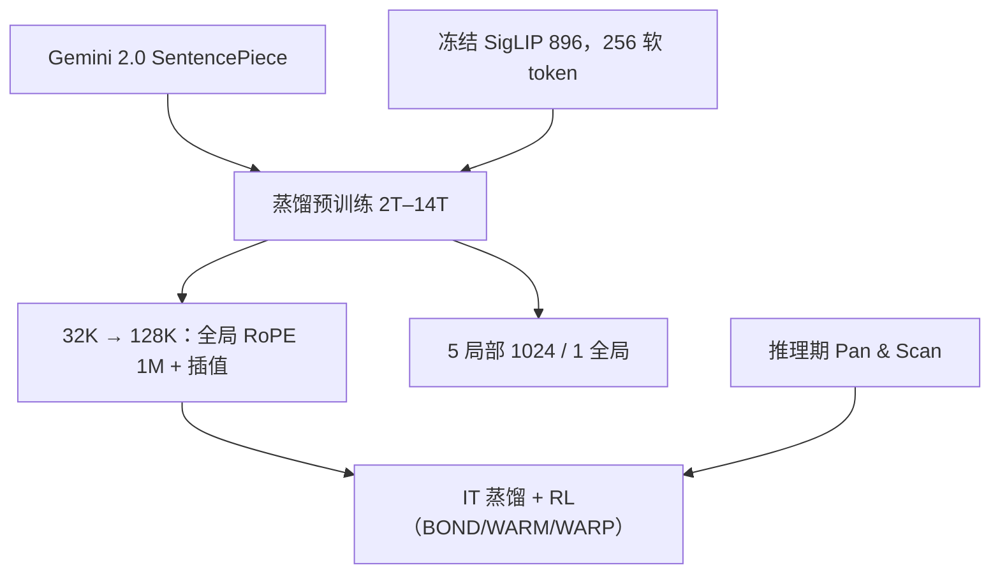

# Gemma 3

我们把局部层对全局层的比例加大、并把局部跨度收短，以免 KV 缓存在长上下文里爆炸；模型在蒸馏下训练，并第一次给 Gemma 加上视觉。

<footer>—— Google DeepMind，Gemma 3 Technical Report，arXiv:2503.19786</footer>

Gemma 3 是 2025 年 3 月的多模态开源权重家族：**1B / 4B / 12B / 27B**。相对 [Gemma 2](/llm/gemma2-report)，它要同时做三件事：至少 128K 上下文、更宽的语言覆盖、以及把图像当成软 token。KV 若仍按「一半层看满窗口」去存，128K 会先把端侧显存打爆。报告的结构回答是：把局部/全局比从 1:1 改成 **5:1**，局部窗收到 **1024**，并用 QK-Norm 替换 2 代的 logit soft-capping。

## 问题

长上下文的第一账单是 KV，不是注意力 FLOPs。Gemma 2 每隔一层全局 8K，已经要两套缓存策略；把窗口乘到 128K，全局层的 KV 线性涨 16 倍。端侧与单卡聊天要的是「多数层只看近邻、少数层看全长」，而不是把每一层都做成 128K 稠密注意力。

第二问是模态。Gemma 2 明确非多模态。Gemma 3 要在仍能跑在手机 / 笔记本 / 高端 GPU 的参数量上加视觉，但不能让视觉编码器的训练成本进语言模型的逐步更新。第三问是小档质量：4B 若还靠硬标签堆 token，很难追上 2 代 27B 的 IT 体验；报告把蒸馏写成全系列预训练目标。

### 5:1 交错，而不是再把滑窗拉长

层模式：5 个局部滑窗层跟 1 个全局层，**第一层是局部**。局部只看 1024，全局看训练/外推后的长上下文。RoPE 基频分裂：全局层从 10k 提到 **1M**，局部层保持 10k。预训练先在 32K 上走，再在 4B/12B/27B 末段用类似位置插值的因子把全局层扩到 128K（报告称缩放因子 8 好用）；**1B 停在 32K**。替换 soft-capping 的是 QK-Norm，灵感来自 ViT 稳定性与 Chameleon 一类工作。

词表按报告 Table 1 写 256k 级；正文 tokenizer 一节写与 Gemini 2.0 相同的 SentencePiece，约 262k、切数字、保留空白、字节回退。配推理读具体 `vocab_size`，不要在 256128 与 262144 之间心算。

## 方法

参数拆分（报告 Table 1）：1B 无视觉编码器，嵌入约 302M、非嵌入约 698M；4B/12B/27B 共享约 417M 的 SigLIP 编码器，语言模型非嵌入分别为约 3.2B / 10.8B / 25.6B。视觉编码器约 400M，输入 **896×896**，输出被压成固定 **256** 个向量（高分辨率用平均池化）。编码器在视觉助手数据上微调后，**四档共用、训练期冻结**；语言模型直接吃预计算嵌入。非方形或高分辨率图在推理期用 Pan & Scan：切成等大不重叠块，再resize 到 896，可关以换速度。

预训练 token：27B 为 **14T**，12B 为 12T，4B 为 4T，1B 为 2T，略多于 Gemma 2，以消化图文混合与更多多语（单语 + 平行语料，不平衡按 Chung 等人一类温度采样处理）。蒸馏：每步从教师分布里按概率加权采样 256 个 logits，学生只在这些位置上学交叉熵，其余置零再归一。基础设施按档用 TPUv5e / v4 / v5p，优化器状态 ZeRO-3，多 pod 走 Pathways。另提供 QAT 约 5000 步的 int4 / block-int4 / fp8 权重，报告给了 32K 上下文下含 KV 的显存表。

### 后训练：蒸馏教师 + RL 配方

IT 相对 2 代换了配方：从大 IT 教师做改进蒸馏，再接基于 BOND / WARM / WARP 改进的 RL。奖励覆盖帮助性、数学、代码执行反馈、指令遵循与多语，并压有害输出；数据过滤去个人信、毒性和错误自我认同。聊天模板仍用 `<start_of_turn>` / `<end_of_turn>`，**必须显式加 `[BOS]`**——字符串 `"[BOS]"` 不会映射到 BOS id。PT 与 IT 的结束符不同，微调不能混用。

## 机制

KV 的账变成：只有约 1/6 的层按全长存键值，其余层环形 1024。128K 上这是能否进 24GB 卡的差别，不是百分比优化。局部层不再承担「靠层叠凑远距离」，远距离只走稀疏的全局层；若实现把全局层也按 1024 裁，长文档与系统提示会一起消失。全局 RoPE 1M 给长下标留相位空间，局部 10k 避免短窗里相位过稀。

视觉侧，256 个软 token 把任意分辨率的代价钉死在语言模型侧；Pan & Scan 用多块换可读小字与极端宽高比，不改训练图。编码器冻结意味着视觉统计不会在语言模型更新时漂移，也意味着语言模型必须在这组固定嵌入上学会对齐——这是适配器式多模态，不是端到端重训 ViT。

Gemma3-4B-IT 对标 Gemma2-27B-IT、Gemma3-27B-IT 对标 Gemini-1.5-Pro，是报告自己的对照句，建立在他们的评测套件上。Arena Elo（27B IT 约 1338，2025-03-08 快照）不含视觉能力。转引要写协议与日期。

### 和 Gemma 2 的断裂点

2 代：1:1 交错、窗 4096、soft-cap、无视觉、8K。3 代：5:1、窗 1024、QK-Norm、SigLIP、128K（1B 除外）、全系列蒸馏。从 2 代 LoRA 热启 3 代会在 Norm、层周期、RoPE 基频、词表和视觉投影上同时错。1B 没有视觉、窗口更短，不能当「缩小的 4B」。QAT 检查点与 bf16 不是同一条损失曲线，端侧应用以 QAT 表的 GB 数为准，不要用 27B bf16 的 54GB 去吓 4-bit 用户。

## 边界与工程取舍

报告写模型在扩到 128K 之后若继续拉长会迅速退化，128K 不是无限外推。P&S 是推理优化，关了就回到单块 896 的伪影。蒸馏 256-logit 采样意味着学生从未见过教师分布的长尾；不要假设 Gemma 3 的校准与 Gemini 教师一致。Gemma 条款仍约束再分发。安全过滤与责任章节占报告后半，只抄架构表得不到官方聊天行为。

不要给 1B 编一个 128K 配置，也不要把 417M 视觉参数加进「1B 也能看图」。多语提升来自配比与新词表，不是自动覆盖所有低资源语言的事实。QAT 三档权重面向 llama.cpp 一类引擎，和训练用的 bf16 不是同一条损失；端侧要以报告 Table 3 的 GB 数为容量规划，不要用 27B 的 54GB 去否定 4-bit 手机部署。

出处编号是 arXiv:2503.19786。不要把 Gemma 3n 的 PLE / MatFormer 或 Gemini 未公开层表写进这一代。IT Elo 与 Table 6 的静态基准是两套数，Arena 胜负不含 MMMU。

## 小结

- Gemma 3 为 1B/4B/12B/27B：128K（1B 为 32K）、5:1 局部–全局、局部窗 1024、全局 RoPE 1M、QK-Norm。
- 4B 起共用冻结 SigLIP（896、256 token），推理可 Pan & Scan；1B 无视觉。
- 全系列蒸馏预训练，token 为 2T/4T/12T/14T；IT 再蒸馏加大模型并接 RL。
- KV 只在约六分之一的全局层按全长计费，这是 128K 能进消费硬件的前提。
- 出处：Gemma Team，*Gemma 3 Technical Report*，arXiv:2503.19786，2025。
