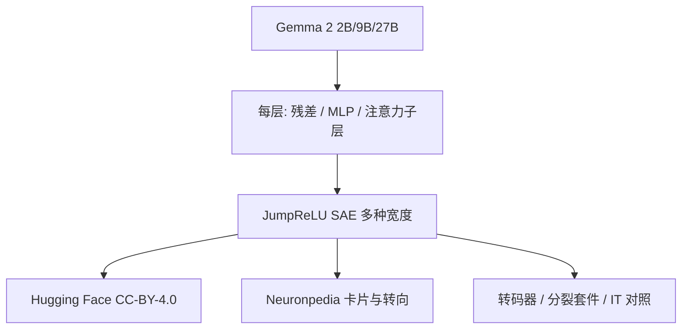

# Gemma Scope 开放 SAE 生态

    
SAE 在产业实验室之外难做，不是因为方法神秘，而是因为要训齐一套覆盖各层的字典太贵；我们释放 Gemma 2 上全层、全子层的 JumpReLU SAE，让更野心的安全与可解释性研究不必先付这笔训练账单。

    <footer>—— Lieberum et al., Gemma Scope: Open Sparse Autoencoders Everywhere All At Once on Gemma 2, 2024</footer>

Gemma Scope 是 Google DeepMind 2024 年放出的开放 [SAE](/llm/sae-sparse-autoencoder) 套件（arXiv:2408.05147）。Lieberum、Rajamanoharan、Conmy、Smith、Sonnerat、Varma、Kramár、Dragan、Shah 与 Nanda 在 Gemma 2 的 2B 与 9B 上，对每一层、每一子层输出训练 JumpReLU SAE，并在 27B 的部分层上补点；另外还有指令微调 9B 的对照、一套转码器、以及同一位点多种宽度的分裂实验。权重以 CC-BY-4.0 放在 Hugging Face `google/gemma-scope`，交互演示在 Neuronpedia。相对 Anthropic 在闭源 Sonnet 上的 [Scaling Monosemanticity](/llm/scaling-monosemanticity)，这篇的交付是基础设施：同一开放模型家族上、到处都有显微镜，社区才能做跨层电路而不是只有一层的特征卡片。

## 问题

训一个 SAE 已经贵；训「每个残差、每个 MLP、每个注意力输出 × 每一层 × 几种宽度」贵两个数量级。没有这套齐全的字典，跨层问题只能停留在论文设想：特征如何演化、如何组合成更复杂的特征、指令微调改了哪些方向。开放模型若只给权重、不给 SAE，可解释性仍被锁在有 TPU 预算的团队里。Gemma Scope 要填的就是这道门槛，而不是再证明「SAE 能找到金门大桥」。

Gemma 2 被选中，是因为它开放、规模阶梯清楚（2B/9B/27B）、且已被用作大量开源实验的底座。套件若绑在闭源 API 上，复现立即失败。许可必须分开写：SAE 权重 CC-BY-4.0，Gemma 2 本身是另一套自定义许可——用显微镜不等于可以任意再分发底座。

### 全层比单层多出来的科学问题

只在中层残差上放一个宽字典，适合找抽象概念；要画电路，必须能问「第 $\ell$ 层的这个特征写到第 $\ell+1$ 层的哪些特征」。这要求相邻位点都有字典，并且最好有转码器（transcoder）直接近似 MLP 映射。Gemma Scope 把「Everywhere All At Once」写进标题，指的就是位点覆盖，而不是某一个 3400 万宽的单点。全覆盖必然在每个点上放弃极端宽度。Sonnet 那篇可以在一个位点上堆千万特征；Gemma Scope 用更节制的宽度换层数。比较两篇的「特征好不好」而不对齐位点与 $L_0$，会把产品选择当成质量差异。

## 方法

编码器使用 JumpReLU（Rajamanoharan 等人 2024）：可学习阈值让稀疏接近 $L_0$，减轻纯 $L_1$ 的幅度收缩。每个 SAE 报标准质量：重构、平均 $L_0$、死特征。Canonical 选择往往取平均 $L_0$ 接近 100 的那一档，作为「多数分析够用」的默认，而不是宣称 100 是自然常数。特征分裂套件在同一位点放多种宽度，用来观察概念如何随 $F$ 撕开。IT 模型上的 SAE 用来对比基座：对齐会移动哪些方向、哪些检测器是对话模板的赝像。

工具链同样是交付。Mishax 用于在 Gemma 里干净地钩激活；SAELens 一类库提供 `from_pretrained`。Neuronpedia 把特征卡片与转向做成可点的网页，降低「没有写过 SAE 训练循环就不能看特征」的门槛。没有这些，开放权重只是一堆无法导航的张量。

$$
f=\mathrm{JumpReLU}(W_{\mathrm{enc}}(x-b_{\mathrm{dec}})+b_{\mathrm{enc}};\,\theta)
$$

阈值 $\theta$ 与 $W$ 一起学。这是套件的默认非线性，读权重时不要按 Towards Monosemanticity 的纯 ReLU+$L_1$ 去解释系数幅度。

### 开放生态的验收标准

一篇开放套件论文的成功标准与一篇发现论文不同。前者要问：第三方能否在一天内加载第 20 层残差的 canonical SAE、复现 $L_0$、在 Neuronpedia 上找到对应卡片、并做一次转向。后者要问：是否发现了新的安全相关特征。Gemma Scope 正文以前者为主，质量表为后者提供地板。社区后续在这套权重上做的幻觉、拒绝、思维链忠实性，才是「生态」二字的内容。

## 机制

### 阈值稀疏与跨层生命周期

JumpReLU 把「过不过阈值」变成真正的稀疏开关，重构时系数不必被 $L_1$ 统一压小，特征的因果幅度更接近模型残差里的真实贡献。全层覆盖则让人观察检测器的生命周期：浅层的 n-gram 与句法、中层的实体与抽象、深层靠近解嵌的任务包装。许多特征会跨层重复，并不是八个独立世界，分析时要避免把重复计数当成更复杂的电路。

指令微调对照提供自然实验。若某个拒绝或奉承方向只在 IT 的 SAE 里清晰，它更像对齐加上去的，而不是预训练世界知识。若基座已有、IT 只改变阈值，则对齐是在调已有方向的增益。这比只看生成差异更接近机制，但仍受字典不完备限制。

Gemma 2 与 Claude 3 Sonnet 不是同一表示几何。不能把 Gemma Scope 的编号特征当成 Sonnet 转向论文里那个特征的开源版。可迁移的是协议：JumpReLU、canonical $L_0$、全层释放、公开卡片。具体方向要在各自字典里重新发现。

## 边界与工程取舍

27B 只有部分层，最大模型的电路仍有缺口。Gemma 许可证与 SAE 许可证不一致，产品化时要分别合规。JumpReLU 的阈值使实现与纯 ReLU SAE 不互换，用错激活函数会得到无意义的 $L_0$。开放并不自动等于正确：标签噪声、重复存放、canonical 定义随 SAELens 快照变化，都在 README 里出现过警告。

套件也不能替代因果标准。加载权重很容易，证明某特征是幻觉的机制仍然要做修补与消融。DeepMind 后来在 Gemma 3 上做 Gemma Scope 2（Matryoshka、跨层转码器），说明「一次释放」不是终点；引用时要写明是 Gemma 2 的 2024 套件还是后续代际。

把几百个 SAE、号称数千万特征相加，会严重重复计算：相邻层、不同宽度、残差与 MLP 之间有大量重叠。论文自己也说 many features likely overlap。报告「生态里有多少概念」时，应在单一位点、单一宽度下数，而不是把仓库里的张量维数加总。

## 小结

- Gemma Scope 为 Gemma 2 的 2B/9B 全层子层释放 JumpReLU SAE，并部分覆盖 27B，许可为 CC-BY-4.0。
- 科学目标是降低全层字典的训练门槛，使跨层电路与对齐对照可在社区复现。
- Canonical 常用平均 $L_0$ 近 100 的档；另含转码器、宽度扫描与 IT 对照。
- 配套 Mishax、Hugging Face、Neuronpedia，开放权重才成为可用生态。
- 与闭源 Sonnet 分解互补：一个拼宽度与生产模型，一个拼覆盖与可复现。
- 出处：Lieberum et al., *Gemma Scope: Open Sparse Autoencoders Everywhere All At Once on Gemma 2*, arXiv:2408.05147, 2024；JumpReLU 见 Rajamanoharan et al., 2024。
