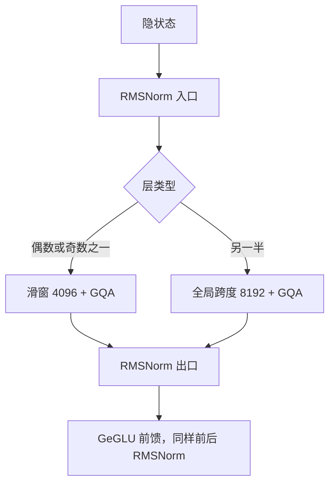

# Gemma / Gemma 2

    
在实用规模上改进开源语言模型：交错局部与全局注意力，分组查询，并用 RMSNorm 同时做子层的入口与出口归一化。

    <footer>—— Google DeepMind, Gemma 2: Improving Open Language Models at a Practical Size, 2024</footer>

Gemma 是 Google 2024 年放出的开源权重语言模型家族，技术上声明继承 Gemini 的研究与基础设施，规模刻意落在可本地跑的档位。第一代技术报告给出 2B 与 7B；Gemma 2 把档位改成 2B、9B、27B，并在公开报告里写清若干「已知技巧」的组合：[RMSNorm](/llm/rmsnorm) 的前后同时归一化、[GQA](/llm/gqa)、局部–全局交错注意力，以及 2B/9B 用知识蒸馏代替单纯的下一词预测。本篇按两份官方报告写，不把后续 Gemma 3 或封闭 Gemini 的未公开细节塞进来。

## 问题

开源 2B–27B 要在笔记本和单卡上可用，又要在同尺寸榜上跟 Llama、Mistral 抢。全套多头注意力在 2B 上 KV 相对更贵；7B 若仍用满头，decode 并发立刻受缓存限制。反过来，第一代 Gemma 2B 直接走 [MQA](/llm/mqa)，7B 走多头，两档注意力形状不一致，推理栈要分叉。Gemma 2 想统一成分组查询，并在 8K 上下文里把每一层的二次注意力打掉一半——不是所有层都看满 8192，而是一层局部、一层全局地交错。

训练稳定性是第二条约束。只做 Pre-RMSNorm 的解码器能训，但 Gemma 2 把 27B 加深到 46 层，报告选择在每个子层的输入**与**输出都做 RMSNorm。这与社区里有时称作三明治的摆法同类：入口管梯度，出口管激活尺度。问题不是发明新归一化，而是承认实用规模上「已知修改」叠加后，质量和可服务性可以一起动。

### 第一代已经定下的底盘

Gemma 1（*Gemma: Open Models Based on Gemini Research and Technology*，2024）是解码器 Transformer：RoPE、近似 GeGLU、RMSNorm 做子层输入归一化、词表约 256K（与 Gemini 大词表同源，嵌入占比因此偏高）。2B 用多查询注意力（KV 头为 1），7B 用多头。上下文长度 8192。Gemma 2 保留 RoPE、GeGLU、大词表与绑嵌入，改的是深度、注意力布局和归一化次数。

Gemma 的「开源」指权重与报告公开，许可是 Gemma 条款而不是 Apache 2.0。写部署与再分发时要读当时的条款，不能把 Gemma 与 Mistral 的许可证混为一谈。

## 方法

Gemma 2 报告列出三档：2B（$d=2304$，26 层，查询头 8 / KV 头 4）、9B（$d=3584$，42 层，16 / 8）、27B（$d=4608$，46 层，32 / 16）。头宽在 2B/9B 为 256，27B 为 128。三档都是 GQA，报告写 `num_groups = 2`，即查询头数是 KV 头数的两倍。非线性为 GeGLU；预训练上下文 8192；词表 256128；嵌入与输出绑权重。

### 局部–全局交错

每一层二选一：局部滑窗或全局因果注意力，相邻层交替。局部窗口 4096，全局层的跨度 8192（与训练长度对齐）。这是 Longformer 一类工作里「局部加全局」在解码器里的层间配额版本，而不是给 CLS 开星形边。局部层的注意力复杂度按窗口走，KV 在实现上也可以按窗裁；全局层仍是满因果 8K。信息每隔一层可以做一次任意远的点对点对齐，中间层做局部精炼。报告还提到推理时改局部窗口对困惑度影响中等，窗口因此可以当轻微的速度旋钮，但不能当成训练没见过的 128K 外推方案。

### 入口与出口都做 RMSNorm

Gemma 2 对注意力子层和前馈子层都使用 Pre-norm 与 Post-norm。形状上接近 $x + \mathrm{Sublayer}(\mathrm{RMSNorm}(x))$ 之后再 RMSNorm，具体实现以报告与开源检查点为准。Post-norm 把块输出重新钉到稳定尺度，减轻深度带来的漂移；Pre-norm 保留残差上的干净通路。这不是新的归一化函数，只是 [Sandwich-LN](/llm/sandwich-ln) 那一类摆法用 RMS 而不是减均值的 LayerNorm。

注意力 logits 与最终分类 logits 还可以做 soft-capping：用 $\mathrm{tanh}$ 把幅度压进有限区间，避免个别极大分数把 softmax 推死。报告把这项与局部–全局、GQA 并列，当作稳定性与推理数值的工程件。

## 机制

GQA 把 KV 缓存相对满头缩小一倍（`num_groups=2`），27B 的 32 个查询头只存 16 套键值。与 MQA 相比，组内仍有两套不同的记忆通道，质量更接近多头；与 Gemma 1 的 7B 满头相比，decode 带宽下降。局部层再把注意力从 $n^2$ 收成 $n\cdot w$，在 8K 训练长度上 $w=4096$ 意味着一半层只看半段最近历史。全局层负责主题、系统提示和远距离指代。交错的周期是 2，感受野不会退化成纯滑窗的层叠近似。

2B 与 9B 用知识蒸馏而不是（仅仅）标准下一词交叉熵：学生学教师的 token 分布。这解释了为何更小的档位能贴近大两到三倍的模型——容量不够时，用教师的软标签比硬标签更省样本噪声。27B 作为教师侧或独立预训练，报告把它与蒸馏档分开写。不要把「Gemma 2 全都是蒸馏」写成一句。

局部层的 KV 若按窗口环形缓冲，全局层仍要存满 8K。服务实现不能按「整网滑窗」去砍缓存，否则全局层读到的键是被覆盖过的近邻，长程通道名存实亡。Gemma 2 的交错是两套缓存策略，不是一套。

### 与 Gemma 1、与 Mistral 滑窗的差别

Gemma 1 没有层间局部–全局交替，2B/7B 注意力类型还不一致。Gemma 2 用同一套 GQA 覆盖三档，并把 [局部–全局混合](/llm/local-global-attention) 做成默认深度模式。Mistral 7B 是**每一层**滑窗，靠层叠撑感受野；Gemma 2 每隔一层给一次满 8K，短上下文上更接近稠密 Transformer，也因此全局层的 FLOPs 仍在。两者都引用滑窗文献，部署时掩码与 KV 布局不能互换。

## 边界与工程取舍

训练长度 8K，报告没有把 128K 当成这一代的主叙事。推理时改窗口是 8K 内部的微调，不是 YaRN 式外推。大词表让嵌入很重，2B 的「有效深度」比参数量看起来更浅，评测要和同词表或同嵌入占比的模型比。Gemma 条款限制再分发与某些使用场景；权重能下不代表能当 Apache 底座做任意商用衍生。

soft-capping 与双 RMSNorm 会改变 logits 尺度，从 Gemma 1 微调检查点或把 LoRA 插到「只有 Pre-Norm」的分叉上，容易 silently 错。实现必须对齐开源配置：GQA 头数、层奇偶、窗口、是否绑嵌入。安全过滤与责任评测在 Gemma 1 报告里占了专门章节，技术复现若只抄架构表，行为与官方聊天模型不会对齐。

不要给 Gemma 2 编造额外的 arXiv 号或把 Gemini Ultra 的层数安到 27B 上。公开可引用的是 Gemma 1 报告（arXiv:2403.08295）与 Gemma 2 报告（arXiv:2408.00118），以及报告引用的 Beltagy 滑窗、Ainslie GQA、Zhang–Sennrich RMSNorm、Hinton 蒸馏。

## 小结

- Gemma 是 Google 2024 年的开源权重家族；第一代 2B/7B，Gemma 2 为 2B/9B/27B。
- Gemma 2 用 RMSNorm 同时做子层输入与输出归一化，GQA（两组），以及 4096 滑窗与 8192 全局层交错。
- 底盘仍是 RoPE、GeGLU、约 256K 词表；2B/9B 可用知识蒸馏训练。
- 局部层与全局层的 KV 策略必须分开实现，不能整网按滑窗裁缓存。
- 许可是 Gemma 条款；长度默认 8K。
- 出处：Gemma 技术报告，arXiv:2403.08295；Gemma 2，arXiv:2408.00118，Google DeepMind，2024。
