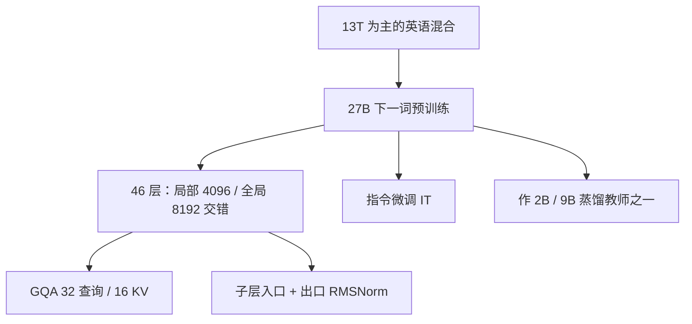

# Gemma-2 27B

Gemma 2 把已知技巧叠在实用规模上：局部与全局注意力交错、分组查询、子层入口与出口都做 RMSNorm；其中 27B 按下一词目标从零预训练，而不是蒸馏学生。

<footer>—— Google DeepMind，Gemma 2，arXiv:2408.00118</footer>

Gemma 2 家族是 2B / 9B / 27B。[家族综述](/llm/gemma) 已经交代共享底盘。本篇只把 **27B** 当成一个计算档位来写：它是三档里唯一主要走标准下一词预测、训在 **13T** 主要英语 token 上的教师尺度，也是 2024 年夏 LMSYS Arena 上「不到 70B 却很能聊」的开源点。2B/9B 的知识蒸馏、以及后来的 Gemma 3，都不在这里展开。

## 问题

2B 与 9B 可以用更强教师的软标签省噪声；27B 若再当学生，就要先有一个明显更大的教师，训练账会变成「先训一个更大的再蒸下来」。报告的选择是：27B **从零预训练** 13T，2B/9B 蒸馏。于是 27B 要单独回答的问题是：在仍能单节点部署的 27B 上，交错滑窗、GQA、双 RMSNorm 与 soft-capping 叠在一起，质量能否贴近当时更大的开源稠密模型，同时 KV 与深度仍可服务。

第二问是深度。27B 提到 **46 层**，$d=4608$。只做 Pre-RMSNorm 也能训，但报告在这一档坚持每个子层入口**与**出口都归一化。问题不是发明新函数，而是承认 46 层上激活尺度会漂，需要出口再钉一次。

### 27B 不是 2B 的线性放大

共享：RoPE、GeGLU、词表 256128、绑嵌入、GQA（`num_groups=2`）、局部窗 4096 与全局跨度 8192 隔层交错、注意力与最终 logits 的 tanh soft-capping。不共享：深度与宽度、头宽、训练目标与 token 量。27B 查询头 32 / KV 头 16，头宽 **128**（2B/9B 头宽 256）；前馈维报告表为 73728。2B 训 2T、9B 训 8T、27B 训 13T。数据以网页、代码、科学文章为主，**非多模态**，也不是按 SOTA 多语为目标来训。

Gemma 许可是 Gemma 条款，不是 Apache 2.0。27B 能下权重，不等于能当任意商用底座再分发。条款以当时文本为准。

## 方法

形状小结：$d_{\mathrm{model}}=4608$，46 层，GQA 32/16，全局 8192，滑窗 4096。局部层只看见最近 4096，全局层看见满训练长度 8192。交替周期为 2，信息每隔一层可以做一次任意远对齐。推理时改局部窗口，报告说对困惑度影响中等，可当轻微速度旋钮，**不能**当成 128K 外推方案。

### 双 RMSNorm 与 soft-capping

每个注意力 / 前馈子层：入口 RMSNorm，出口再 RMSNorm。这与 [Sandwich-LN](/llm/sandwich-ln) 同类，用 RMS 而不是减均值。注意力 logits 与最终分类 logits 用 $\mathrm{tanh}$ 压进有限区间，避免个别极大分数把 softmax 推死。开源实现里常见注意力 cap 50、最终 cap 30一类常数，以配置文件为准。

预训练 13T 后接指令微调得到 IT 档。模型卡上预训练档 MMLU 5-shot top-1 为 **75.2**（9B 为 71.3，2B 为 51.3）；HumanEval pass@1 27B 为 51.8，GSM8K 5-shot 74.0。IT 档另有毒性与偏见套件，不在本篇逐项抄。Arena 上 27B 的对话名次是产品证据，引用应指向当时排行快照，而不是把 Elo 写成论文表。

## 机制

GQA 使 KV 相对满头减半：32 个查询头只存 16 套键值，decode 带宽按 27B 仍可接受。局部层把一半深度的注意力从 $n^2$ 收成 $n\cdot 4096$；全局层保留 8K 主题与系统提示。与 Mistral 7B「每层都滑窗、靠层叠撑感受野」不同，27B 每隔一层给满 8K，短上下文更接近稠密 Transformer，全局层 FLOPs 也仍在。服务实现必须**两套 KV 策略**：局部可环形裁窗，全局必须存满 8K，否则远距离通道名存实亡。

27B 不当蒸馏学生，软标签噪声少一层，知识密度更吃 13T 与 46 层容量。2B/9B 看起来「不合尺寸地强」，部分能力来自 27B（或同族教师）的分布；把 27B 的 MMLU 解释成「蒸馏奇迹」是张冠李戴。大词表让嵌入很重，有效「推理深度」不能只看 27B 这个整数。

报告写模型非多模态、非以多语 SOTA 为目标。中文等语言能生成，不代表达到 Gemma 条款下的官方支持门槛。产品语言应做自己的安全与质量回归。

### 和 70B 级开源、和 9B 蒸馏档怎么选

需要单节点、许可可接受、8K 内对话，27B 是 2024 年中很强的开源点。需要 128K、工具、或 Apache，应看 Llama 3.1 / [NeMo](/llm/mistral-nemo) 等，而不是把 Gemma 2 的窗口口头升级。端侧选 2B/9B，不要用 27B 的 Arena 名次去证明手机可跑。从 Gemma 1 微调检查点接到 27B，层数、GQA、双 Norm、soft-cap 都不兼容，必须按 2 代配置重来。

## 边界与工程取舍

训练长度 8K。soft-capping 改变 logits 尺度，采样温度要重扫。绑嵌入使改词表很贵。不要把 Gemini 的未公开层数安到 27B。Gemma 2 报告编号 arXiv:2408.00118，Gemma 1 为 arXiv:2403.08295。不要给 27B 单独立一个不存在的论文号。

IT 与 PT 权重用途不同：对话用 IT，继续预训练用 PT。安全过滤在 Gemma 报告里有专章，只抄架构表得不到官方聊天行为。

27B 的服务账主要是 46 层的 decode 深度与全局层的 8K KV，不是 70B 级的张量宽。一张 80GB 卡可以 BF16 放下权重，但 8K×并发会先打满 KV。量化 8-bit 后与 PT 榜的相对差距可能收窄或翻转，后训练与量化误差不是可交换的。若用 27B 当教师蒸馏自己的学生，教师应是 PT 或你继续训过的底座；用 IT 当教师会把聊天套话蒸进下一词分布。Gemma 2 报告把 27B 写成实用规模的上限档：再往上他们没有在这一代放 70B 开源点，不要幻想存在一个未发布的 Gemma 2 70B 共用同一张表。本地部署时把 27B 与 9B 的聊天模板弄混，会表现为无故拒答，而不是算力不足。

论文表 FFN 维 73728 与部分开源实现里「门控一半宽度」的计数方式不同，是 GeGLU 双投影的口径差。配资源读具体 `config.json`，不要和 9B 的 28672 线性外推。27B 的 Arena 名次随对照模型集合变，写进文章时要标明快照月份，不能把 2024 年夏的座次当成永久排名。

## 小结

- Gemma-2 27B 是 Google 2024 年从零预训练的 46 层稠密模型，13T token，GQA 32/16，局部–全局交错，双 RMSNorm。
- 它是 2B/9B 蒸馏线的教师尺度，自己不是蒸馏学生。
- 默认 8K；局部与全局 KV 必须分开实现。
- 许可为 Gemma 条款；非多模态、非多语 SOTA 目标。
- 出处：Gemma Team，*Gemma 2: Improving Open Language Models at a Practical Size*，arXiv:2408.00118，2024。
