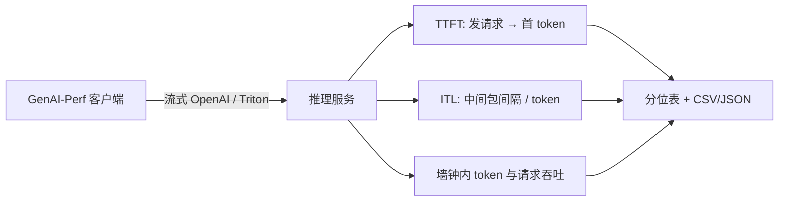

# GenAI-Perf

生成式服务的性能不能只报「每秒请求数」：必须把首 token 时间、中间 token 间隔、输出吞吐与请求吞吐拆开，并在流式接口上按真实并发去打。

<footer>—— NVIDIA Triton 文档：GenAI-Perf 测量 LLM 的 TTFT、ITL、请求延迟、输出 token 吞吐与请求吞吐</footer>

分类模型一次前向对应一次延迟。自回归 LLM 一次请求对应一次预填充和一串生成，用户感知的是第一个 token 何时出现、后续 token 是否跟得上阅读，运营感知的是整机每秒吐出多少 token。NVIDIA 把这件事收成命令行工具 **GenAI-Perf**：对已经在跑的推理服务发负载，按流式响应打时间戳，输出一张带平均、最小、最大、P99 / P90 / P75 的表，并落盘 CSV / JSON。它随 Triton 发布提供，也用于对 NVIDIA NIM、TensorRT-LLM 以及 OpenAI 兼容接口做对照。本篇写它量什么、怎么扫工作点、以及和 [MLPerf Inference](/llm/mlperf-inference-llm) 的合同有何不同。官方文档已提示功能转向 **AIPerf**；引用时以当时 Triton / perf_analyzer 说明为准，不把已冻结的子命令写成永久 API。

负载形态与批处理见 [静态批 vs 动态批](/llm/static-vs-dynamic-batch)；工作点选择见 [延迟-吞吐帕累托](/llm/latency-throughput-pareto)。

## 问题

用普通 HTTP 压测去打 `/v1/chat/completions`，若只记录「完整 JSON 返回」的时间，得到的是请求延迟，丢失了流式首包。若服务端把整段生成完再吐，TTFT 会被人为拉成接近总延迟，和线上 SSE 不是同一系统。若提示词长度、输出长度不固定，吞吐会跟样本混在一起，无法复现。GenAI-Perf 要固定的是：针对生成式端点，在指定并发或指定到达率下，分别报告 **Time to First Token**、**Inter Token Latency**（以及较新文档中的 Time to Second Token、每用户输出 token 吞吐）、**Request Latency**、输入/输出序列长度，以及整次基准的 **Output Token Throughput** 与 **Request Throughput**。

服务必须已经起来。工具不负责编译 TensorRT 引擎，只负责当客户端。后端参数（`--backend tensorrtllm` 等）告诉它如何解析流；OpenAI 兼容模式则打 chat / completions / embeddings。数据集可以是合成长度，也可以是 OpenOrca、CNN/DailyMail 一类文档里点名的公开集。没有流式、没有稳定的分词对齐，ITL 这一列没有定义——因为「中间响应之间的时间除以后一包的 token 数」依赖服务如何切 chunk。

### 分位数字与单一吞吐数字

TTFT、ITL、请求延迟按请求（或按中间包）有一条分布，表里给 avg/min/max/p99/p90/p75。输出 token 吞吐与请求吞吐是整次实验一个数：总输出 token（或完成的请求）除以基准墙钟。把 P99 TTFT 和「平均 tokens/s」写在同一句里当 SLA，会把用户尾延迟和机房利用率混在一起。并发一高，平均 tokens/s 往往上升，P99 TTFT 往往变差——这正是帕累托上要扫的那一维，工具负责出点，决策见专文。

NVIDIA 技术博客 *Measuring Generative AI Model Performance Using NVIDIA GenAI-Perf and an OpenAI-Compatible API* 把该工具定位为 NIM、Triton、TensorRT-LLM 之间用同一套 OpenAI 兼容接口对照的默认客户端。对照合法的前提是：同一模型、同一精度、同一提示分布、同一流式语义。

## 方法

先把服务打到稳定：引擎、KV 池、预热。再用 `genai-perf profile`（具体子命令随版本）指定模型名、URL、并发或 request rate、输入/输出长度或数据集、是否 streaming。文档示例里常见对 Triton + TensorRT-LLM 的 GPT-2 快速路径，以及容器 `nvcr.io/nvidia/tritonserver:<release>-py3-sdk`。正式实验不要用 GPT-2 当结论：长度、KV 与调度行为和 70B 级服务不是同一屋顶线。

扫工作点：固定输入/输出长度，从并发 1 扫到 GPU 显存或延迟 SLO 打满；或固定并发，扫输入长度（prefill 重）与输出长度（decode 重）。每次出一行 TTFT / ITL / 吞吐。`analyze` 一类子命令把多场景收成报告与 checkpoint，避免手工拼 CSV。产物里的 `profile_export.json` 来自底层 Perf Analyzer 的事件时间戳，GenAI-Perf 再聚合成 LLM 指标；排障时应核对分词后的 output sequence length 是否真是你以为的 `max_tokens`，否则 ITL 会被短生成稀释。

遥测：文档与配方常接 DCGM，看功耗、显存、利用率。tokens/s 很高但 SM 很空，可能是排队在 CPU 调度；SM 很满但 ITL 很差，可能是 batch 过大或 KV 带宽墙。工具给指标，不自动指出是 [HBM](/llm/hbm-roofline) 还是调度。多 LoRA、embedding、rerank、多模态在较新说明里也列为可测对象，指标集合与 LLM 不完全相同，不要用 TTFT 去报 embedding 服务。

### 和 MLPerf、自写压测的分工

[MLPerf Inference](/llm/mlperf-inference-llm) 规定模型、数据集、精度门槛、LoadGen 到达过程、以及 Server 场景的 TTFT/TPOT 阈值；提交的是可审计的 tokens/s。GenAI-Perf 是工程扫描器：随便换并发、换 NIM 版本、换量化，出表快，没有封闭划分的合法性。自写脚本容易漏掉流式首包或用错分词器。三者关系：用 GenAI-Perf 找工作点，用 MLPerf 做跨厂商海报，用生产日志验证真实提示分布。文档列出的 OpenOrca / CNN-DailyMail 便于和公开叙述对齐，仍不是你的用户流量。

负载模型有「固定并发」与「固定到达率」。前者接近用完线程池的闭环；后者更接近开环泊松到达，排队论上更像 Server 场景。延迟 SLA 应用到达率扫描；容量规划可以并发扫描。混用两种负载却比较 TTFT，结论无效。

## 机制

TTFT 包含排队、prefill、以及第一个 decode token 的调度。输入越长，prefill 越重，TTFT 分布右移；并发越高，排队项变大。ITL 近似每个输出 token 的间隔，连续批处理下它反映 decode 步时间加调度抖动，不是裸 GPU kernel 时间。请求延迟 ≈ TTFT +（输出 token 数 − 1）× 某种逐步时间，但逐步时间不恒定：开头可能受 prefill 拖尾、结尾可能受结束符、中间可能因批成员变化而抖动，所以文档要单独报 ITL 分布，而不是用总延迟除以长度。Time to Second Token 用来抓住「首包之后第二包是否卡住」——有的服务首 token 很快（缓存或投机），第二包才进入稳态 decode。

输出 token 吞吐计的是基准期间所有请求的生成 token 之和除以墙钟，衡量机房利用率。每用户输出吞吐（较新指标）把生成阶段的 token 摊到该请求自己的生成时长上，更接近「这个用户觉得有多快」。两者可以反向运动：提高并发，前者升、后者降。帕累托分析必须两条都看。

ITL 的定义是「相邻中间响应的时间差，除以后一响应的生成 token 数」。服务若一个 SSE 事件塞很多 token，ITL 会被摊薄，看起来优于真实逐 token 流。对照实验必须固定 chunk 语义，否则是在比流式实现而不是比模型。

### 合成长度与真实长度

合成固定 ISL/OSL 可复现，便于画曲线。真实数据集长度方差会把 TTFT 和 ITL 的方差撑大，P99 可能被长尾提示主导。报告里应写清：固定长度扫描，还是命名数据集。分词器必须与服务端一致，否则「output sequence length」列与计费 token 对不上，吞吐会被系统性放大或缩小。Stop 序列、忽略 EOS、忽略输入长度截断，都会改 OSL，必须写进命令行记录——文档要求 JSON 里保存参数，正是为了这件事。

## 边界与工程取舍

不要在非流式端点上解释 ITL。不要把 GPT-2 示例数字写进 70B 容量规划。不要用单次 30 秒压测的峰值 tokens/s 当月报，没有预热与稳态窗口的数字含启动。不要跨硬件比较却不写精度、KV 量化、最大并发。文档写明 GenAI-Perf 不再积极加功能、新需求看 AIPerf：新集群应确认当前推荐客户端，避免脚本绑死旧 CLI。自定义 API 可用 Jinja 模板或自定义 frontend，那是扩展，默认指标仍按生成式假设，不适合任意 JSON RPC。

客户端与服务若不同机，网络 RTT 会进 TTFT；机内 loopback 又会低估线上。测 SLA 时客户端应放在与用户等价的网络位置，或明确声明测的是「服务本机」。GPU 遥测缺失时，不要用 tokens/s 反推 MFU。

出处：NVIDIA Triton 用户指南 *GenAI-Perf*（指标表、profile 流程、流式与 OpenAI 兼容、产物 JSON/CSV）；NVIDIA Developer Blog 对 NIM / Triton / TensorRT-LLM 对照的说明。MLPerf 规则不由本工具定义。

## 小结

- GenAI-Perf 是生成式服务的客户端压测器，主指标是 TTFT、ITL、请求延迟、token 吞吐与请求吞吐。
- 分布用分位数；整次实验的吞吐是标量。二者必须一起报才能谈 SLA 与利用率。
- 服务先启动；负载用并发或到达率扫描，流式语义必须与线上一致。
- 与 MLPerf 互补：一个是工程扫描，一个是封闭提交合同。
- 版本上注意向 AIPerf 的过渡，以当时官方说明为准。
- 出处：NVIDIA Triton GenAI-Perf 文档与技术博客。
