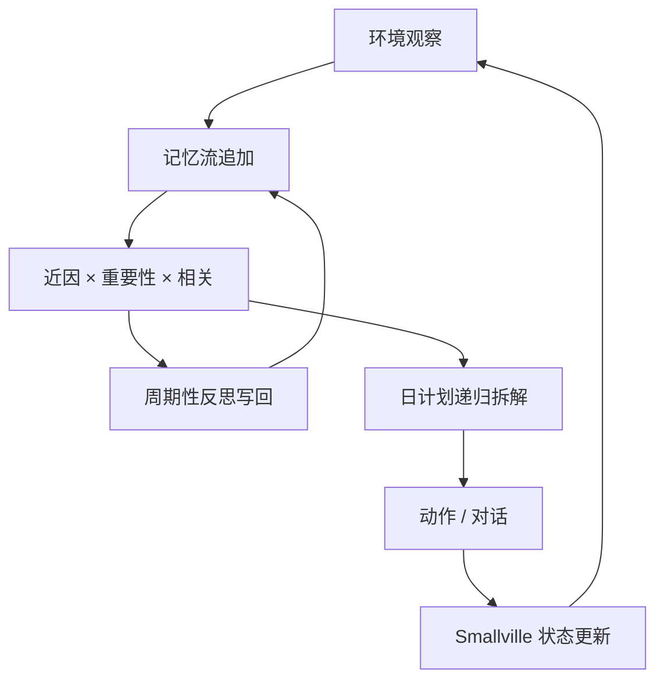

# Generative Agents

    
把每个智能体的经历写成自然语言流水账，按近因、重要性和相关性检索，再周期性反思成更高层的判断，并用这些记忆递归做成一天的计划—— believable 的行为来自记忆架构，而不是来自更长的单次提示。

    <footer>—— Park 等，Generative Agents: Interactive Simulacra of Human Behavior，UIST 2023</footer>

Joon Sung Park、Joseph C. O’Brien、Carrie J. Cai、Meredith Ringel Morris、Percy Liang 与 Michael S. Bernstein（Stanford / Google）的 UIST 2023 论文（arXiv:2304.03442，DOI: 10.1145/3586183.3606763）给出 **generative agents**：在类《模拟人生》的沙盒 **Smallville** 里安置 25 个角色，用 GPT-3.5 驱动观察、记忆、反思与规划。智能体起床、上班、聊天、形成关系；从一条「想办情人节派对」的种子意图，涌现出邀请、布置、赴约。评测分受控访谈与端到端两日模拟。本篇写记忆流与检索公式、反思如何写回记忆、计划如何拆成时刻表。应用是社会原型与角色扮演排练，工作流止于沙盒内交互，不涉及操纵真实人类或攻击性社会工程。

## 问题

要把「可信的人」放进互动环境，不能每一步把一生经历塞进上下文：窗口不够，噪声还会淹没当下。只根据当前观察生成下一句，角色会忘早上的约定、与每个人的关系归零。需要长期记忆模块：完整记录经验，动态取出与此刻相关的子集，并随时间合成更高层的自我与社会判断，再变成可执行的日程。

Smallville 提供咖啡馆、公园、住宅、物件状态（炉子开着、冰箱空了）。用户可用自然语言改物件状态，智能体应在下一刻感知并反应。架构必须同时服务：**单独一人是否像该角色**，以及**许多人互动是否涌现出传播、关系、协作**。

### 记忆流不是向量数据库里的 RAG 问答

每条记录是带时间戳的自然语言观察：「冰箱空闲」「在公园遇见 Latoya，她在做摄影项目」。检索不是为了回答用户百科，而是为了条件化「现在做什么、对谁说什么」。反思与计划也会作为记录写回，成为未来检索的对象。这与 Voyager 的技能库不同：那边存可执行代码，这边存经历与态度。

实现用当时的 gpt-3.5-turbo；作者预期换 GPT-4 只增强提示表现，不改记忆–反思–规划三件套。引用行为案例时应区分「架构涌现」与「模型随机编造的记忆」——后者是论文点名的失败模式。

## 方法

架构三件。**(1) 记忆流**： perceiver 把环境事件追加为观察。**(2) 检索**：对当前查询（例如「你现在最期待什么」）给每条记忆打分，近因、重要性、相关性加权求和，取 top 若干条送进提示。重要性由模型对「这件事对角色有多重要」打 1–10；相关性是嵌入余弦；近因是时间衰减。**(3) 反思**：当重要性累积过阈值，提示模型基于最近记忆生成更高层结论（「Klaus 热爱写作」），写入记忆流。**(4) 规划**：先生成当天高层计划，再递归拆到小时与分钟级动作；遇打断则反应并可能改计划。对话与移动由沙盒引擎执行路径。

25 个智能体各有一段种子人设（职业、关系）。端到端例子：Isabella 被初始化为要在 Hobbs Cafe 办情人节派对；之后邀请、请 Maria 帮忙布置、Maria 邀请 Klaus，当日多人到场——传播与赴约不是脚本分支，是记忆与计划交互的结果。

评测：用自然语言「访谈」智能体，测是否还记得人设、计划、关系、能否反思；消融去掉记忆、反思或规划，访谈分数下降，说明三件套各自必要。端到端看信息是否扩散、关系是否更新、派对是否发生。失败集中在：检索漏掉关键记忆、对记忆添油加醋、口吻过于正式。

### 检索分数是架构的旋钮

只有近因，角色变成金鱼；只有重要性，日常走路挤不进窗口；只有相关性，会翻出语义相近但过期的事。三者相加是工程折中，权重需调。反思频率过高会把噪声上升成性格，过低则不会出现「我对 Klaus 有好感」这种能改变邀请行为的中间变量。计划递归深度决定是「上午工作」还是「10:15 去拿咖啡」——过细则调用次数爆炸（25 人 × 每时刻一次 LLM）。

## 机制

可信性来自条件前缀的一致性：同一 Isabella 在不同时刻检索到重叠的派对相关记忆，言行才不会自相矛盾。涌现不是额外模块，而是多个检索–生成循环通过共享环境状态耦合：A 对 B 说「有派对」，该观察进入 B 的记忆流，B 的计划被改写。消融证明：没有记忆则访谈与协作都垮；没有反思则难以形成稳定态度；没有计划则行为碎成对瞬时观察的反应，像只有 ReAct、没有日程。

与 WebGPT / ReAct：那些系统为了一个用户问题优化一条轨迹；generative agents 为每个角色维护一生的流，目标函数是 believable，不是 QA 准确率。与 HuggingGPT：没有专家模型完成感知，观察由沙盒符号状态生成。应用上，论文设想面试排练、社交产品原型；用户进入沙盒也是一个智能体，居民一视同仁。

不要把「25 人小镇」写成通用多人在线模拟器的性能结论。LLM 调用次数与记忆条数线性恶化，检索会成为瓶颈。论文环境是作者手搭的地图，不是程序化生成世界。

### 访谈评测测的是记忆架构，不是道德判断

问「你在期待什么」时，若检索命中布置派对的记忆，回答会具体；若把记忆摘要成「我喜欢整洁」，就不可信。这解释了为何作者反对「把一生摘要进提示」：摘要丢失了检索该保住的具体事件。添油加醋则是模型在检索不足时用语言模型先验补全，看起来更戏剧，却破坏模拟的因果账本——产品若要可调试，应记录每次检索命中的 id。

## 边界与工程取舍

成本：每智能体每时间步多次调用，25 人两日游戏时间是研究级账单。记忆造假与过度礼貌是模型先验，单靠架构消不掉。沙盒物件状态是符号化的，没有真实物理。不要用于未经同意地模拟真实个体，或生成操纵性话术去对真实用户使用；论文场景是游戏式小镇与设计原型。规划过期（炉子着火）依赖下一观察进入记忆——若感知漏了，计划会继续做早餐。换更强骨干可能减少正式口吻，但检索漏记仍在。

出处：Park, O’Brien, Cai, Morris, Liang, Bernstein，*Generative Agents: Interactive Simulacra of Human Behavior*，UIST 2023，arXiv:2304.03442。演示与代码见论文项目链接。对照具身代码技能见 Voyager。

## 小结

- Generative agents 用记忆流 + 近因/重要性/相关性检索 + 反思 + 递归规划驱动可信日常行为。
- Smallville 中 25 个角色展现信息扩散、关系形成与派对协作等涌现。
- 消融表明三件套缺一不可；失败多为检索遗漏或对记忆虚构。
- 出处：Park et al.，UIST 2023。
