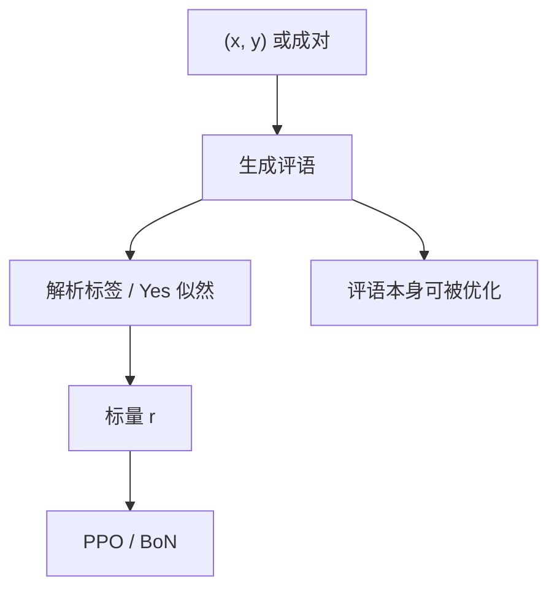

# 生成式奖励模型

不要只吐一个标量；让裁判先写出谁更好、为什么，再把那份判断收成奖励。

<footer>—— Zhang 等 Generative Verifiers；Mahan 等 Generative Reward Models</footer>

[上一课](/llm/rm-overoptimization)把标量 RM 的命运写成过优化曲线：点估计的 $r_\phi$ 一旦成为目标就会被榨干。缺口是：**判别头把全部偏好压进一个 logit，既难解释，也给捷径留了短特征。** 生成式奖励模型（GenRM）改用自回归：对 $(x,y)$ 或成对 $(y_a,y_b)$ 生成评语，再解析出分或胜负。本课写这条对象转换。后课 LLM 裁判谈提示与偏差；本课先把「奖励是一段话」接上 [RLHF](/llm/rlhf-pipeline)。

## 问题

标量 RM 的最后一层是线性头，长度、列表、关键词极易占满。人类比较时其实先有理由再给序；BT 训练把理由扔掉了。GenRM 要恢复中间文本：给定题目与回答，生成「逐步是否合法 / 哪条更好」，用生成概率或解析出的标签当 $r$。希望是：黑客必须同时骗过一段连贯评语，而不只是抬高一个 logit。

这不是 [过程监督](/llm/process-supervision) 的 PRM。PRM 预测逐步对错的分类头；GenRM 可以是验证者风格的 CoT，也可以是成对比较的解说。两者都比标量厚，也都引入新的过优化面：策略可以学着写「裁判爱看的回答」，或直接污染评语格式。

### 生成的是验证，还是比较

验证式：输入 $(x,y)$，生成对错或分数。比较式：输入 $(x,y_a,y_b)$，生成胜者。前者可直接给 PPO；后者更像标注员，要先采样候选再判。Zhang 等人的生成式验证器主要走前者，把正确性写成下一个 token 的似然。Mahan 等人强调生成式偏好模型在分布外更稳。不要把两篇收成同一个头。

用 $\log p(\text{Yes}\mid x,y)$ 当奖励，仍是标量，只是这个标量经过了一段 CoT。CoT 被优化之后，一样会 Goodhart。

## 方法

训练数据：带评语的比较，或带逐步对错的解答（PRM800K 一类也可拿来训生成验证器）。损失是评语 token 的因果 LM，外加对最终标签 token 的加权。推理：采样或贪婪生成评语，解析最后一行的分数 / 胜负；或对「Yes/No」算对数概率，避免采样噪声。接到 PPO 时，$r$ 仍是标量，只是计算贵一个生成器。

与 [DPO](/llm/dpo) 的差别：DPO 不训奖励；GenRM 仍训奖励，只是奖励器是 LM。可以先 GenRM 打分再 DPO，那是用生成器当教师，不是 GenRM 本身做策略优化。

## 机制

评语提供的归纳偏置是：判断必须经过可写下来的理由。对数学，这接近生成式过程验证；对开放偏好，理由可能只是漂亮话，不增加信息。经验上，生成式验证器在可核对域（对错有金标）提升更明显，因为评语的中间步骤能被结果部分约束。开放域里，生成式 RM 的胜率校准仍要单独做，上一课的仿射对「Yes 概率」同样适用。

过优化通道从「抬 logit」变成「写裁判爱看的表面」。若裁判总夸列表，策略仍写列表，只是现在还配一段自我表扬。集成 GenRM（多份评语）能推迟，成本是 $K$ 次长生成。

评语长度要截断并格式化。无约束 CoT 会让延迟不可控，RL 墙钟被裁判吃掉。

## 边界与工程取舍

GenRM 的墙钟常是标量 RM 的数十倍。在线 PPO 每条轨迹都跑生成裁判，只适合小规模或离线打分。可验证域应优先 [程序校验](/llm/verifiable-reward)，不要用生成器代替编译器。下一课把「用现成 LLM + 提示当裁判」从「专门训一个生成式 RM」里拆出来：前者更常见，偏差也更文献化。

## 小结

- GenRM 用自回归评语再解析成 $r$，加厚奖励器，不取消标量过优化。
- 验证式与比较式是两种输入；不要混成一个头。
- 可核对域更受惠；开放域的评语可能只是修辞。
- 在线 RL 成本高，优先离线打分或可验证奖励。
- 出处：Zhang 等 Generative Verifiers；Mahan 等 Generative Reward Models；过优化仍见 Gao 等。
