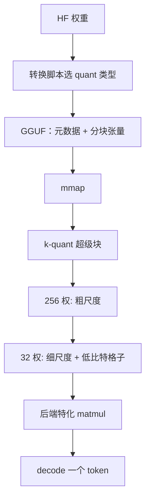

# GGUF / k-quants

GGUF 是一份可 mmap 的张量容器：量化类型、分词器与超参写在元数据里；k-quant 用超级块上的多层尺度，把异常值关进比 Q4_0 更细的格子，而不需要 GPTQ 那种离线 Hessian。

<footer>—— ggml / llama.cpp 的 GGUF 规范与 k-quant 实现说明</footer>

本地推理要把模型当成一个文件打开，而不是先起 Python、再把 safetensors 解成半精度再临时量化。GGUF（GPT-Generated Unified Format）是 ggml 生态用来替换早期混乱 `.bin` / GGML 文件的容器：魔数、版本、键值元数据、张量信息、然后是按块存放的量化权重。k-quant（`Q2_K` … `Q6_K`，以及常见的 `Q4_K_M` 配方）是写在这种容器里的一族**分块量化数据类型**，用 256 权重量级的超级块、块内再分组，配不同精度的尺度，减轻老式 `Q4_0` 一块一个 scale 对异常通道的伤害。它不是一篇 ICLR 论文里的新目标函数，而是 llama.cpp 里为 CPU / Metal / CUDA 核写出来的存储与计算布局。质量与速度必须锁定量化类型再比；「GGUF 模型」只说明容器，不说明比特。运行时故事见 [llama.cpp / ggml](/llm/llamacpp)。

## 问题

早期 GGML 二进制随量化方案迭代，转换脚本与加载器经常互不认。模型还要把词表、RoPE 基、架构名、量化版本放在一起，否则 mmap 到一半才发现缺 tokenizer。需要一种带版本的容器：新加载器能跳过不认识的元数据键，旧文件能报错而不是静默错。这是 GGUF 要解的**分发**问题。

量化问题是另一轴。`Q4_0` 一类方案把 32 个权重共用一个 FP16 尺度，异常值把尺度拉大，同块其余权重的有效比特变少，困惑度在 7B 上已经刺手。GPTQ / AWQ 用校准去保护显著方向，但依赖 Python 量化流水线与特定 GPU 核，和 ggml 的「打开文件就开始 matmul」不吻合。k-quant 要在**纯分块、可 SIMD 反量化**的约束下，用更多的尺度比特换异常值鲁棒性，并且让转换在 CPU 上对任意 HF 权重跑完，不必解 Hessian。

### 容器与码本不要互相替代

GGUF 可以装 FP16、`Q8_0`、k-quant、甚至后续的 i-quant 等。说「转成 GGUF」没有指定误差。反过来，k-quant 的内存布局也可以出现在别的封装里，但生态事实是它和 GGUF + llama.cpp 核绑在一起。评测必须写 `Q4_K_M` 或 `Q5_K_S` 这种全名；只写 GGUF 与只写 4-bit 一样无信息。

GGUF 不负责训练。LoRA 要先合并再量化，或使用运行时对适配器的有限支持。在线改权重、多适配器并发，不是这个格式的设计中心，服务端见 vLLM 多 LoRA。

## 方法

文件布局公开且故意简单：文件头魔数 `GGUF`、版本号、张量个数、元数据键值对（字符串、数、数组），然后每个张量的名字、形状、量化类型、数据偏移。加载器按偏移 mmap，decode 时按块把量化权重与尺度读进 SIMD 寄存器，反量化成浮点乘激活，或走为该类型特化的整数点积。分词器与 chat template 应写进元数据，避免「权重对了、模板错了」。

k-quant 的方法是超级块。以常见的 256 个权重为一个 super-block：内部再切成 8 个 32 元组。超级块上存一份较粗的尺度，每个 32 元组再存更细的尺度或量化后的尺度；权重本身用 2–6 bit。异常值被限制在 32 这一档的尺度里，不再污染整整 256 个位置。`Q4_K` 是 4-bit 权这一档的代表；`Q5_K`、`Q6_K` 加比特换质量。配方后缀 `_S` / `_M` / `_L` 不是另三种格子，而是**哪些张量用更低比特、哪些张量（如 `attn_v`、`ffn_down`）留更高比特**的混合方案。`Q4_K_M` 成为社区默认，是经验上体积、PPL、核效率的折中，不是理论上的最优码本。

转换通常是离线、一次、非 GPTQ：对每块估 min/max 或绝对最大值，写入尺度与量化整数。也可以先做 GPTQ/AWQ 再塞进 GGUF，那是两条流水线的串联，质量归因要写清楚，不能把 GPTQ 的 PPL 标成「k-quant 的结果」。推理激活一般是 FP16/FP32 或按后端的 8-bit，和权重 k-quant 独立。

### 核决定墙钟，比特不决定

同一份 `Q4_K_M`，CPU AVX、ARM NEON、Metal、CUDA 的实现完整度不同。有特化核的类型可以比「比特更低但走标量反量化」的类型更快。因此 `Q3_K` 不必比 `Q4_K` 快，`Q4_0` 有时在某后端反而更快。选类型要看该设备的核表与你的 PPL 预算，而不是看字母顺序。Apple 统一内存上，mmap 量化块少一次拷贝，这是 GGUF 本地路径相对「CUDA + 独立显存 + safetensors」的结构差，不是算法差。

## 机制

分块仿射量化的误差是块内动态范围决定的。超级块机制把动态范围的估计拆成两级：粗尺度管 256 这个窗口的总能量，细尺度管 32 这个窗口里的局部尖峰。相对单尺度 `Q4_0`，异常通道的 $s$ 不再统治整块。这与 AWQ 用全局通道 $s$ 保护显著列、GPTQ 用 Hessian 补偿，是三条不同的误差控制：k-quant 不看校准任务，只看这块权重自己的统计，故转换快、对任务中立，也故不能在「这一列对语言建模特别重要」的意义上做针对性保护——它保护的是数值尖峰，不是语义显著。

mmap 机制：操作系统按页载入正在 matmul 的那些块，冷启动不必把 70B 的 4-bit 一次打进进程堆。这是本地助手能在 16–32 GB 内存上跑 30B 量化模型的前提之一。服务端高并发若随机访问所有层的所有块，页缓存行为不同，GGUF 不是为多租户吞吐设计的。

`Q4_K_M` 的 M 表示 mixed：重要张量更胖。把所有张量都打成同一 `Q4_K` 体积会更小、PPL 通常更差。比较必须锁定配方全名。

与 [QLoRA](/llm/qlora) 的 NF4：NF4 是正态分位数码本，面向训练期冻结基座；k-quant 是均匀/近均匀格子加多级尺度，面向 ggml 反量化核。两者都叫 4-bit，网格不同，不能当同一检查点。

## 边界与工程取舍

不要用一份公开的 `Q4_K_M` 聊天体感代替领域评测。转换常用通用校准或甚至无校准分块，长尾专有名词、代码、多语言可能先糊。需要任务对齐时，应在同一 GGUF 类型上用你的集测，或改走 GPTQ/AWQ 再转换并声明。新架构（MLA、奇异 MoE）要等 ggml 实现算子与 quant 核，窗口期内只有 Python 引擎能跑，这不是 GGUF 的错。

许可证：格式与加载器是开源仓库的 MIT 一类许可；模型权重另有各家协议。量化不改变权证。安全上，GGUF 可含自定义元数据，加载不可信文件与加载不可信 pickle 类似，应限来源。

出处是 https://github.com/ggerganov/ggml 的 GGUF 说明与 llama.cpp 量化文档，不要给 k-quant 编造 arXiv。社区博客里的 PPL 表要核对该日的 commit 与模型，布局改过不止一次。

服务引擎（vLLM、TRT-LLM）有自己的 GPTQ/AWQ/FP8 布局。GGUF 作为主格式出现在本地与部分兼容层；集群上为了核性能通常会再转一份。选 GGUF 的理由是：一份文件、多后端、mmap、k-quant 在 CPU 上足够好。选它当数据中心唯一格式，会把 GPU Tensor Core 的 INT4/FP8 路径让出去。

### 元数据里的词表与 RoPE 必须跟权重同一次转换

GGUF 把 tokenizer 模型、特殊 token、RoPE 基频、架构字符串和量化类型放在同一文件，是为了避免「权重是 Llama-3、词表还是 Llama-2」。转换脚本若只搬张量、用加载器默认词表，chat template 会对不齐，模型看起来像量化坏了。k-quant 改的是权重格子，改不了分词。排查「量化后变笨」要先 diff 元数据键，再去调 `Q5_K_M` 换 `Q6_K`。新版本 GGUF 增加的键，旧加载器应忽略；缺的关键键应硬失败，而不是用静默默认。

## 小结

- GGUF 是 ggml 的带元数据张量容器，为 mmap 与跨版本分发，不是量化算法本身。
- k-quant 用超级块多层尺度做 2–6 bit 权重，缓解 `Q4_0` 单尺度被异常值绑架。
- `_S/_M/_L` 是不同张量混合比特的配方，`Q4_K_M` 是常见折中。
- 墙钟取决于后端是否为该类型写了核，更低比特不必更快。
- 转换默认不看任务显著通道；要任务对齐需另测或串 GPTQ/AWQ。
- 与 GPU 生态的 GPTQ/AWQ/SmoothQuant 布局不互换；与 QLoRA NF4 也不互换。
- 出处：Georgi Gerganov 及贡献者的 GGUF 规范、llama.cpp 量化类型说明；不编造会议论文。
