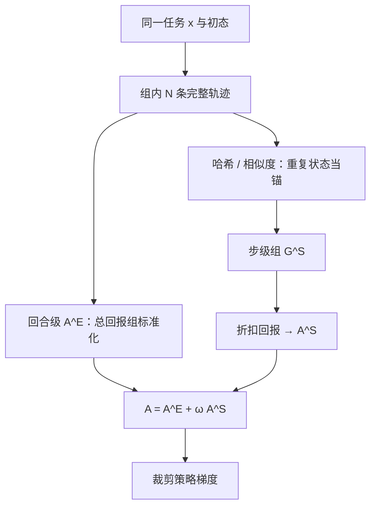

# GiGPO 多轮步级优势

组相对方法可以没有 critic，但把整条轨迹收成一个标量，就分不清哪一步把任务做砸；同一状态下出现过的动作，事后就可以再分成更小的一组。

<footer>—— Feng、Xue、Liu、An，Group-in-Group Policy Optimization for LLM Agent Training，arXiv:2505.10978</footer>

[GRPO](/llm/grpo-paper) 与 [RLOO](/llm/rloo-paper) 把「同一题上采一组输出、组内相对打分」做成可扩展的无 critic 配方，在数学、代码这类 **单轮、终点奖励** 任务上站稳。代理环境把同一配方直接套上去会塌：ALFWorld 一轮可到约 50 步、超过 2 万 token，奖励经常只在结束时给成功或失败。轨迹级相对优势鼓励「整局更好」，却把中间误点、绕路、重复搜索压成同一个系数。Feng、Xue、Liu、An 提出 **GiGPO**（Group-in-Group Policy Optimization）：保留组内无 critic，再在组里嵌一套 **锚状态分组**，用跨轨迹重复出现的环境状态构造步级组，得到微优势 $A^{S}$，与宏优势 $A^{E}$ 相加。论文公开于 arXiv:2505.10978，代码在 `langfengQ/verl-agent`。本篇按原文写两级优势，不把后续同名变体或未发表实现写成该文结果。

## 问题

设任务描述 $x$，策略 $\pi_{\theta}(\mathbf{a}_t\mid \mathbf{s}_t,x)$ 逐步产出文本动作。轨迹 $\boldsymbol{\tau}=\{(\mathbf{s}_t,\mathbf{a}_t,r_t)\}_{t=1}^{T}$ 的回报常常稀疏。组方法对同一 $x$ 采 $N$ 条完整轨迹，用

$$
A(\boldsymbol{\tau}_i)=\texttt{GroupComputation}\bigl(\{R(\boldsymbol{\tau}_j)\}_{j=1}^{N}\bigr)
$$

给整条 $\boldsymbol{\tau}_i$ 一个标量，再广播到每一个 token。数学题上这够用：对错发生在终点，中间 token 共享同一对错。家居与网页代理上不够用：同是失败局，有的在结果页点了正确商品再点错结账，有的从未离开搜索框。轨迹级 $A$ 把两种失败当成一类，梯度无法告诉模型「在那一页该点哪个」。

朴素补救是对每个 $\mathbf{s}_t$ 再滚若干假设动作，做成逐步组。论文图 1 中路标明：额外前向与「从未执行的动作如何给奖励」会把算力打爆。GiGPO 的观察是——**同一任务、同一初始状态** 下，组内轨迹会反复撞上相同网页、房间或搜索结果页。这些重复状态不必再滚，事后哈希聚合即可。

### 稀疏奖励下轨迹级信号的盲区

RAGEN 一类做法把状态、推理、动作拼成一条「超长回复」再套 GRPO，在 ALFWorld 这种长程上会碰到扩展性问题：组内方差被整局成败支配，中间环路得不到相对惩罚。PPO 能靠价值头做逐步信用，但要再挂一个近乎同规模的 critic，正是组方法想避开的。GiGPO 问的是：能否在 **不增加 LLM rollout、不增加 GPU 显存** 的前提下，把组相对从「局」嵌套进「步」。

锚状态分组依赖「状态可对齐」。文本观察若含时间戳、随机广告或绝对坐标噪声，哈希永远对不齐，步级组会退化成单例，$A^{S}$ 为零。论文因此在搜索 QA 上允许最长公共子序列相似度超过 0.9 时合并状态；这是实现选择，不是理论保证。

## 方法

对固定 $x$ 与相同初态 $\mathbf{s}_1$，采组 $\{\boldsymbol{\tau}_i\}_{i=1}^{N}$。回合回报 $R(\boldsymbol{\tau}_i)=\sum_t r_t^{(i)}$，二值任务上成功为 1、失败为 0。回合级组

$$
G^{E}=\bigl\{(\boldsymbol{\tau}_i,R(\boldsymbol{\tau}_i))\bigr\}_{i=1}^{N},
\qquad
A^{E}(\boldsymbol{\tau}_i)=\frac{R(\boldsymbol{\tau}_i)-\mathrm{mean}(\mathbf{R})}{F_{\mathrm{norm}}(\mathbf{R})}.
$$

$F_{\mathrm{norm}}$ 默认可取组内标准差（GRPO 风格），也可固定为 1，以免过难或过易任务上 std 过小放大梯度——这与 [Dr. GRPO](/llm/dr-grpo) 对题级 std 的批评同方向，但是代理长程上的经验选择。论文主实验 $\omega=1$，未再搜。

步级不新滚动作。令 $\mathcal{U}$ 为组内出现过的互异环境状态。每个锚 $\tilde{\mathbf{s}}\in\mathcal{U}$ 收集所有撞上它的动作，并用折扣回报代替即时奖：

$$
R_t^{(i)}=\sum_{k=t}^{T}\gamma^{k-t}r_k^{(i)},
\qquad
G^{S}(\tilde{\mathbf{s}})=\bigl\{(\mathbf{a}_t^{(i)},R_t^{(i)})\mid \mathbf{s}_t^{(i)}=\tilde{\mathbf{s}}\bigr\}.
$$

组内再标准化得到 $A^{S}(\mathbf{a}_t^{(i)})$。合成优势

$$
A(\mathbf{a}_t^{(i)})=A^{E}(\boldsymbol{\tau}_i)+\omega\,A^{S}(\mathbf{a}_t^{(i)}).
$$

目标仍是 PPO 式裁剪代理，外加对参考策略的 KL，对 $N$ 条轨迹、$T$ 步平均。哈希表分组的额外时间论文报 **小于 0.002%**，显存与 LLM rollout 次数与 GRPO 相同。

### 同一结果页上的相对排序

论文用 WebShop 两条轨迹说明 $A^{S}$ 做什么。两条都停在同一搜索结果页：$\tau_1$ 先点错第 2 件、返回后再点第 1 件并成功；$\tau_2$ 点「下一页」后失败。折扣使「先点错再挽回」的较早动作回报低于后来的正确点击，失败轨迹的「下一页」更低。于是同一锚组内出现

$$
A^{S}(\text{第 1 件})\gt A^{S}(\text{第 2 件})\gt A^{S}(\text{下一页}),
$$

这是轨迹级标量给不出的序。重复查询、原地转圈会进入同一 $G^{S}$，从而在训练中被压掉——搜索 QA 上 7B 模型单跳平均约 0.9 次工具调用、多跳约 1.6 次，与强调省工具的 OTC 同一量级。

## 机制

$A^{E}$ 提供稳定的「这局相对同组更好还是更差」，避免只靠逐步信号在全失败组里抖动。$A^{S}$ 提供「在这个可复现的决策点，哪个动作的后续回报更好」。二者缺一：消融里去掉 $A^{E}$，长程一致性塌；去掉 $A^{S}$，Cool / Pick2 / WebShop 这类需要逐步分辨的任务掉得更狠。$F_{\mathrm{norm}}=\mathrm{std}$ 与 $=1$ 的差距小于结构消融，但在 Look、Pick2、WebShop 上固定 1 往往更稳——难任务组内奖励近乎伯努利，std 会人为抬梯度。

### 训练过程中步级组如何变

ALFWorld 训练曲线上，成功率先升；检查点处 $|G^{S}(\tilde{\mathbf{s}})|$ 的分布会变。早期策略乱走，同一房间被反复访问，大组多；后期策略更干净，部分锚的组变小。组变小不是算法失效，而是可对比动作变少：$A^{S}$ 的有效样本随策略改进而变稀。实现上应对过小组（例如 size=1）把 $A^{S}$ 置零，只保留 $A^{E}$，以免除零或假方差。

GiGPO 的步级组是「事后对照」，不是 MCTS 里的前向分支。它不能比较从未在组内出现过的动作，也不能在确定性、永不重复的状态空间里变出微优势。开放网页若几乎没有共享 DOM 快照，应预期 $A^{S}$ 接近关闭，算法退回 GRPO。

## 边界与工程取舍

主结果钉在 Qwen2.5-1.5B/3B/7B-Instruct、组大小 ALFWorld/WebShop 为 8、搜索 QA 为 5、最多 4 轮。1.5B 上 GiGPO（$F_{\mathrm{norm}}=1$）相对 GRPO：ALFWorld 成功率 +13.3 个百分点（72.8% → 86.1%），WebShop 成功率 +10.6 个百分点；7B 上分别为 +12.6 与 +9.1。搜索增强 QA 平均 3B 42.1%、7B 47.2%，对照 Search-R1、ZeroSearch、StepSearch。这些数字绑在该骨干与该环境，不是任意代理的保证。

状态键的选择是隐藏超参。用原始 HTML 会过细，用「URL + 抽取的商品列表」可能过粗。相似度阈值 0.9 会把近似页合并，也可能把不同库存的页当成同一决策点。奖励塑造（中间「拿到物品」）会进入 $R_t$，使 $A^{S}$ 更密，但也会改变与纯成功失败对照的可比性。GiGPO 与 DAPO、Dr. GRPO 的损失改写正交，可以叠，原文当作兼容性声明，没有在 ALFWorld 上逐一复现。

公开信息以 arXiv:2505.10978 与配套代码为准。若某训练框架把「步级 GRPO」写成 GiGPO 但没有锚状态哈希，那是另一套信用分配，不要把本文的 ALFWorld 表往过抄。

## 小结

- GiGPO 在组相对框架内嵌套回合级 $A^{E}$ 与步级 $A^{S}$，用跨轨迹重复状态做锚，无需 critic、无需额外 LLM rollout。
- 步级组比较的是同一状态下已执行动作的折扣回报，能区分「点错再挽回」与「翻到下一页失败」。
- 合成优势 $A=A^{E}+\omega A^{S}$ 再走裁剪 PPO；$\omega=1$ 是论文默认。
- 相对 GRPO，原文在 ALFWorld 上报大于 12 个百分点、WebShop 大于 9 个百分点的成功率提升，搜索 QA 平均 42.1%（3B）与 47.2%（7B）。
- 状态无法对齐时 $A^{S}$ 退化；过难组的 std 归一可能有害，可改 $F_{\mathrm{norm}}=1$。
- 出处：Feng 等，*Group-in-Group Policy Optimization for LLM Agent Training*，arXiv:2505.10978。
