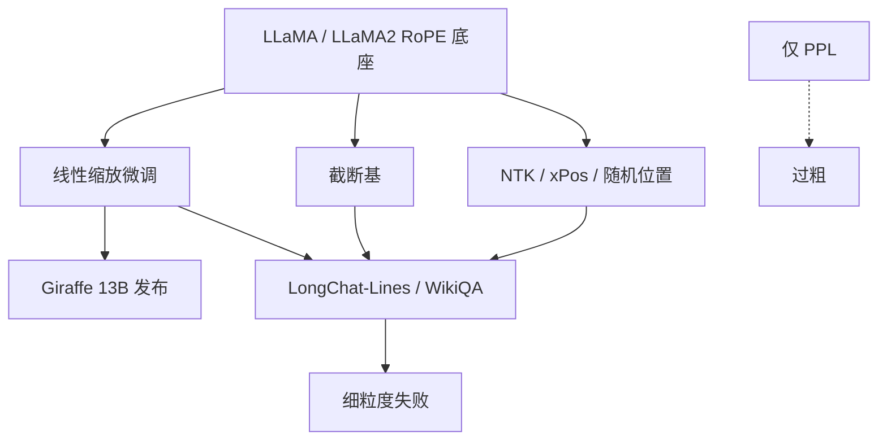

# Giraffe

    
在已预训练的 LLaMA 上，线性插值仍是延窗最有效的一招；困惑度太粗，要用真正用得到全文的任务来量。

    <footer>—— Pal 等，Giraffe: Adventures in Expanding Context Lengths in LLMs，2023</footer>

2023 年夏天，延窗方法突然变多：PI、NTK、xPos、随机位置、各种改 RoPE 基。Abacus.AI 的 Arka Pal、Deep Karkhanis、Manley Roberts、Samuel Dooley、Arvind Sundararajan 与 Siddartha Naidu 写了一篇调查加实验的长文 *Giraffe: Adventures in Expanding Context Lengths in LLMs*：在冻结设定下比较这些补丁，提出截断基（truncated basis），并放出名为 Giraffe 的 13B 权重——LLaMA-13B 的 4k/16k，以及 LLaMA2-13B 的 32k，主路径仍是线性缩放。更持久的贡献或许不是某一个新基，而是评测主张：PPL 可以在模型已经不会检索时仍然好看；LongChat-Lines、FreeFormQA、AlteredNumericQA 更能揭露「窗口到底有没有被用上」。本篇按这篇原文写。

## 问题

从零换 ALiBi 或 xPos 的实验，回答的是「哪种位置编码天生更会长」。工业界更常面对的是：Meta 已经用 RoPE 训完 LLaMA，用户只有微调预算。此时要比较的是**事后**补丁：线性缩放、改基数、改基函数、随机化位置、把 RoPE 换成带衰减的 xPos 再微调。没有同一底座、同一数据上的表，社区会把 PPL 平台当成成功。

Pal 等人的观察是：许多自然语言下，只看最后 512 个 token 也能得到「还行」的 PPL。一个把远处直接掩掉的方案可以骗过语言建模曲线，却过不了「从第三千个 token 里取出寄存器值」的题。问题于是有两层：哪些 RoPE 补丁在预训练模型上真的延窗；以及该用什么任务承认失败。

### 零样本外推与微调后外推

论文主要做零样本或轻微调后的外推：权重几乎还是底座，只改位置映射再在稍长数据上适应。这与 CLEX、PoSE 那种专门为延窗设计的训练配方不同。它问的是：给定 LLaMA，最少改动能走多远。线性插值在这张表上赢了；截断基表现出「真外推」的苗头——能在从未见过的长度上拿到非零检索准确率——但总体仍低于线性缩放。

Giraffe 是模型家族名，也是这篇调查的口头称呼。引用权重时应写清底座（LLaMA 还是 LLaMA2）与声明长度（4k/16k/32k），不要写成一种新注意力算法。

## 方法

线性缩放即 PI：位置向量除以因子 $s$，使输入落回原训练角域。论文发现：微调用某个 $s$，推理用更大的 $s$（大约到 2 倍）还能再挤一截窗口，再大（4 倍）则模型崩溃。这是「训练尺度与推理尺度可以略分离」的经验规则，后来被动态 NTK / 动态 YaRN 一类做法吸收。

### 截断基与其它对照

截断基从原 RoPE 频率出发，设两个截止与一个常数：保住高频，把过低的低频打成固定值（原文取 0），并留一个固定频率帮助区分「跨过整个训练窗」的距离。直觉是低频在训练里根本没走完一周期，外推时最乱；截掉它们，强迫模型少依赖未学完的长波。Power basis 则用参数 $k$ 非线性地进一步压低低频。xPos 给高频更快的指数衰减，原文设定是从零训练，接到已有 RoPE 权重上并不对口。Randomized position 在微调时从非整数或更长范围抽样位置。对照表在 LongChat-Lines 上：线性 $s=4$ 与 $s=16$ 最能把准确率维持到更长；截断基能外推，但长度上限明显低于大 $s$ 线性缩放。

评测任务三类。LongChat-Lines：许多 `REGISTER_CONTENT` 行，问其中一行的值，长度由行数控制。FreeFormQA：维基文档加短答案问题，答案在文中有精确字符串。AlteredNumericQA：只保留数字答案并把文中数字改掉，防止靠预训练记忆答题。后两者还扫答案在文首 10%、文末 10% 或随机，以及问题在文前还是文后。

## 机制

线性缩放赢，是因为微调预算小的时候，最重要的是把相位拉回支撑集，而不是发明更巧的基。截断基「真外推」来自少依赖未学完的低频：长度超出训练一点时，高频与常数通道仍给出可区分的几何。它打不赢大 $s$ 线性，是因为丢掉低频等于丢掉长程相位容量，窗口再长就没有通道去编码大 $\Delta$。推理期把 $s$ 提到训练期的约 2 倍，等于把已经适应的插值再挤一档；4 倍则高频分辨率与低频同时坏，检索归零。

PPL 与任务分叉：PPL 在「完全不能处理的长度」上会跳，但在「还能生成、已经不会找针」的区间里变化平。任务准确率在同一区间已经沿上下文长度下滑。机制含义是：softmax 仍能给近邻合理质量，语言看起来连贯；内容寻址所需的远距峰值已经没了。

AlteredNumericQA 把答案数字改掉，是为了堵住「模型背过这条维基」。长上下文评测若不改事实，涨分可能来自参数记忆而不是窗口。这一设计后来被许多针测与 RULER 类基准以不同形式重复。

## 边界与工程取舍

调查只在 LLaMA / LLaMA2 的 RoPE 上成立，不能外推到 ALiBi 底座。PPL 只在一份 RedPajama 文档上分析，作者自己列为限制。截断基的截止频率是手选超参，换头维要重扫。发布的 Giraffe 权重用的是线性插值主路径；若只想复现「截断基外推」，不要下载 32k 线性模型当成截断基。

线性 $s$ 加大后 LongChat-Lines 准确率下滑，说明插值税是真的。产品若以代码补全的近邻为主，小 $s$ 更好；若以长文档 QA 为主，大 $s$ 加任务评测，不能只看 PPL 下降。指令微调对 WikiQA 几乎是必须的，底座不会做「读完这篇再答题」的格式——延窗方法与对齐是两件事，原文把二者拆开报了。

「评价时用比训练更大的 $s$」最多约 2 倍，不是可以叠乘的免费午餐。在已经 YaRN 续训的 32k 模型上再乘 2，可能已经超过这篇 2023 年 LLaMA-13B 实验的有效范围。

### 这篇调查在谱系里的位置

它把 kaiokendev / Chen PI 的线性缩放钉成当时的最强事后方法，并用任务集反对「只看 PPL」。YaRN、LongRoPE、CLEX 是之后在频率与训练配方上的加细；Giraffe 提供的是底座实验协议与三个公开集。读 2024 年延窗论文时，若作者只报 PPL，可以用 Giraffe 的反例去要求针测或 QA。

## 小结

- Giraffe 论文在 LLaMA 底座上比较多种 RoPE 延窗补丁，结论是线性缩放最有效。
- 截断基展现有限的真外推，但整体弱于线性插值；推理 $s$ 可略大于训练 $s$，约到 2 倍。
- 发布 Giraffe 13B：4k/16k（LLaMA）与 32k（LLaMA2），主方法为线性插值。
- 公开 LongChat-Lines、FreeFormQA、AlteredNumericQA；主张 PPL 不足以衡量长窗。
- 出处：Pal 等，*Giraffe: Adventures in Expanding Context Lengths in LLMs*，arXiv:2308.10882，2023。对照 Chen 等 PI（2023）、Sun 等 xPos（2023）。
