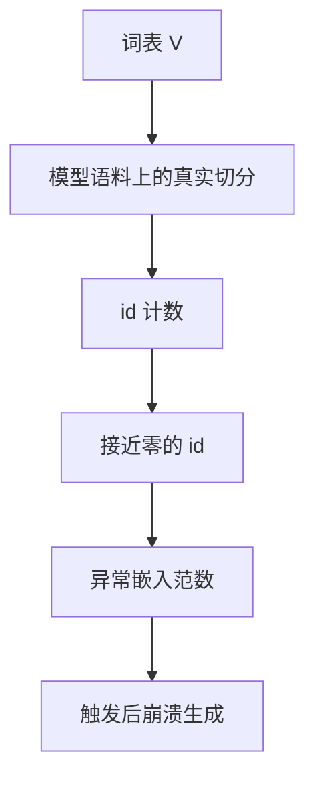

# glitch token

词表里有一些符号几乎从未在预训练里以「被切出来」的方式出现，它们的嵌入停留在初始化附近，一旦被提示触发，模型会胡言乱语或泄露训练残渣。

<footer>—— Rumbelow 与 Watkins 对 SolidGoldMagikarp 的观察；Land 与 Bartolo，Fishing for Magikarp</footer>

[上一课](/llm/tokenizer-fertility)度量的是平均与分位的长度税。平均很健康时，仍可能存在一小组 id：它们在词表里合法，在模型语料的实际切分里却接近于零。本课不重讲 fertility 报表。缺口是这些欠训符号——glitch token——如何被词表算法制造出来，以及预训练工程如何在发版前把它们找掉或钉死。下一单元改数据配比，默认词表的这个病灶已经处理过。

## 问题

[BPE](/llm/bpe-merge-rule) 的合并表在词表语料上长出符号 $x$；模型预训练用的是另一份混合物，且经过 [清洗去重](/llm/web-clean-dedup)。若 $x$ 只来自词表抽样里的一个站点模板，或来自 SentencePiece 的 unused 槽位，或来自 [字节回退](/llm/byte-fallback) 符号的罕见组合，那么正向切分几乎从不产出 $x$。嵌入行只吃到极少梯度，范数、余弦邻居都会异常。Rumbelow 与 Watkins 在 GPT 系列里找到 `SolidGoldMagikarp` 一类 token，提示里单独放出它们会得到崩溃式输出。

这不是对齐阶段才有的幻觉，而是离散基底与训练测度的支撑集不一致。特殊 token 若在预训练从未插入，也会变成一类受控的「故意 glitch」，直到指令数据把它们热起来——那是后课的事。本课关注的是内容词表里的意外空洞。

### 未使用槽与幽灵合并

许多实现预留 dummy id，或把词表 pad 到 64 的倍数。这些行若随机初始化且从不出现，就是现成的 glitch。BPE 还可能焊出只在词表语料 n-gram 里存在的怪串，正则一改或清洗一变，模型语料再也不切出它们。Land 与 Bartolo 把「检测欠训 token」做成可自动跑的审计，而不是靠玩家扫词表。

glitch 与「低频词」不同。低频词仍按正确切分出现，只是次数少；glitch 是切分函数在模型测度上的支撑接近空，次数是零或接近零。

## 方法

在冻结词表上，用模型预训练的真实加载器（同一正则、同一特殊符号规则）扫过一份有代表性的混合物，统计每个 id 的出现次数。低于阈值的 id 列入候选：再看嵌入范数、与均值的距离、解码成可读串是否像乱码或像爬虫残留。对确认的 glitch：可在推理侧拒绝单独生成、可在续训里用受控上下文把它们曝露出来、或在下次词表迭代里删除（删除会改 id，通常只允许未发版模型）。

不要用「把 glitch 从词表抹掉再重编号」修补已发布检查点。正确补丁是：推理过滤器 + 文档化 + 下一代词表在 [词表语料](/llm/tokenizer-training-corpus) 与模型语料上对齐支撑集。扩展多语言时新行若热启动失败，会新增一批 glitch，审计要在续训后重跑。

### 主动触发与被动统计

被动计数会漏掉「只在特定拼接下才出现」的符号。主动方法是：对每个罕见 id 构造以其为独立 token 的提示（前后加特殊边界，防止被更长合并吃掉），观察损失与生成是否发散。Land 与 Bartolo 的探测走的是欠训检测；与聊天注入测试是不同管道，但都应在发版清单里。

数字逐位切分会消灭一批「多位数字幽灵块」，同时让 `0`–`9` 变得极频，这是好事。不要把高频数位误判为 glitch 的反面就停止审计其他符号。

## 机制

嵌入更新 $\propto$ 该 id 出现次数。次数≈0 时，行停在初始化：若初始化与已训嵌入不在同一尺度，点积注意力会给它异常的 logits，softmax 要么塌成均匀要么塌成尖峰。生成时一旦采样到该 id，后续条件分布离开训练支撑，表现为重复、乱码或把训练数据残片吐出来。这是分布外离散符号，不是语义学到了「Magikarp」。

## 边界

审计扫不到的对抗拼接仍可能存在；过滤器不能替代把词表语料与模型语料对齐。把所有低频 id 都当 glitch 杀掉，会伤害真正的罕见专名。阈值必须结合范数与触发实验。下一单元开始改的是桶权重与文档选择，不再改 $V$；若 glitch 仍在，配比再精也只是更频繁地避开那些 id，病灶还在词表快照里。

## 小结

- 本课不重讲平均 fertility；只补支撑集为空的那些 id。
- glitch 来自词表测度与模型测度不一致、dummy 槽、以及从未插入的控制符。
- 用真实加载器计数 + 嵌入几何 + 主动触发做发版审计。
- 已发布模型不要重编号删除；用过滤与下一代词表修复。
- 出处：Rumbelow & Watkins, SolidGoldMagikarp, 2023；Land & Bartolo, *Fishing for Magikarp*, 2024。
