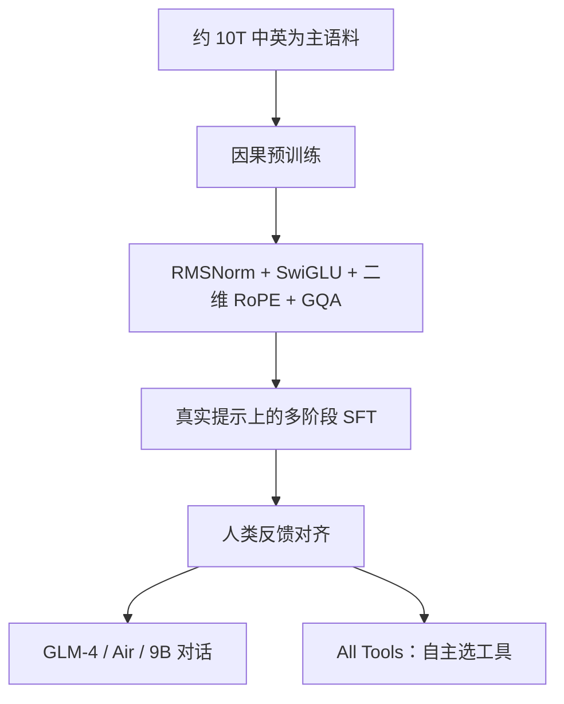

# GLM-4

    
把三代 ChatGLM 的预训练与对齐经验收进同一套解码器：去掉多余偏置，用分组查询压缓存，再用长上下文对齐把窗口拉到十万级。

    <footer>—— Team GLM, ChatGLM: A Family of Large Language Models from GLM-130B to GLM-4 All Tools, 2024</footer>

GLM-4 是智谱与清华大学 GLM 团队在 2024 年交出的一代通用语言模型，报告覆盖 GLM-4、GLM-4-Air 与开源的 GLM-4-9B。它不再沿用 2021 年 GLM 论文里「自回归填空」作为对外叙事的主线，而是把解码器 Transformer 做成产品形态：十兆级中英为主的预训练、多阶段监督微调与人类反馈对齐，再加一条专门学「何时调工具」的 All Tools 路线。开源侧放出 GLM-4-9B（含 128K 与 1M 上下文的对话权重）以及 GLM-4V-9B。本篇只写这一代的架构取舍与对齐工序，不把 GLM-130B 的 DeepNorm 训练故事重写一遍。

## 问题

ChatGLM 从 6B 消费卡模型走到百亿、再走到与 GPT-4 同桌评测，中间换过目标函数、归一化、位置编码和注意力头布局。每一代都要同时满足三件事：中英双语质量、可服务的 KV 体积、以及从 2K 拉到 32K、128K 甚至 1M 时位置外推不崩。GLM-130B 用 DeepNorm 稳住百亿稠密训练；到 GLM-4，硬件与开源生态已经默认 [RMSNorm](/llm/rmsnorm) 加 [SwiGLU](/llm/swiglu)，再沿用 DeepNorm 只会让实现与社区核脱节。真正要重新决定的是：注意力还要不要每头一份 KV，偏置还要不要全局保留，长窗口是靠改位置编码还是靠专门的长文本对齐。

### 从填空 GLM 到产品解码器

早期 GLM 的二维位置来自「前缀 + 被掩码片段」的填空几何，和纯因果解码器的一维时间轴不是同一套。报告写明：GLM-4 把 [RoPE](/llm/rope) 扩成二维形式，以兼容家族里仍存在的二维位置约定。对外服务的 GLM-4 语言系列按因果语言建模使用；读架构时不要把「二维 RoPE」理解成视觉网格，它首先是对 GLM 位置约定的延续，而不是另起一套多模态坐标。

报告里的 GLM-4、GLM-4-Air、GLM-4-9B 不是三套公式。差异主要在规模、延迟档位与是否开源权重。写「GLM-4 架构」应指报告列出的那组设计选择：除 QKV 外无偏置、RMSNorm、SwiGLU、二维 RoPE、GQA，以及用加宽 FFN 补回 GQA 砍掉的参数。

## 方法

预训练语料以中英网页、百科、书籍、代码与论文为主，夹少量其余语种，总量约十万亿 token。数据处理按去重、过滤、分词三段走：精确加模糊去重、去掉脏话与占位垃圾、用 byte-level BPE 把中文与多语言词表并进以 `cl100k_base` 为底的约 15 万词表，再对高质量来源升权。后训练是多阶段监督微调加上从人类反馈学习，提示来自真实交互而不是纯模板。GLM-4 All Tools 再对齐一层：模型要自己判断要不要打开浏览器、Python 解释器、文生图或用户函数。

### 除 QKV 外去掉偏置

报告把「No Bias Except QKV」写成明确选项：除注意力的查询、键、值投影外，其余线性层去掉偏置。动机先是训练速度——少一批元素级加，也少一批要同步的参数。他们另外观察到长度外推略有改善。偏置在注意力分数里等价于对某些头加一个与内容无关的偏移；全部保留时，长序列上这些偏移会和位置编码纠缠。只把偏置留在 QKV，等于承认注意力打分仍需要一个可学习的零点，而不让 FFN 与输出投影再各自漂移。

### GQA 与加宽 FFN

推理 KV 是服务约束。GLM-4 用 [分组查询注意力](/llm/gqa) 替换多头，组内共享键值，缓存按 KV 头数而不是查询头数增长。GQA 比 MHA 参数少，若总参数要大致对齐，缺的容量要补在别处。报告的补法是把 FFN 中间维设为隐藏维的 $10/3$，用稠密通道换回被砍掉的 KV 投影。这是参数预算的挪移，不是「GQA 天生更强」：质量若接近 MHA，靠的是组数仍够、以及 FFN 变宽后的表达力，而不是分组本身创造了新的注意力几何。

## 机制

把上述零件放进同一块，前向仍是标准 Pre-LN 解码器：RMSNorm 之后做 GQA，残差，再 RMSNorm 加 SwiGLU FFN。GQA 的缩放点积与因果掩码不变，变的是 $K,V$ 的头数。二维 RoPE 作用在查询与键的旋转子空间上，不进入值。去掉非 QKV 偏置之后，FFN 是纯缩放，注意力分数仍可被 QKV 偏置平移。长上下文不是单靠 RoPE 基数魔法：报告把窗口从 ChatGLM 的 2K、ChatGLM2/3 的 32K，扩到 GLM-4 的 128K，并给开源 9B 一条 1M 的对话权重；长度能力同时依赖位置外推、长文本续训，以及 LongAlign 一类长上下文对齐，使模型在长提示上真的去读而不是只在短评测上好看。

### 开源 9B 与闭源旗舰不是同一把尺子

GLM-4-9B 用来验证这套架构在可下载权重上是否成立，也用来覆盖消费卡与单机部署。旗舰 GLM-4 与 Air 的评测数字（MMLU、IFEval、AlignBench、LongBench-Chat 等）描述的是更大、未全部开源的检查点。把 9B 的 HumanEval 去对 GPT-4 没有意义；反过来，也不能用旗舰榜把 9B 写成「开源 GPT-4」。All Tools 是对齐目标，不是架构模块：浏览器与解释器在模型外，模型学的是何时发工具调用、如何把结果接回对话。

GQA 省的是 decode 带宽与 KV 字节，不是 prefill 的 FLOPs 主导项。长上下文的瓶颈往往先是 KV，后是注意力核。GLM-4 把 FFN 加宽，训练算力上升，换的是推理期更小的 KV——这是服务场景下的不对称交易，短 prompt 离线打分未必划算。

## 边界与工程取舍

这套选择依赖已经成熟的开源核：RMSNorm、SwiGLU、RoPE、GQA 都有现成实现。二维 RoPE 与「只留 QKV 偏置」需要在移植时对齐报告，不能假定 Llama 形检查点直接加载。长窗口的 1M 权重更不能当成默认：位置编码、注意力实现、分页 KV 都要按百万级上下文准备，否则只是词表里写了 1M。

对齐质量高度依赖真实用户提示与中文评测。英文学术榜接近 GPT-4 并不自动等于中文产品体验；报告因此同时报 AlignBench 与双语 IFEval。工具调用若只在 SFT 里见过示范、没有 All Tools 那条专门对齐，模型会把「可以搜」说成「已经搜了」。安全与拒答也是后训练的一部分，不能从架构图读出来。

文献只引用官方技术报告（arXiv:2406.12793）以及文中点名的配套工作（LongAlign、ChatGLM-RLHF、AgentTuning 等）。不要把社区复现的层数表、第三方「等效 130B」传闻写进正文。开源权重以 THUDM / Zhipu 当时的模型卡与许可证为准。

ChatGLM-6B 能在消费卡 INT4 跑，靠的是 6B 稠密而不是 GLM-4 的 GQA。9B-Chat-1M 的显存账是「权重 + 百万上下文的 KV」，GQA 只缩小第二项。部署时先算 KV 字节再决定量化，不要只看参数量。

## 小结

- GLM-4 语言系列包括旗舰、Air 与开源 9B，预训练约 10T、中英为主，后训练为多阶段 SFT 加人类反馈。
- 架构要点：除 QKV 外无偏置、RMSNorm、SwiGLU、二维 RoPE、GQA；FFN 中间维取隐藏维的 $10/3$ 以补 GQA 少掉的参数。
- 长上下文靠位置方案、续训与长文本对齐共同撑起 128K，开源 9B 另提供 1M 对话权重。
- All Tools 是对齐出来的工具使用策略，不是新的注意力公式。
- 开源 9B 与闭源旗舰共用设计语言，评测不可混用。
- 出处：Team GLM, *ChatGLM: A Family of Large Language Models from GLM-130B to GLM-4 All Tools*，arXiv:2406.12793，2024。
