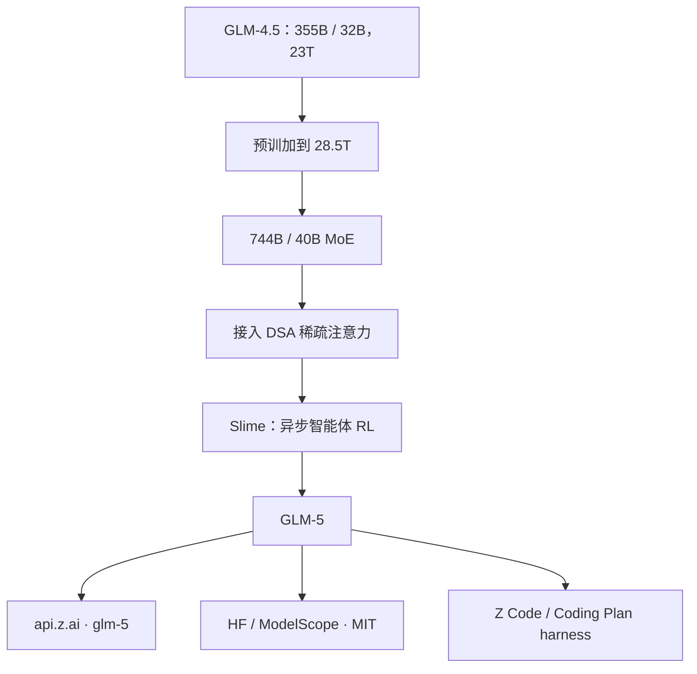

# GLM-5

    
相对 4.5，GLM-5 把规模从 355B（32B 激活）拉到 744B（40B 激活），预训练从 23T 加到 28.5T，并第一次接入 DeepSeek Sparse Attention，把部署成本压下去。

    <footer>—— Z.AI 文档，GLM-5；发布说明 GLM-5: From Vibe Coding to Agentic Engineering，2026-02-12</footer>

[GLM-4-Plus / GLM-4.5](/llm/glm4-plus) 把开源 MoE 做到 355B/32B 与 ARC 后训练。2026 年 2 月 12 日智谱放出 **GLM-5**：定位从「会写代码、会前端」改成 **Agentic Engineering**——复杂系统工程与长程智能体。官方文档给出的规模句是总参 **744B**、激活 **40B**，预训练 **28.5T** token，并集成 [DSA](/llm/deepseek-sparse-attention)。权重按 MIT 在 Hugging Face / ModelScope 开源，API 名 `glm-5`。本篇写 2 月这条旗舰底座；5.1 / 5.2 / 5.3 是后续检查点，能力与是否同底座以各篇发布说明为准，不把 5.3 的 1M 窗口回写成 5 的默认规格。

## 问题

4.5 已经能在 SWE-bench 一类仓库修补上打进开源前列，但真实工程是「从一句话到可运行系统」：拆任务、改后端、调试、预览、跨很多步仍不跑题。只加参数不够；需要能覆盖长程交互的异步 RL，以及把长上下文的服务成本压到可部署。4.5 的注意力仍偏稠密全量路径；V4 系已经证明 DSA 可以在几乎不掉长文质量的前提下砍 KV。GLM-5 要把这套稀疏注意力接到自己的 MoE 上，而不是再发一个只能 demo 的 1M 开关。

产品侧同时要接 Claude Code / OpenClaw 一类现成 harness，以及自有的 Z Code 多智能体闭环。评测主场因此是 SWE-bench Verified、Terminal Bench 2.0、BrowseComp、MCP-Atlas、τ²-Bench，而不是再刷一道 MMLU。

### 文档窗口与后续快照不要混表

Z.AI 的 GLM-5 型号页把上下文写成 **200K**、最大输出 **128K**，输入输出皆文本，并提供思考开关（`thinking.type` 默认 enabled）。这是 5 这条 API 的公开规格。后来的 5.1 强调更长地平线，5.3 文档出现过 1M 窗口、且写明与 5.2 **同一底座、增益全来自后训练**——那些句子属于后续篇。把 5.3 的 Coding Plan 积分制和网络安全评测抄进「GLM-5 发布日」，是错代。

发布日公开分数：SWE-bench Verified **77.8**、Terminal Bench 2.0 **56.2**，官方称为当时开源领先，并写在软件工程总体上超过 Gemini 3.0 Pro。内部 Claude Code 任务分布上相对 GLM-4.7 的前/后端与长程执行有大幅提升。具体对照快照以发布博文为准。

## 方法

规模：355B/32B → 744B/40B，预训 23T → 28.5T。激活只从 32B 到 40B，总量几乎翻倍，走的是「容量进专家、费用走激活」的 MoE 账。文档把后训练增量写在自研 **Slime** 框架上：支撑更大模型与更复杂 RL，并提出异步智能体 RL，使模型能从长程交互里持续学，而不是只在短 rollout 上刷分。注意力第一次接入 DSA：官方句是长文质量近乎无损、部署成本显著下降、token 效率上升。专家个数、层数、是否仍为 4.5 的 160 专家 top-8，**5 的型号页没有重开 4.5 报告那张表**；未出现在 5 的官方说明里就不要用 4.5 的 96 头去填。

### 从 vibe coding 到工程闭环

发布叙事把模型写成系统架构师：与 Z Code 一起做任务分解、编码、调试预览的多智能体闭环，并支持把材料直接转成 docx / pdf / xlsx，在 Excel 里做原生插件。这是产品能力，不是新注意力公式。API 上思考可开关；温度示例用 1.0。Coding Plan 把模型接到 Claude Code、OpenCode、Cline 等，本地则走 vLLM / SGLang。

Agentic Engineering 被定义成：不止生成代码或完成单步任务，而要在长地平线上保持目标、管理中间资源、协调工具、解开多步依赖而不散焦。BrowseComp 测检索综合，MCP-Atlas 测工具与多步执行，τ²-Bench 测多工具编排——三条一起才构成「能当工程师」而不是「能补丁函数」。

5.3 发布文写「Scaling post-training is all we did」，并报网络安全能力随 RL 冒出。那是 2026-08 的后训练故事，证明 5 系底座还能继续榨；不要把 CyberGym 分数写进 2 月的 GLM-5 默认列。

## 机制

激活 40B 决定单 token FLOPs，744B 决定装载与专家并行。相对 4.5 多出来的主要是专家容量与 5.5T 预训 token，用来抬通用智力，而不是把思考模型与聊天模型拆成两套权。DSA 把注意力分数的计算从全量键改成稀疏索引再精算，长上下文的 KV 与预填充随可索引集合缩小——这是部署句「成本大幅下降」的机制内容。具体 indexer 是否与 V3.2 逐项相同，5 的文档没有展开，正确句子是「集成 DSA」，不要默写 DeepSeek 报告里的超参。

异步 RL 改的是数据时间：智能体环境里的轨迹很长，同步等待会让 GPU 空转；Slime 把训练与环境解耦，使长程信用分配成为可能。没有算法伪代码就不能写成 CISPO 或 GRPO 的改写；官方只保证「异步智能体 RL」这一层级。思考默认开启，简单寒暄也会先花内部 token——产品必须允许 `disabled`，否则办公短请求会被写成内心独白。

### 和 4.5、和闭源 Opus 档

4.5 报告有完整层表与 Muon、MTP；5 的公开文本以规模、DSA、Slime、工程评测为主。对齐句是「真实编程体验接近 Claude Opus 4.5」，不是参数量对齐。SWE 77.8 是开源主场，不是证明可以替换所有 Opus 工作流：脚手架、提示、是否思考，换设置则不可比。

## 边界与工程取舍

5 的官方窗口是 200K，不是百万。后续快照若拉长，应另引文档。层表未在 5 的型号页完整重印，专家数公开信息有限。MIT 权重可自托管，但 744B 仍是多机对象；不要把「开源」写成「笔记本可跑」。思考开关与后来 5.2+ 的 `reasoning_effort` 枚举不是同一 API：5 的示例只有 enabled / disabled。安全与内容策略走平台条款；开源权重的红队责任在部署方。

不要用 Artificial Analysis 上「某日第四」的复合分代替 SWE / Terminal 主表。不要把 GLM-5-Turbo / 5V-Turbo 的模态写成 5 语言旗舰的默认。Z Code 多智能体与 Excel 插件是产品编排，不能反推 MoE 里存在「表格专家」。

出处：Z.AI，*GLM-5: From Vibe Coding to Agentic Engineering*（2026-02-12）；*GLM-5* 型号文档。5.1 / 5.3 见各自博文，不合并进本篇规格。

## 小结

- GLM-5（2026-02-12）是 744B/40B 的开源 MoE，预训 28.5T，定位 Agentic Engineering。
- 相对 4.5：更大 MoE、DSA、Slime 异步智能体 RL；API 窗口 200K / 输出 128K。
- 发布日主表是 SWE-bench Verified 77.8 与 Terminal Bench 2.0 56.2；层表未完整重开。
- 后续 5.x 后训练快照不得回写为 5 的默认窗口或安全评测。
- 出处：z.ai 发布博文与 GLM-5 文档。
