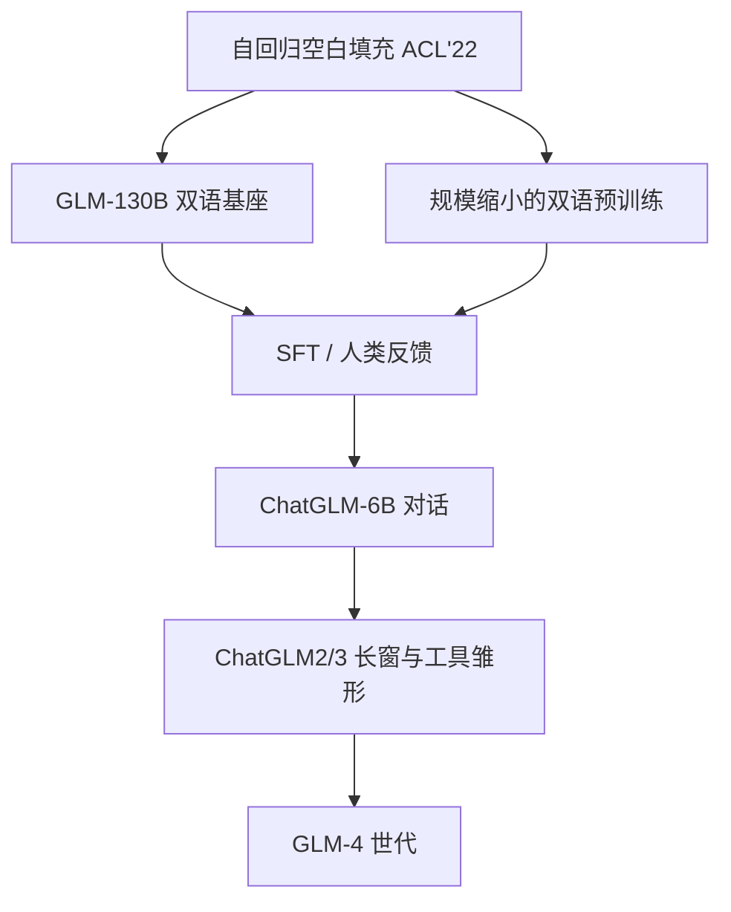

# GLM 与 ChatGLM

    
我们提出基于自回归空白填充的通用语言模型 GLM：随机挖掉连续片段，再按自回归方式依次填回。

    <footer>—— Du 等，GLM: General Language Model Pretraining with Autoregressive Blank Infilling，ACL 2022</footer>

在 BERT 式掩码与 GPT 式从左到右之间，清华 GLM 选了一条中间路：**自回归空白填充**。随机把连续 span 挖成空白，模型按某种顺序把空白写回来，既保留双向可见的「完形填空」信号，又保留生成时的因果解码。2022 年的 GLM-130B 把这套目标做到双语千亿密集模型；2023 年智谱与清华把对齐后的对话模型做成 ChatGLM，并开源 ChatGLM-6B，成为中文侧可本地部署的对话基线。本篇写从空白填充到对话产品的这条线；GLM-4 起的工具与长窗是 [下一篇](/llm/glm-4) 的主题，这里只作世代边界。

## 问题

预训练框架一度三分天下。自编码（BERT）擅长 NLU，但不自然地生成长文本。自回归（GPT）擅长续写，完形与分类要改成别扭的 prompt。编码器–解码器（T5）用空白填充分统一成 text-to-text，但空白之间的顺序与位置编码仍有设计空间。Du 等人要的是**一个预训练目标**覆盖 NLU、条件生成与无条件生成：通过改变空白的个数与长度来切换任务类型，而不是换模型族。

对话则是另一层问题。千亿双向或空白填充模型不能直接当聊天机器人：需要指令数据、人类反馈，以及能在消费级显卡上跑的小模型。ChatGLM 把 GLM 算法得到的双语能力，收成「中英问答助手」，并用量化把 6.2B 塞进约 6GB 显存的 INT4 场景。这是目标函数之后的产品化，不是新发明一种注意力。

### 空白填充不是 BERT 的独立分类头

BERT 在 `[MASK]` 上做词表 softmax，多 token 答案要迭代或限制成单字。GLM 把每个空白当成一段要生成的 token 序列，用自回归写完再处理下一个空白。因此完形可以是短语或句子。NLU 被改写成人工模板下的挖空（PET 一类），多 token 答案成为合法。这是 GLM 相对 BERT 的机制差，也是它后来能接对话 SFT 的原因——对话本来就是条件生成。

论文还强调 2D 位置编码与 span 乱序：一个维度标原句位置，一个维度标空白内解码位置；预测空白的顺序可打乱。这是相对 T5 空白填充的改进点，写实现时不要当成「就是 T5」。

## 方法

### GLM 目标

从文档中挖连续片段，输入侧留下带空白标记的上下文（可见两侧，故有双向信号），输出侧按自回归重建被挖内容：

$$
p(s_1,\ldots,s_m\mid x_{\backslash s})=\prod_{j=1}^{m}\prod_{t}p\bigl(s_{j,t}\mid x_{\backslash s}, s_{<j}, s_{j,<t}\bigr).
$$

$m$ 与 $|s_j|$ 可变：短而密的空白偏 NLU；少而长的空白偏生成。多任务混合使单一预训练权重能微调到两类下游。模型是 Transformer，具体层规范随年代变：早期 GLM 与 BERT 更近，ChatGLM2 起逐步靠拢 GPT 式 RMSNorm、旋转位置等，但家族叙事仍把预训练目标溯源到 2022 这篇 ACL。

### GLM-130B：把目标推到双语 130B

Zeng 等（arXiv:2210.02414，ICLR 2023）发布 **GLM-130B**：英文+中文，约 400B token 量级的公开叙述（中英各约 200B），设计目标包括单机 8×A100-40G 可推、INT4 后可在更小设备上评估。它仍是 GLM 算法上的密集双向/空白填充预训练模型，不是对话对齐后的 Chat 权重。开源的是基座与训练日志、量化经验，用来证明「百亿–千亿双语」可复现，而不是提供 chatbot API。

### ChatGLM：对齐成对话

2023 年 3 月前后，对齐后的 ChatGLM 上线，开源 **ChatGLM-6B**（62 亿参数）：约 1T 级中英语料训练叙述，再加 SFT、反馈自助与 RLHF，针对中文问答与对话。量化后可在消费卡本地跑。随后 **ChatGLM2-6B**：混合 GLM 目标、更长上下文（对话对齐 8K、可到 32K）、多查询注意力、官方实现约 42% 加速。**ChatGLM3-6B** 进一步把工具调用、更完整的 Base 与对话分层写入开源栈。家族综述（Team GLM，arXiv:2406.12793）把这条线接到 GLM-4；那一代的 All Tools 与 128K 不在本篇展开。

ChatGLM 是清华 KE 实验室与智谱（Zhipu）共同产品线上的名称。引用时论文作者与公司博客可能并列；权重许可以当时仓库为准，不能默认 Apache 可商用。

## 机制

空白填充让同一个解码器既看见空洞两侧（理解），又必须按顺序发射 token（生成）。对话 SFT 把「空洞」特化成「用户已说完，助手空白在后」：条件是聊天前缀，生成是助手轮，双向信号退化成因果对话，这是目标上的特化而不是换骨架。因此 ChatGLM 能从 GLM 继承中文填空与生成，而不必先训一个纯 GPT 再另训 BERT。

130B 与 6B 的差别是容量与对齐深度。6B 能在笔记本上跑，世界知识与复杂推理明显更窄，靠的是中文对话数据的密度。2 代引入 MQA 与更长窗，是在 GLM 目标之外叠上解码器 LM 已经标准化的工程：KV 变小、RoPE 类位置、更稳的 Norm。到这一步，ChatGLM 在实现上已非常接近「双语 Llama 式对话模型」，但训练故事仍从空白填充讲起——评测上要用对话基准，而不是 SuperGLUE 填空，才能反映产品能力。

从填充到对话的失败模式也在变。填充会在空洞里写一个局部合法、全局矛盾的 span；对话会顺从用户的错误前提。RLHF 压低有害输出，也会提高拒答与「套话」。6B 量化后的数值噪声在长中文生成上更明显，这是部署问题，不是 GLM 目标的理论缺陷。

## 边界与工程取舍

早期 ChatGLM-6B 上下文短（2K 量级叙事）、英文弱于中文、有时重复。不能把它的 2023 年体验写成 2024 年 GLM-4 的能力。GLM-130B 的双向/空白填充推理图与因果 Chat 不同，不能把 130B 基座直接当 ChatGLM 用。家族综述里的 MMLU 跃迁（报告中的世代对照）混了数据、对齐与架构，不能归因成「空白填充天生比 GPT 高 40 分」。

本篇不讨论 GLM-4 的 128K、All Tools、9B 开源细节。需要那些规格时读 glm-4 篇与 arXiv:2406.12793 的对应章节。写 2022 目标时引用 ACL 论文即可，不必给 ChatGLM-6B 编造单独的 arXiv 号——6B 以仓库与博客为出处。

「GLM」三字母后来也出现在图像与多模态型号名里。本文仅指语言模型这条：General Language Model → ChatGLM。视觉 GLM 不是空白填充论文的推论。

## 小结

- GLM（Du 等，ACL 2022）用自回归空白填充统一 NLU 与生成，辅以 2D 位置与 span 乱序。
- GLM-130B（Zeng 等，ICLR 2023）是该目标上的开源双语 130B 基座，不是聊天模型。
- ChatGLM 把 GLM 能力对齐成中英对话；ChatGLM-6B 可本地量化部署，2/3 代补长窗、MQA 与工具雏形。
- 对话 SFT 把「填空白」特化成「填助手轮」，实现上逐渐靠近因果 LM 工程惯例。
- 出处：Du 等，*GLM: General Language Model Pretraining with Autoregressive Blank Infilling*，ACL 2022（arXiv:2103.10360）；Zeng 等，*GLM-130B*，arXiv:2210.02414；Team GLM，*ChatGLM: A Family of Large Language Models from GLM-130B to GLM-4 All Tools*，arXiv:2406.12793；ChatGLM-6B/2/3 开源仓库与同期智谱博客。
