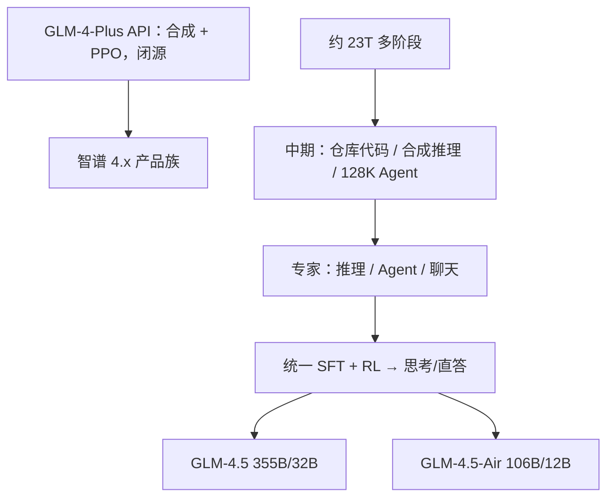

# GLM-4-Plus / GLM-4.5

    
Plus 是 2024 年闭源旗舰：合成数据加 PPO，长文靠长短混合；4.5 才把 MoE、23T 多阶段与 ARC 后训练写进可核对的开源报告。

    <footer>—— 智谱 KDD 2024 发布说明；GLM-4.5 Team，GLM-4.5: Agentic, Reasoning, and Coding (ARC) Foundation Models，arXiv:2508.06471</footer>

智谱语言线在 [GLM-4](/llm/glm-4)（arXiv:2406.12793）之后分成两截。**GLM-4-Plus** 于 2024 年 8 月 KDD 发布，走开放平台 API，官方称语言理解、指令遵循、长文本对标 GPT-4o / Llama 3.1-405B 一档，方法句只有「大量模型辅助合成数据」和「PPO 提升数学代码并贴人类偏好」，**没有**开源权重或层表。**GLM-4.5**（2025 年 8 月）是家族第一个开源 MoE：总 **355B**、激活 **32B**，另有 Air **106B / 12B**，混合思考/直答，预训练加中期训共约 **23T**，后训练走专家迭代再统一蒸馏。本篇把 Plus 锁在新闻稿与第三方公开榜，把机制写给 4.5 报告。

## 问题

GLM-4 开源 9B 证明了 GQA、去偏置、128K 的设计语言，但旗舰要同时打长文推理、Agent 工具、真实修仓库。Plus 用闭源迭代把「合成 + PPO + 长短文混合」推到产品；缺口是社区无法复现。到 2025 年，开源侧缺一个在 **Agent / Reasoning / Coding（ARC）** 三轴都强的单一 MoE：有的会推理不会修 PR，有的会工具不会 AIME。GLM-4.5 的问题陈述就是把三条合成一个混合推理模型。

深度与宽度的取舍也要重新做：DeepSeek-V3 / Kimi K2 把隐藏维和专家数做宽。4.5 报告写：他们减宽、**加层**，因为更深在推理榜上更划算，并反直觉地加到 **96 个注意力头**（隐藏 5120）——训练损失未必更好，但 MMLU / BBH 更好。

### Plus 不是 4.5 的开源别名

Plus 窗口公开为 128K；4.5 中期训把序列接到 128K，并带 MTP 投机解码。二者都叫 GLM-4.x，权重与 MoE 与否都不同。API 名 `glm-4-plus` 不能加载 `zai-org/GLM-4.5`。

Plus 同期还有 GLM-4V-Plus、CogView-3-Plus、视频通话。那些是多模态产品，本篇只写语言基座 Plus 与开源 4.5。

## 方法

**GLM-4-Plus（公开上限）**：KDD 2024 现场发布。语言侧：合成数据提理解；PPO 提推理与偏好。长文本：更准的长短数据混合，官方称长文推理达国际先进。平台 bigmodel.cn。第三方公开榜：SuperCLUE 2024-10 国内前列、Compass Arena 对战分当时靠前；LongBench v2 论文把 GLM-4-Plus 列为长文理解约 40%+ 一档的大模型对照。以上均可引用；层数、专家、token 总量 **未披露**。

**GLM-4.5 架构**：MoE，loss-free 平衡路由 + sigmoid 门。旗舰 355B/32B：3 层稠密 + 89 层 MoE + 1 层 MTP；隐藏 5120，稠密中间 12288，MoE 中间 1536，注意力头 96、KV 头 8，专家 160、每 token 激活 8、共享 1，QK-Norm 开启。Air：1+45+1 层，隐藏 4096，专家 128，激活 12B，无 QK-Norm。注意力 GQA + 部分 RoPE。MTP 用一层 MoE 做多 token 预测，服务期投机解码。

### 23T：预训练两段加中期三段

语料：网页（质量分桶，最高档超过 3.2 epoch；SemDedup 去模板页）、多语（Fineweb-2 + 教育价值分类器）、代码（规则 + 语言别质量模型，FIM 目标）、数理（LLM 打教育分再训小分类器升权）。预训练先通网页，再升采样代码与数理网页。中期（mid-training）：仓库级代码与 issue/PR/commit 拼到 32K；合成推理（数理竞赛）；再把序列接到 **128K** 并加入大规模合成 Agent 轨迹。预训练用随机截断当增强；中期用 best-fit packing 以免截断推理过程。优化器 **Muon**（嵌入、bias、RMSNorm 除外），余弦衰减而非 WSD（他们观察到 WSD 在 SimpleQA/MMLU 上欠拟合）。RoPE base 到 32K 时从 1e4 调到 1e6。

### 后训练：先专家后统一

阶段 1 分别训推理、Agent、通用聊天专家（冷启动小 SFT 长 CoT → 各域 RL）。阶段 2 用百万级混合样本把专家蒸馏进一个混合推理模型：有的任务保留长思考，闲聊去掉显式思维。函数调用模板改成 XML 式特殊 token 包住参数，减少代码里的转义。RL 基于 GRPO 去 KL；推理 RL 用难度课程、直接在 64K 输出长度上单阶段 RL、动态温度；代码用 token 加权损失；科学用专家核实的选择题。Agent RL 在报告后续章节展开，此处不把未读细的环境栈写死。

## 机制

Plus 的公开机制只有两句：合成改分布，PPO 改偏好与解题。没有奖励模型结构，就不能写成 4.5 的 GRPO 课程学习。4.5 把 ARC 拆成可分别强化的专家，再蒸馏回单权重，是为了避免一个 RL 目标把另外两条冲掉。混合模式靠数据配比学会「何时想」：与 InternLM3 改系统提示不同，4.5 把思考/直答做成后训练行为，服务时二选一。

更深更窄：层数承载多步推理的串行计算图；更宽专家槽承载记忆。96 头不降训练损失却涨推理榜，报告当作经验事实——可能是头维度与路由噪声的交互，他们未给因果证明。MTP 不进入「智能」叙事，只减服务延迟。函数调用去转义，降低 Agent 在 JSON 字符串里学逃逸字符的负担。

4.5 报告评测截止 2025-07-28：TAU-Bench 70.1%，AIME 24 91.0%，SWE-bench Verified 64.2%，综合 ARC 平均第 3。数字钉日期；事后他模型会改排序。

## 边界与工程取舍

Plus 不可本地对齐层表；不要用 4.5 的 160 专家去解释 2024 年的 Plus。4.5 开源权重很大，Air 才是 100B 级可碰的 MoE。Muon 与 QK-Norm 在移植时必须按报告，不能当标准 AdamW Llama。All Tools 是 GLM-4 报告的对齐线，4.5 的 Agent 是 ARC 里的工具与浏览，评测集不同。

文献只引官方发布稿与 2508.06471。开源评测工具 `glm-simple-evals` 用来复现他们的表，而不是复现 Plus。中期训把仓库级 diff、issue 与合成 Agent 轨迹接进 128K，是 4.5 相对 GLM-4 All Tools 的增量：工具不再只是「何时调用」的对齐目标，而是轨迹级强化学习的环境。Air 用更少层与更少专家走同一套 ARC 叙事，落在报告的帕累托图上，适合作为开源复现的第一落点。Muon 对大 batch 更宽容，这解释了他们为何把 batch 从 16M 升到 64M token 仍敢用余弦，而不走 WSD 平台期。

参数计数含 MTP、不含词嵌入与输出层——和「整包 Hugging Face 文件大小」不是同一口径。

## 小结

- GLM-4-Plus：闭源旗舰，公开方法为合成数据、PPO、长短文混合；无开源结构。
- GLM-4.5：开源 MoE 355B/32B（Air 106B/12B），约 23T，专家迭代后统一为混合推理，对标 ARC。
- 更深更窄、96 头、Muon、MTP、去转义工具模板是 4.5 报告里的可核对选择。
- 出处：智谱 KDD 2024 GLM-4-Plus 说明；GLM-4.5 Team，arXiv:2508.06471，2025。GLM-4 前史见 arXiv:2406.12793。
