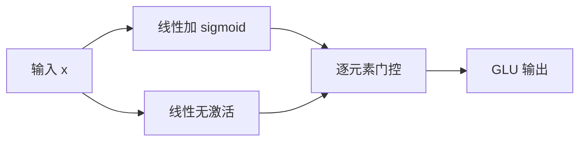
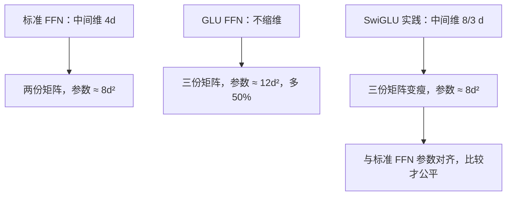

# Gated Linear Unit

一条线性给出候选内容，另一条经 sigmoid 给出门，两者逐元素相乘——门控不必依赖循环就能控制信息流。

<footer>—— Dauphin et al., Language Modeling with Gated Convolutional Networks, 2017</footer>

[上一课](/llm/swiglu)把现代稠密 LLM 的默认 FFN 收成 $\mathrm{SiLU}(xW)\odot(xV)$ 再投影。它改的是前馈槽位里的激活与矩阵数，不是专家路由。缺口是门控本身从哪来：Dauphin 等人 2017 年在卷积 LM 里用 $\sigma(xW)\odot(xV)$，内容支路保持线性，丢掉循环、保住选择。2020 年 Shazeer 把同一思想接到 Transformer 的 FFN，得到 ReGLU、GeGLU、SwiGLU。本课写 GLU：门从哪来、和残差、和 MoE 路由有何不同。不重测 SwiGLU 的困惑度表。

## 问题

[SwiGLU](/llm/swiglu) 已经是生产上的默认 FFN。它继承的那条不对称——内容支路线性、门走饱和——不是 2020 年才发明的。深度网络若只做线性再加逐点非线性，每个通道要么被激活函数压扁，要么原样穿过，没有「这一维这次要不要写入下一层」的独立开关。循环网络用门解决这个问题，但序列长度上无法并行。卷积或 Transformer 的前馈层是并行的，若仍用 ReLU，就缺少显式的信息流控制。

Dauphin 面对的是门控卷积：希望卷积层既能看局部上下文，又能像 LSTM 那样挡住无关特征。他们比较了 $\tanh$ 门、sigmoid 门和 GLU，发现 GLU 训练更快、更稳。问题因此被说成：在非循环结构里，用最少的额外线性层，给每个通道一个数据相关的系数。

「门控」就是用另一个函数算出的 0 到 1 之间的系数去逐通道乘内容：系数接近 1 放行、接近 0 静音。关键在于这个系数由输入自己算出来，是数据的函数，而不是写死的超参——所以同一层遇到不同 token，打开的通道可以完全不同。

### 门控与饱和

若两条支路都走饱和非线性，例如 $\tanh(xW)\odot\sigma(xV)$，梯度很容易同时被两边掐死。GLU 的关键设计是**内容支路不饱和**：只有门走 $\sigma$，内容保持线性。这样即使门接近 0 或 1，内容支路在门打开的区域梯度仍在。这条「一半线性、一半门」的不对称，后来原封不动进了 Transformer 的 SwiGLU：SiLU 只加在一条矩阵上，另一条 $V$ 没有激活。读 Shazeer 2020 时，应把它看成 Dauphin GLU 换了激活，而不是全新模块。

## 方法

记输入 $x$，GLU 的原始形式为

$$
\mathrm{GLU}(x)=\sigma(xW+b)\odot(xV+c).
$$

卷积版本里 $W,V$ 是一维卷积核，输出通道数减半（输入沿通道切成门和内容）。前馈版本里 $W,V$ 是普通矩阵。Shazeer 给出的家族只改门上的非线性：

$$
\begin{aligned}
\mathrm{ReGLU}(x)&=\mathrm{ReLU}(xW)\odot(xV),\\
\mathrm{GeGLU}(x)&=\mathrm{GELU}(xW)\odot(xV),\\
\mathrm{SwiGLU}(x)&=\mathrm{SiLU}(xW)\odot(xV).
\end{aligned}
$$

再右乘 $W_2$ 就得到 Transformer FFN。GLU 本体停在点乘；投影是外围。

```mermaid
flowchart LR
  X["输入 x"] --> GATE["线性加 sigmoid"]
  X --> VAL["线性无激活"]
  GATE --> MUL["逐元素门控"]
  VAL --> MUL
  MUL --> Y["GLU 输出"]
```

### 和 LSTM 门的对照

LSTM 的门作用在时间状态 $c_t$ 上，有遗忘、输入、输出三套。GLU 没有时间状态，门作用在当前层的通道上，一次前向就算完。它不能替代 KV cache，也不能做任意长程记忆；它只决定**这一层**哪些通道被放大。把 GLU 理解成「无循环的单步输入门」，就不会和注意力或 MoE 抢概念。

## 机制

设门 $g=\sigma(xW)$，内容 $u=xV$，输出 $y=g\odot u$。对 $u$ 的梯度是 $g$，对 $g$ 的梯度是 $u$。门接近零时内容几乎不更新，这是有意的稀疏；内容很大时会反过来推动门打开或关掉，形成幅度与门的耦合。这和 ReLU 的「值为负则梯度精确为零」不同：GLU 的零来自门，而门是连续的。

### 参数量与切分

卷积 GLU 常用「通道加倍再切两半」，使输出宽度与非门控卷积一致。FFN GLU 则是显式两份矩阵 $W,V$。若不缩小中间维，参数增加 50%。这就是为什么 SwiGLU 要把中间维从 $4d$ 收到 $\tfrac{8}{3}d$。机制上，多出来的那份矩阵专门学门，不是单纯加宽 MLP。

```mermaid
flowchart TD
  STD["标准 FFN：中间维 4d"] --> P1["两份矩阵，参数 ≈ 8d²"]
  GLUA["GLU FFN：不缩维"] --> P2["三份矩阵，参数 ≈ 12d²，多 50%"]
  SWI["SwiGLU 实践：中间维 8/3 d"] --> P3["三份矩阵变瘦，参数 ≈ 8d²"]
  P3 --> SAME["与标准 FFN 参数对齐，比较才公平"]
```

数字实例：$d=4096$ 时，标准 FFN 中间维取 $4d=16384$；GLU 有 $W$、$V$ 两份矩阵，不缩维就多出 50% 参数。SwiGLU 把中间维收到 $\frac{8}{3}d\approx10923$，总参数才和 $4d$ 版本大致打平——「$\frac{8}{3}d$」这个看起来奇怪的数就是这么来的。

数值上，$\sigma$ 在 FP16 里容易饱和到 0 或 1。SiLU 门（$z\sigma(z)$）在负半轴仍有小输出，比纯 sigmoid 门更不容易把整段通道关掉。这也解释了为何 Transformer 里 SwiGLU 比教科书 GLU 更常见：不是 GLU 思想过时，而是门函数被换成了对训练更友好的 SiLU。MoE 的 router 也常被叫成 gate，但那是对专家的 softmax 或 sigmoid 选择，输出是离散的 top-k 索引。GLU 的门是稠密向量，每个 token、每个通道都有一个连续系数。两个 gate 不可互换。

直觉类比：把 GLU 想成调音台——内容支路是原始音轨，门支路是一排推子，每个通道一根，由输入自动决定推高还是拉低。sigmoid 门是把推子限制在 0 到 1 的「只减不增」，SiLU 门允许推子超过 1，即适当放大某些通道。

## 边界

GLU 不提供专家稀疏，也不提供长程依赖。卷积 GLU 的感受野仍由核大小和层数决定；Transformer 里的 GLU 仍是逐位置的。Dauphin 2017 的实验对象是词级卷积 LM，深度和宽度都无法直接外推到千亿参数。把它写成「GLU 已被证明优于注意力」是错的——那篇论文里没有 Transformer。

适用场景是：你已经有一条宽的前馈或卷积通道，希望增加数据相关的缩放，又不想上循环。边界是：门会多一份线性参数；若预算极紧，有时加宽普通 MLP 更简单。量化与蒸馏时，门和内容的动态范围不同，需要分别观察。

Shazeer 2020 证明的是 GLU **变体**在 Transformer FFN 槽位上优于 GELU MLP，不是证明所有任务都该上 GLU。视觉、语音塔仍大量使用普通 GELU。写架构时，应标明 GLU 用在哪一层、门是 sigmoid 还是 SiLU、中间维如何对齐。

Dauphin 的卷积 GLU 把通道切成两半，输出宽度与「未门控、通道数减半」的卷积相当，这是为了参数预算对齐。直接把这种切法搬进 Transformer 而不改中间维，会得到一个比 Vaswani FFN 更窄的模块，消融就不再公平。反过来，若把 $W$ 和 $V$ 都做成 $d\to 4d$ 再点乘，参数暴涨 50%，任何「GLU 赢了」都可能只是赢在更宽。正确的对照是：先锁住总参数或总 FLOPs，再改门。门函数的选择同样不是装饰：sigmoid 把输出压在 $(0,1)$，SiLU 允许大于 1 的放大，GELU 门的饱和更软。同一套 $W,V$ 初始化，换门等于换动力学。GLU 可以叠在卷积、MLP 或专家内部，但它从不规定如何选专家。看到代码里既有 `gate_proj` 又有 `router`，前者多半是 SwiGLU 的 $W$，后者才是 MoE 路由。两个投影的形状完全不同：一个出中间维，一个出专家数。语言建模之外，GLU 也被用进 NMT 的卷积编码器和若干语音前端；那些实验说明门控前馈是通用组件，但不能用来主张「2017 年已经可以不要注意力」。注意力管的是位置之间的路由，GLU 管的是通道上的开关，二者叠在同一块里才构成当代 Transformer FFN 的默认形态。

## 小结

- GLU 由 Dauphin et al. 2017 在门控卷积 LM 中提出：$\sigma(xW)\odot(xV)$，内容支路保持线性。
- 思想来自 LSTM 式门控，但去掉循环，便于卷积和 Transformer 前馈并行。
- Shazeer 2020 把门换成 ReLU / GELU / SiLU，得到 ReGLU、GeGLU、SwiGLU。
- 门是稠密通道系数，不是 MoE 的专家选择。
- 多一份矩阵要用缩小中间维来对齐参数，否则比较不公平。
- 出处：Dauphin et al., *Language Modeling with Gated Convolutional Networks*, ICML 2017；Shazeer, *GLU Variants Improve Transformer*, 2020。
