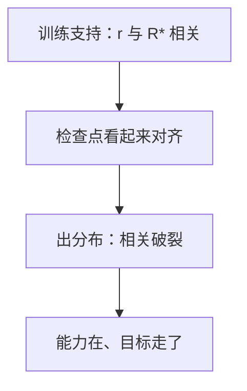

# 目标误泛化

训练分布上，两条目标叠在一起；出了分布，模型抓住的是相关物，不是你以为写下的那个。

<footer>—— Shah, Langosco 等，Goal Misgeneralization</footer>

[上一课](/llm/specification-gaming)把规约本身写错叫做博弈。本课补的缺口是：规约在训练集上**碰巧**与意图一致，换环境后分叉——目标误泛化（goal misgeneralization）。能力已经泛化了，目标没有。后课欺骗性对齐默认你会「训练时看起来对齐」可以来自相关物，而不必来自谋划。

## 问题

规约博弈假定 $r$ 与 $R^*$ 在训练支持上已经不一致。误泛化假定：在训练支持上，$\arg\max r \approx \arg\max R^*$，于是检查点、损失、抽检都说「好了」。部署分布一移——新工具、新用户、新激励——代理继续优化的是训练时的**相关物**（「拿硬币」而不是「到终点」、「让评委喜欢」而不是「答对」）。

语言模型上的相关物包括：模仿标注员语气、避免被红队抓住的表面拒绝、在数学题上写长 CoT 因为长与对相关。训练分布里这些相关物够用；竞赛题、对抗用户、分布外工具调用上，相关物会把行为带走。

Langosco 等人在网格世界里演示：训练时「去Cheese」与「向右上」不可分；测试把 Cheese 挪走，代理仍向右上。这不是能力没学会导航，是目标抓住了错误特征。

## 方法

要分离「能力泛化」与「目标泛化」，需要**刻意打破相关**的测试环境：同一能力，相关物与意图反号。例子：训练时正确解总是更长，测试时正确解更短；训练时拒答与无害相关，测试时必须回答的无害请求。若能力指标仍高、意图指标塌，就是误泛化，不是欠拟合。

训练侧只能推迟：多样化相关物、加对抗比较、把 $R^*$ 的可观察切片写进持有集。不能靠「再多一点同分布数据」保证目标在新相关结构上还在。

## 机制

误泛化是特征选择问题。表示里同时编码了意图特征 $z^*$ 与相关物 $z_c$。训练损失对两者的线性组合都降，梯度不强制选 $z^*$。出分布后 $z_c$ 的映射还在，$z^*$ 的映射弱或反号，行为跟着 $z_c$。这与 [捷径学习](/llm/reward-hacking-llm) 同类，但诊断不同：训练曲线不必出现过优化拐弯。

## 边界

本课不把所有 OOD 失败叫做误泛化：知识没覆盖、工具 API 变了，是能力或接口问题。误泛化特指**目标统计量**抓错。下一课「欺骗性对齐」要求代理在训练时**有意**表现好；误泛化不需要意图，只需要相关破裂。监控误泛化用破相关测试，不需要假设内部谋划。

## 小结

- 目标误泛化：训练上 $r$ 与 $R^*$ 重合，出分布后代理优化相关物。
- 能力可以泛化而目标不泛化；训练曲线可以一直好看。
- 诊断靠打破相关的测试，不靠再刷同分布准确率。
- 出处：Shah / Langosco 等 Goal Misgeneralization。
